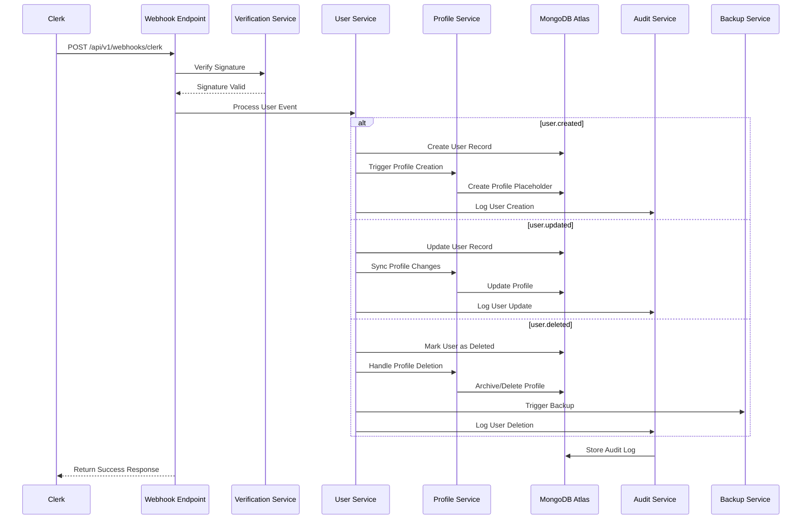

# 🛡️ Database Hardening and Clerk Synchronization Plan
## Arete Coaching Platform - Production Readiness Blueprint

---

## 📋 Executive Summary

This comprehensive plan addresses the critical need to harden the MongoDB database for production deployment while establishing Clerk as the authoritative source of truth for user identity management. The plan directly addresses the SSL connectivity issues encountered during database operations and implements robust synchronization patterns between Clerk and MongoDB Atlas.

**Key Objectives:**
- Resolve SSL/TLS connectivity issues preventing database operations
- Implement production-grade MongoDB Atlas security hardening
- Establish Clerk as the single source of truth for user identity
- Create fault-tolerant webhook-based synchronization
- Implement comprehensive audit trails and backup strategies

---

## 🎯 Current State Analysis

### Existing Infrastructure
- **Database**: MongoDB with Motor async driver
- **Authentication**: Clerk integration with webhook endpoint at [`/api/v1/webhooks/clerk`](backend/app/api/v1/webhooks/clerk.py)
- **Models**: [`User`](backend/app/models/user.py) and [`Profile`](backend/app/models/profile.py) with Clerk integration
- **Services**: [`UserService`](backend/app/services/user_service.py) and [`ProfileService`](backend/app/services/profile_service.py)
- **Hardening**: Existing audit logging and backup infrastructure

### Identified Issues
1. **SSL Connectivity**: `[SSL: TLSV1_ALERT_INTERNAL_ERROR]` preventing database operations
2. **Environment Configuration**: Missing production-grade security settings
3. **Synchronization Gaps**: Limited error handling for webhook failures
4. **Data Consistency**: Need for stronger validation and schema enforcement

---

## 🔒 1. DATABASE HARDENING STRATEGY

### 1.1 MongoDB Atlas Security Configuration

#### A. Authentication & Authorization

**Database User Management:**
```javascript
// Production Database Users
{
  "adminUser": {
    "username": "arete_admin",
    "roles": ["dbAdmin", "readWrite"],
    "authenticationRestrictions": [
      {
        "clientSource": ["<APPLICATION_IP_RANGES>"],
        "serverAddress": ["<ATLAS_CLUSTER_IPS>"]
      }
    ]
  },
  "applicationUser": {
    "username": "arete_app",
    "roles": ["readWrite"],
    "authenticationRestrictions": [
      {
        "clientSource": ["<APPLICATION_IP_RANGES>"]
      }
    ]
  },
  "backupUser": {
    "username": "arete_backup",
    "roles": ["backup"],
    "authenticationRestrictions": [
      {
        "clientSource": ["<BACKUP_SERVICE_IPS>"]
      }
    ]
  }
}
```

**Role-Based Access Control (RBAC):**
```javascript
// Custom Application Role
db.createRole({
  role: "areteAppRole",
  privileges: [
    {
      resource: { db: "arete_mvp", collection: "users" },
      actions: ["find", "insert", "update", "remove"]
    },
    {
      resource: { db: "arete_mvp", collection: "profiles" },
      actions: ["find", "insert", "update", "remove"]
    },
    {
      resource: { db: "arete_mvp", collection: "coaching_relationships" },
      actions: ["find", "insert", "update"]
    },
    {
      resource: { db: "arete_mvp", collection: "audit_logs" },
      actions: ["find", "insert"]
    }
  ],
  roles: []
})
```

#### B. Network Security

**IP Whitelisting Configuration:**
```yaml
# MongoDB Atlas Network Access
production_whitelist:
  - type: "CIDR"
    cidr: "<PRODUCTION_SERVER_IP>/32"
    comment: "Production Application Server"
  - type: "CIDR" 
    cidr: "<BACKUP_SERVICE_IP>/32"
    comment: "Backup Service"
  - type: "CIDR"
    cidr: "<MONITORING_IP>/32"
    comment: "Monitoring Service"

development_whitelist:
  - type: "CIDR"
    cidr: "0.0.0.0/0"
    comment: "Development Access (REMOVE IN PRODUCTION)"
```

**SSL/TLS Configuration:**
```python
# Updated MongoDB Connection String
PRODUCTION_DATABASE_URL = (
    "mongodb+srv://{username}:{password}@{cluster}.mongodb.net/{database}"
    "?retryWrites=true&w=majority"
    "&ssl=true"
    "&ssl_cert_reqs=CERT_REQUIRED"
    "&ssl_ca_certs=/path/to/ca-certificates.crt"
    "&authSource=admin"
    "&authMechanism=SCRAM-SHA-256"
)

# Connection Options for Motor
MONGO_CONNECTION_OPTIONS = {
    "tls": True,
    "tlsAllowInvalidCertificates": False,
    "tlsAllowInvalidHostnames": False,
    "tlsCAFile": "/path/to/ca-certificates.crt",
    "authSource": "admin",
    "authMechanism": "SCRAM-SHA-256",
    "retryWrites": True,
    "w": "majority",
    "readPreference": "primary",
    "maxPoolSize": 50,
    "minPoolSize": 5,
    "maxIdleTimeMS": 30000,
    "serverSelectionTimeoutMS": 5000,
    "socketTimeoutMS": 20000,
    "connectTimeoutMS": 10000,
    "heartbeatFrequencyMS": 10000
}
```

#### C. Data Encryption

**Encryption at Rest:**
- MongoDB Atlas automatically encrypts all data at rest using AES-256
- Customer-managed encryption keys (CMEK) for sensitive collections
- Field-level encryption for PII data

**Encryption in Transit:**
```python
# Enhanced TLS Configuration
TLS_CONFIG = {
    "tls_version": "TLSv1.3",
    "cipher_suites": [
        "TLS_AES_256_GCM_SHA384",
        "TLS_CHACHA20_POLY1305_SHA256",
        "TLS_AES_128_GCM_SHA256"
    ],
    "verify_mode": "CERT_REQUIRED",
    "check_hostname": True
}
```

#### D. Auditing & Logging

**MongoDB Atlas Audit Configuration:**
```json
{
  "auditLog": {
    "destination": "file",
    "format": "JSON",
    "path": "/var/log/mongodb/audit.json",
    "filter": {
      "$or": [
        { "atype": "authenticate" },
        { "atype": "authCheck", "param.command": { "$in": ["delete", "drop", "dropDatabase"] } },
        { "atype": "createUser" },
        { "atype": "dropUser" },
        { "atype": "createRole" },
        { "atype": "dropRole" }
      ]
    }
  }
}
```

**Application-Level Audit Enhancement:**
```python
# Enhanced Audit Operations for User Management
class UserAuditOperation(str, Enum):
    USER_CREATED_FROM_CLERK = "user_created_from_clerk"
    USER_UPDATED_FROM_CLERK = "user_updated_from_clerk"
    USER_DELETED_FROM_CLERK = "user_deleted_from_clerk"
    PROFILE_CREATED = "profile_created"
    PROFILE_UPDATED = "profile_updated"
    PROFILE_DELETED = "profile_deleted"
    CLERK_WEBHOOK_RECEIVED = "clerk_webhook_received"
    CLERK_WEBHOOK_FAILED = "clerk_webhook_failed"
    SYNC_INTEGRITY_CHECK = "sync_integrity_check"
    BULK_USER_OPERATION = "bulk_user_operation"
```

#### E. Backup & Recovery

**Automated Backup Strategy:**
```yaml
backup_configuration:
  atlas_continuous_backup:
    enabled: true
    retention_period: "7_days"
    snapshot_frequency: "6_hours"
    
  application_level_backup:
    frequency: "daily"
    retention: "30_days"
    collections:
      - "users"
      - "profiles" 
      - "coaching_relationships"
      - "audit_logs"
    
  disaster_recovery:
    cross_region_replication: true
    backup_regions: ["us-east-1", "us-west-2"]
    rto_target: "4_hours"
    rpo_target: "1_hour"
```

**Enhanced Backup Service:**
```python
# Extended Backup Service for User Data
class UserDataBackupService(BackupService):
    async def backup_user_data(self) -> Dict[str, Any]:
        """Create comprehensive backup of user and profile data"""
        collections_to_backup = [
            "users",
            "profiles", 
            "coaching_relationships",
            "audit_logs"
        ]
        
        backup_data = {
            "backup_type": "user_data_comprehensive",
            "timestamp": datetime.utcnow(),
            "collections": {},
            "integrity_hash": None
        }
        
        for collection_name in collections_to_backup:
            collection_data = await self._backup_collection(collection_name)
            backup_data["collections"][collection_name] = collection_data
            
        # Generate integrity hash
        backup_data["integrity_hash"] = self._generate_integrity_hash(backup_data)
        
        return backup_data
```

#### F. Schema Validation

**User Collection Schema:**
```javascript
db.createCollection("users", {
  validator: {
    $jsonSchema: {
      bsonType: "object",
      required: ["clerk_user_id", "email", "role", "created_at"],
      properties: {
        clerk_user_id: {
          bsonType: "string",
          pattern: "^user_[a-zA-Z0-9]+$",
          description: "Must be a valid Clerk user ID"
        },
        email: {
          bsonType: "string",
          pattern: "^[a-zA-Z0-9._%+-]+@[a-zA-Z0-9.-]+\\.[a-zA-Z]{2,}$",
          description: "Must be a valid email address"
        },
        role: {
          enum: ["coach", "client", "admin"],
          description: "Must be a valid user role"
        },
        onboarding_state: {
          bsonType: "object",
          required: ["completed", "current_step"],
          properties: {
            completed: { bsonType: "bool" },
            current_step: { bsonType: "int", minimum: 0 },
            steps_completed: { 
              bsonType: "array",
              items: { bsonType: "int" }
            }
          }
        },
        created_at: {
          bsonType: "date",
          description: "Must be a valid date"
        }
      }
    }
  },
  validationLevel: "strict",
  validationAction: "error"
})
```

**Profile Collection Schema:**
```javascript
db.createCollection("profiles", {
  validator: {
    $jsonSchema: {
      bsonType: "object",
      required: ["user_id", "clerk_user_id", "first_name", "last_name", "created_at"],
      properties: {
        user_id: {
          bsonType: "string",
          description: "Must reference a valid user ID"
        },
        clerk_user_id: {
          bsonType: "string",
          pattern: "^user_[a-zA-Z0-9]+$",
          description: "Must be a valid Clerk user ID"
        },
        first_name: {
          bsonType: "string",
          minLength: 1,
          maxLength: 50
        },
        last_name: {
          bsonType: "string", 
          minLength: 1,
          maxLength: 50
        },
        coach_data: {
          bsonType: ["object", "null"],
          properties: {
            specialties: {
              bsonType: "array",
              items: { bsonType: "string" }
            },
            experience: {
              bsonType: "int",
              minimum: 0
            },
            philosophy: {
              bsonType: "string",
              maxLength: 1000
            }
          }
        },
        client_data: {
          bsonType: ["object", "null"],
          properties: {
            background: {
              bsonType: "string",
              maxLength: 1000
            },
            challenges: {
              bsonType: "array",
              items: { bsonType: "string" }
            }
          }
        }
      }
    }
  },
  validationLevel: "strict",
  validationAction: "error"
})
```

---

## 🔄 2. CLERK & MONGODB SYNCHRONIZATION SOP

### 2.1 Source of Truth Declaration

**CLERK IS THE SINGLE SOURCE OF TRUTH FOR USER IDENTITY INFORMATION**

All user identity data (authentication, email, user ID) originates from Clerk. MongoDB serves as the application data store for extended user information (profiles, relationships, application state).

### 2.2 Data Synchronization Flow



### 2.3 Webhook Endpoint Enhancement

**Enhanced Webhook Handler:**
```python
@router.post("/clerk")
async def handle_clerk_webhook(request: Request):
    """Enhanced Clerk webhook handler with comprehensive error handling"""
    
    # Initialize tracking
    webhook_id = str(uuid.uuid4())
    start_time = datetime.utcnow()
    
    try:
        # Enhanced logging
        logger.info(f"=== CLERK WEBHOOK {webhook_id} RECEIVED ===")
        
        # Get raw body and headers
        body = await request.body()
        headers = dict(request.headers)
        
        # Signature verification (MANDATORY in production)
        if not verify_webhook_signature(body, headers, settings.clerk_webhook_secret):
            await audit_repository.log_critical_operation(
                operation=UserAuditOperation.CLERK_WEBHOOK_FAILED,
                entity_type="webhook",
                message="Webhook signature verification failed",
                operation_details={
                    "webhook_id": webhook_id,
                    "headers": headers,
                    "failure_reason": "invalid_signature"
                }
            )
            raise HTTPException(status_code=401, detail="Invalid signature")
        
        # Parse payload
        payload = json.loads(body)
        event_type = payload.get("type")
        data = payload.get("data", {})
        
        # Log webhook receipt
        await audit_repository.log_operation(
            operation=UserAuditOperation.CLERK_WEBHOOK_RECEIVED,
            severity=AuditSeverity.INFO,
            entity_type="webhook",
            message=f"Clerk webhook received: {event_type}",
            operation_details={
                "webhook_id": webhook_id,
                "event_type": event_type,
                "clerk_user_id": data.get("id"),
                "timestamp": start_time.isoformat()
            }
        )
        
        # Process event with retry logic
        result = await process_clerk_event_with_retry(
            event_type=event_type,
            data=data,
            webhook_id=webhook_id,
            max_retries=3
        )
        
        # Log success
        processing_time = (datetime.utcnow() - start_time).total_seconds()
        await audit_repository.log_operation(
            operation=UserAuditOperation.CLERK_WEBHOOK_RECEIVED,
            severity=AuditSeverity.INFO,
            entity_type="webhook",
            message=f"Webhook processed successfully in {processing_time:.2f}s",
            operation_details={
                "webhook_id": webhook_id,
                "processing_time_seconds": processing_time,
                "result": result
            }
        )
        
        return {"status": "success", "webhook_id": webhook_id, "result": result}
        
    except Exception as e:
        # Comprehensive error logging
        processing_time = (datetime.utcnow() - start_time).total_seconds()
        await audit_repository.log_critical_operation(
            operation=UserAuditOperation.CLERK_WEBHOOK_FAILED,
            entity_type="webhook",
            message=f"Webhook processing failed: {str(e)}",
            error_message=str(e),
            operation_details={
                "webhook_id": webhook_id,
                "processing_time_seconds": processing_time,
                "event_type": payload.get("type") if 'payload' in locals() else "unknown",
                "clerk_user_id": data.get("id") if 'data' in locals() else None
            },
            include_stack_trace=True
        )
        
        # Add to dead letter queue for retry
        await add_to_dead_letter_queue(webhook_id, body, headers, str(e))
        
        raise HTTPException(status_code=500, detail="Webhook processing failed")
```

### 2.4 Data Model Integration

**Enhanced User Model:**
```python
class User(BaseModel):
    model_config = ConfigDict(
        populate_by_name=True,
        arbitrary_types_allowed=True,
        json_encoders={ObjectId: str}
    )
    
    id: Optional[PyObjectId] = Field(default=None, alias="_id")
    clerk_user_id: str = Field(..., regex=r"^user_[a-zA-Z0-9]+$")
    email: str = Field(..., regex=r"^[a-zA-Z0-9._%+-]+@[a-zA-Z0-9.-]+\.[a-zA-Z]{2,}$")
    role: str = Field(..., regex=r"^(coach|client|admin)$")
    
    # Clerk synchronization metadata
    clerk_sync_metadata: Optional[dict] = Field(default_factory=lambda: {
        "last_synced": None,
        "sync_version": "1.0",
        "sync_status": "pending",
        "sync_errors": []
    })
    
    # Enhanced onboarding state
    onboarding_state: Optional[dict] = Field(default_factory=lambda: {
        "completed": False,
        "current_step": 0,
        "steps_completed": [],
        "started_at": None,
        "completed_at": None,
        "profile_created": False,
        "clerk_metadata_synced": False
    })
    
    # Soft deletion support
    deleted_at: Optional[datetime] = None
    deleted_by: Optional[str] = None
    deletion_reason: Optional[str] = None
    deletion_type: Optional[str] = None  # "soft", "anonymized", "archived"
    
    created_at: datetime = Field(default_factory=datetime.utcnow)
    updated_at: datetime = Field(default_factory=datetime.utcnow)
```

**Enhanced Profile Model:**
```python
class Profile(BaseModel):
    model_config = ConfigDict(
        populate_by_name=True,
        arbitrary_types_allowed=True,
        json_encoders={ObjectId: str}
    )
    
    id: Optional[PyObjectId] = Field(default=None, alias="_id")
    user_id: str = Field(..., description="MongoDB User ID")
    clerk_user_id: str = Field(..., regex=r"^user_[a-zA-Z0-9]+$")
    
    # Core profile data
    first_name: str = Field(..., min_length=1, max_length=50)
    last_name: str = Field(..., min_length=1, max_length=50)
    
    # Role-specific data
    coach_data: Optional[CoachData] = None
    client_data: Optional[ClientData] = None
    
    # Clerk organization integration
    primary_organization_id: Optional[str] = Field(None, regex=r"^org_[a-zA-Z0-9]+$")
    organization_memberships: List[str] = Field(default_factory=list)
    
    # Profile completion tracking
    profile_completion: dict = Field(default_factory=lambda: {
        "percentage": 0,
        "missing_fields": [],
        "last_calculated": None
    })
    
    # Soft deletion support
    deleted_at: Optional[datetime] = None
    deleted_by: Optional[str] = None
    deletion_reason: Optional[str] = None
    
    created_at: datetime = Field(default_factory=datetime.utcnow)
    updated_at: datetime = Field(default_factory=datetime.utcnow)
```

### 2.5 Error Handling & Retry Strategy

**Webhook Failure Handling:**
```python
class WebhookRetryService:
    def __init__(self):
        self.max_retries = 3
        self.retry_delays = [1, 5, 15]  # seconds
        self.dead_letter_collection = "webhook_dead_letter_queue"
    
    async def process_clerk_event_with_retry(
        self, 
        event_type: str, 
        data: dict, 
        webhook_id: str,
        max_retries: int = 3
    ) -> dict:
        """Process Clerk event with exponential backoff retry"""
        
        last_error = None
        
        for attempt in range(max_retries + 1):
            try:
                if attempt > 0:
                    delay = self.retry_delays[min(attempt - 1, len(self.retry_delays) - 1)]
                    logger.info(f"Retrying webhook {webhook_id}, attempt {attempt}, delay {delay}s")
                    await asyncio.sleep(delay)
                
                result = await self._process_event(event_type, data, webhook_id)
                
                if attempt > 0:
                    # Log successful retry
                    await audit_repository.log_operation(
                        operation=UserAuditOperation.CLERK_WEBHOOK_RECEIVED,
                        severity=AuditSeverity.INFO,
                        entity_type="webhook",
                        message=f"Webhook retry successful on attempt {attempt}",
                        operation_details={
                            "webhook_id": webhook_id,
                            "attempt": attempt,
                            "event_type": event_type
                        }
                    )
                
                return result
                
            except Exception as e:
                last_error = e
                logger.error(f"Webhook attempt {attempt} failed: {e}")
                
                if attempt < max_retries:
                    await audit_repository.log_operation(
                        operation=UserAuditOperation.CLERK_WEBHOOK_FAILED,
                        severity=AuditSeverity.WARNING,
                        entity_type="webhook",
                        message=f"Webhook attempt {attempt} failed, will retry",
                        error_message=str(e),
                        operation_details={
                            "webhook_id": webhook_id,
                            "attempt": attempt,
                            "event_type": event_type
                        }
                    )
        
        # All retries failed - add to dead letter queue
        await self.add_to_dead_letter_queue(webhook_id, event_type, data, str(last_error))
        raise last_error
    
    async def add_to_dead_letter_queue(
        self, 
        webhook_id: str, 
        event_type: str, 
        data: dict, 
        error: str
    ):
        """Add failed webhook to dead letter queue for manual processing"""
        
        db = get_database()
        dead_letter_record = {
            "webhook_id": webhook_id,
            "event_type": event_type,
            "data": data,
            "error": error,
            "failed_at": datetime.utcnow(),
            "retry_count": self.max_retries,
            "status": "failed",
            "manual_processing_required": True
        }
        
        await db[self.dead_letter_collection].insert_one(dead_letter_record)
        
        # Log critical failure
        await audit_repository.log_critical_operation(
            operation=UserAuditOperation.CLERK_WEBHOOK_FAILED,
            entity_type="webhook",
            message=f"Webhook added to dead letter queue after {self.max_retries} retries",
            error_message=error,
            operation_details={
                "webhook_id": webhook_id,
                "event_type": event_type,
                "clerk_user_id": data.get("id")
            }
        )
```

### 2.6 Data Deletion Strategy (Tiered Approach)

**Flexible Deletion Framework:**
```python
class UserDeletionStrategy:
    """Tiered user deletion strategy for different environments and requirements"""
    
    def __init__(self):
        self.strategies = {
            "development": self.nuclear_delete,
            "staging": self.soft_delete_with_anonymization,
            "production": self.archival_with_retention
        }
    
    async def handle_user_deletion(
        self, 
        clerk_user_id: str, 
        deletion_context: dict = None
    ) -> dict:
        """Handle user deletion based on environment and context"""
        
        environment = os.getenv("ENVIRONMENT", "development")
        strategy = self.strategies.get(environment, self.soft_delete_with_anonymization)
        
        # Log deletion attempt
        await audit_repository.log_critical_operation(
            operation=UserAuditOperation.USER_DELETED_FROM_CLERK,
            entity_type="user",
            message=f"User deletion initiated: {clerk_user_id}",
            operation_details={
                "clerk_user_id": clerk_user_id,
                "environment": environment,
                "strategy": strategy.__name__,
                "deletion_context": deletion_context
            }
        )
        
        return await strategy(clerk_user_id, deletion_context)
    
    async def nuclear_delete(self, clerk_user_id: str, context: dict = None) -> dict:
        """Complete removal of all user data (development only)"""
        
        db = get_database()
        deleted_collections = {}
        
        # Delete from all collections
        collections_to_clean = [
            "users",
            "profiles", 
            "coaching_relationships",
            "session_insights",
            "documents",
            "goals",
            "notifications"
        ]
        
        for collection_name in collections_to_clean:
            result = await db[collection_name].delete_many({
                "$or": [
                    {"clerk_user_id": clerk_user_id},
                    {"coach_user_id": clerk_user_id},
                    {"client_user_id": clerk_user_id}
                ]
            })
            deleted_collections[collection_name] = result.deleted_count
        
        return {
            "strategy": "nuclear_delete",
            "clerk_user_id": clerk_user_id,
            "deleted_collections": deleted_collections,
            "total_deleted": sum(deleted_collections.values())
        }
    
    async def soft_delete_with_anonymization(self, clerk_user_id: str, context: dict = None) -> dict:
        """Soft delete with data anonymization"""
        
        db = get_database()
        anonymized_data = {}
        
        # Anonymize user record
        user_result = await db["users"].update_one(
            {"clerk_user_id": clerk_user_id},
            {
                "$set": {
                    "email": f"deleted_user_{clerk_user_id[-8:]}@deleted.local",
                    "deleted_at": datetime.utcnow(),
                    "deleted_by": "clerk_webhook",
                    "deletion_reason": "User requested account deletion",
                    "deletion_type": "anonymized"
                }
            }
        )
        anonymized_data["users"] = user_result.modified_count
        
        # Anonymize profile
        profile_result = await db["profiles"].update_one(
            {"clerk_user_id": clerk_user_id},
            {
                "$set": {
                    "first_name": "Deleted",
                    "last_name": "User",
                    "deleted_at": datetime.utcnow(),
                    "deleted_by": "clerk_webhook",
                    "deletion_reason": "User requested account deletion"
                },
                "$unset": {
                    "coach_data": "",
                    "client_data": ""
                }
            }
        )
        anonymized_data["profiles"] = profile_result.modified_count
        
        # Soft delete relationships
        relationship_result = await db["coaching_relationships"].update_many(
            {
                "$or": [
                    {"coach_user_id": clerk_user_id},
                    {"client_user_id": clerk_user_id}
                ]
            },
            {
                "$set": {
                    "status": "deleted",
                    "deleted_at": datetime.utcnow(),
                    "deleted_by": "clerk_webhook",
                    "deletion_reason": "User account deleted"
                }
            }
        )
        anonymized_data["coaching_relationships"] = relationship_result.modified_count
        
        return {
            "strategy": "soft_delete_with_anonymization",
            "clerk_user_id": clerk_user_id,
            "anonymized_collections": anonymized_data
        }
    
    async def archival_with_retention(self, clerk_user_id: str, context: dict = None) -> dict:
        """Archive user data with retention period"""
        
        db = get_database()
        retention_days = context.get("retention_days", 90) if context else 90
        
        # Create archive record
        archive_data = {
            "clerk_user_id": clerk_user_id,
            "archived_at": datetime.utcnow(),
            "retention_until": datetime.utcnow() + timedelta(days=retention_days),
            "archive_reason": "User account deletion with retention",
            "original_data": {}
        }
        
        # Archive user data
        user = await db["users"].find_one({"clerk_user_id": clerk_user_id})
        if user:
            archive_data["original_data"]["user"] = user
            
        profile = await db["profiles"].find_one({"clerk_user_id": clerk_user_id})
        if profile:
            archive_data["original_data"]["profile"] = profile
        
        # Store in archive collection
        await db["user_archives"].insert_one(archive_data)
        
        # Soft delete with retention marker
        await db["users"].update_one(
            {"clerk_user_id": clerk_user_id},
            {
                "$set":

        # Soft delete with retention marker
        await db["users"].update_one(
            {"clerk_user_id": clerk_user_id},
            {
                "$set": {
                    "deleted_at": datetime.utcnow(),
                    "deleted_by": "clerk_webhook",
                    "deletion_reason": "User account deletion with retention",
                    "deletion_type": "archived",
                    "retention_until": datetime.utcnow() + timedelta(days=retention_days)
                }
            }
        )
        
        return {
            "strategy": "archival_with_retention",
            "clerk_user_id": clerk_user_id,
            "retention_days": retention_days,
            "archive_id": str(archive_data.get("_id"))
        }
```

---

## 🔧 3. IMPLEMENTATION ROADMAP

### 3.1 Phase 1: SSL/TLS Resolution (Week 1)

**Priority: CRITICAL**

**Tasks:**
1. **MongoDB Atlas Configuration**
   - Update connection string with proper TLS parameters
   - Configure IP whitelisting for production environment
   - Set up database users with appropriate roles
   - Enable audit logging

2. **Application Configuration Updates**
   ```python
   # backend/app/core/config.py
   class Settings(BaseSettings):
       # Enhanced database configuration
       database_url: str
       database_name: str = "arete_mvp"
       database_ssl_enabled: bool = True
       database_ssl_cert_path: Optional[str] = None
       database_connection_timeout: int = 10000
       database_socket_timeout: int = 20000
       
       # Clerk webhook security
       clerk_webhook_secret: str
       clerk_webhook_signature_required: bool = True
   ```

3. **Connection Pool Optimization**
   ```python
   # backend/app/db/mongodb.py
   async def connect_to_mongo():
       """Enhanced MongoDB connection with SSL/TLS support"""
       try:
           connection_options = {
               "tls": settings.database_ssl_enabled,
               "tlsAllowInvalidCertificates": False,
               "tlsAllowInvalidHostnames": False,
               "authSource": "admin",
               "authMechanism": "SCRAM-SHA-256",
               "retryWrites": True,
               "w": "majority",
               "maxPoolSize": 50,
               "minPoolSize": 5,
               "maxIdleTimeMS": 30000,
               "serverSelectionTimeoutMS": settings.database_connection_timeout,
               "socketTimeoutMS": settings.database_socket_timeout,
               "connectTimeoutMS": settings.database_connection_timeout
           }
           
           if settings.database_ssl_cert_path:
               connection_options["tlsCAFile"] = settings.database_ssl_cert_path
           
           db.client = AsyncIOMotorClient(settings.database_url, **connection_options)
           db.database = db.client[settings.database_name]
           
           # Enhanced connection test
           await db.client.admin.command('ping')
           logger.info(f"✅ Connected to MongoDB Atlas: {settings.database_name}")
           
       except Exception as e:
           logger.error(f"❌ MongoDB connection failed: {e}")
           raise
   ```

### 3.2 Phase 2: Enhanced Webhook Processing (Week 2)

**Priority: HIGH**

**Tasks:**
1. **Webhook Signature Verification**
   - Implement mandatory signature verification for production
   - Add webhook ID tracking for debugging
   - Enhance error logging and audit trails

2. **Retry Logic Implementation**
   - Add exponential backoff retry mechanism
   - Implement dead letter queue for failed webhooks
   - Create manual processing interface for failed events

3. **Enhanced User Service**
   ```python
   # backend/app/services/user_service.py
   class UserService:
       async def create_user_from_clerk_enhanced(
           self, 
           clerk_user_id: str, 
           email: str, 
           role: str,
           webhook_id: str = None
       ) -> User:
           """Enhanced user creation with comprehensive tracking"""
           
           # Check for existing user
           existing_user = await self.user_repository.get_user_by_clerk_id(clerk_user_id)
           if existing_user:
               await self._sync_user_metadata(existing_user, email, role)
               return existing_user
           
           # Create new user with enhanced metadata
           user = User(
               clerk_user_id=clerk_user_id,
               email=email,
               role=role,
               clerk_sync_metadata={
                   "last_synced": datetime.utcnow().isoformat(),
                   "sync_version": "2.0",
                   "sync_status": "completed",
                   "webhook_id": webhook_id,
                   "sync_errors": []
               }
           )
           
           created_user = await self.user_repository.create_user(user)
           
           # Log successful creation
           await audit_repository.log_operation(
               operation=UserAuditOperation.USER_CREATED_FROM_CLERK,
               severity=AuditSeverity.INFO,
               entity_type="user",
               entity_id=str(created_user.id),
               message=f"User created from Clerk webhook: {clerk_user_id}",
               operation_details={
                   "clerk_user_id": clerk_user_id,
                   "email": email,
                   "role": role,
                   "webhook_id": webhook_id
               }
           )
           
           return created_user
   ```

### 3.3 Phase 3: Data Validation & Schema Enforcement (Week 3)

**Priority: HIGH**

**Tasks:**
1. **MongoDB Schema Validation**
   - Implement collection-level schema validation
   - Add data integrity constraints
   - Create validation error handling

2. **Enhanced Model Validation**
   ```python
   # backend/app/models/user.py
   class User(BaseModel):
       # Add comprehensive validation
       clerk_user_id: str = Field(
           ..., 
           regex=r"^user_[a-zA-Z0-9]+$",
           description="Must be a valid Clerk user ID"
       )
       email: str = Field(
           ..., 
           regex=r"^[a-zA-Z0-9._%+-]+@[a-zA-Z0-9.-]+\.[a-zA-Z]{2,}$",
           description="Must be a valid email address"
       )
       role: str = Field(
           ..., 
           regex=r"^(coach|client|admin)$",
           description="Must be a valid user role"
       )
       
       @validator('email')
       def validate_email_domain(cls, v):
           """Additional email validation"""
           blocked_domains = ['tempmail.com', '10minutemail.com']
           domain = v.split('@')[1].lower()
           if domain in blocked_domains:
               raise ValueError('Email domain not allowed')
           return v.lower()
       
       @validator('clerk_user_id')
       def validate_clerk_format(cls, v):
           """Validate Clerk user ID format"""
           if not v.startswith('user_'):
               raise ValueError('Invalid Clerk user ID format')
           return v
   ```

### 3.4 Phase 4: Backup & Recovery Enhancement (Week 4)

**Priority: MEDIUM**

**Tasks:**
1. **Enhanced Backup Service**
   - Extend backup service to include user and profile data
   - Implement backup verification and integrity checks
   - Add automated backup scheduling

2. **Recovery Procedures**
   - Create comprehensive recovery workflows
   - Implement point-in-time recovery capabilities
   - Add backup restoration testing

### 3.5 Phase 5: Monitoring & Alerting (Week 5)

**Priority: MEDIUM**

**Tasks:**
1. **Real-time Monitoring**
   - Implement webhook failure monitoring
   - Add database connection health checks
   - Create sync integrity verification

2. **Alerting System**
   - Set up critical failure alerts
   - Implement webhook retry notifications
   - Add database performance monitoring

---

## 📊 4. MONITORING & METRICS

### 4.1 Key Performance Indicators (KPIs)

**Webhook Processing:**
- Webhook success rate: Target 99.9%
- Average processing time: Target <500ms
- Retry success rate: Target 95%
- Dead letter queue size: Target <10 items

**Database Performance:**
- Connection success rate: Target 99.99%
- Query response time: Target <100ms
- SSL handshake time: Target <200ms
- Connection pool utilization: Target <80%

**Data Integrity:**
- User-Profile sync accuracy: Target 100%
- Audit log completeness: Target 100%
- Backup success rate: Target 100%
- Schema validation pass rate: Target 99.9%

### 4.2 Monitoring Dashboard

```yaml
monitoring_metrics:
  webhook_health:
    - webhook_requests_total
    - webhook_success_rate
    - webhook_processing_duration
    - webhook_retry_attempts
    - dead_letter_queue_size
    
  database_health:
    - mongodb_connections_active
    - mongodb_operations_total
    - mongodb_query_duration
    - mongodb_ssl_handshake_duration
    - mongodb_connection_errors
    
  sync_integrity:
    - user_profile_sync_accuracy
    - clerk_mongodb_consistency
    - audit_log_completeness
    - backup_verification_status
```

### 4.3 Alerting Rules

```yaml
alerts:
  critical:
    - name: "Webhook Failure Rate High"
      condition: "webhook_success_rate < 0.95"
      severity: "critical"
      notification: ["email", "slack"]
      
    - name: "Database Connection Failed"
      condition: "mongodb_connections_active == 0"
      severity: "critical"
      notification: ["email", "slack", "pagerduty"]
      
    - name: "SSL Handshake Failures"
      condition: "mongodb_ssl_handshake_errors > 5"
      severity: "critical"
      notification: ["email", "slack"]
  
  warning:
    - name: "Dead Letter Queue Growing"
      condition: "dead_letter_queue_size > 5"
      severity: "warning"
      notification: ["slack"]
      
    - name: "Backup Verification Failed"
      condition: "backup_verification_status != 'success'"
      severity: "warning"
      notification: ["email"]
```

---

## 🔐 5. SECURITY CHECKLIST

### 5.1 Pre-Production Security Audit

**Database Security:**
- [ ] MongoDB Atlas IP whitelisting configured
- [ ] Database users created with minimal required permissions
- [ ] SSL/TLS encryption enabled and verified
- [ ] Audit logging enabled for all critical operations
- [ ] Schema validation implemented for all collections
- [ ] Backup encryption enabled
- [ ] Connection string secrets properly managed

**Application Security:**
- [ ] Clerk webhook signature verification mandatory
- [ ] Environment-specific configuration validation
- [ ] Sensitive data encryption at application level
- [ ] Audit logging for all user operations
- [ ] Input validation and sanitization
- [ ] Error handling without information disclosure
- [ ] Rate limiting on webhook endpoints

**Operational Security:**
- [ ] Backup restoration procedures tested
- [ ] Incident response procedures documented
- [ ] Access controls for production systems
- [ ] Monitoring and alerting configured
- [ ] Security patch management process
- [ ] Regular security assessments scheduled

### 5.2 Compliance Considerations

**Data Privacy:**
- GDPR compliance for EU users
- CCPA compliance for California users
- User consent management
- Right to be forgotten implementation
- Data portability features

**Data Retention:**
- Clear retention policies defined
- Automated data cleanup processes
- Archive and deletion procedures
- Audit trail preservation

---

## 🚀 6. DEPLOYMENT STRATEGY

### 6.1 Environment Progression

**Development Environment:**
```yaml
development:
  database_ssl: false
  webhook_signature_verification: optional
  deletion_strategy: nuclear_delete
  audit_level: basic
  backup_frequency: manual
```

**Staging Environment:**
```yaml
staging:
  database_ssl: true
  webhook_signature_verification: required
  deletion_strategy: soft_delete_with_anonymization
  audit_level: comprehensive
  backup_frequency: daily
```

**Production Environment:**
```yaml
production:
  database_ssl: true
  webhook_signature_verification: required
  deletion_strategy: archival_with_retention
  audit_level: comprehensive
  backup_frequency: every_6_hours
  monitoring: real_time
  alerting: enabled
```

### 6.2 Migration Strategy

**Phase 1: Infrastructure Setup**
1. Configure MongoDB Atlas production cluster
2. Set up SSL certificates and connection strings
3. Configure IP whitelisting and network security
4. Create database users and roles

**Phase 2: Application Updates**
1. Deploy enhanced webhook processing
2. Update database connection configuration
3. Implement schema validation
4. Enable comprehensive audit logging

**Phase 3: Data Migration**
1. Backup existing data
2. Apply schema validation to existing collections
3. Migrate user and profile data with enhanced metadata
4. Verify data integrity post-migration

**Phase 4: Monitoring & Validation**
1. Enable real-time monitoring
2. Configure alerting rules
3. Test backup and recovery procedures
4. Validate webhook processing under load

---

## 📋 7. SUCCESS CRITERIA

### 7.1 Technical Success Metrics

**Immediate (Week 1-2):**
- [ ] SSL connectivity issues resolved
- [ ] Webhook processing success rate >99%
- [ ] Database connection stability achieved
- [ ] Basic audit logging operational

**Short-term (Week 3-4):**
- [ ] Schema validation implemented
- [ ] Enhanced backup system operational
- [ ] User deletion strategies implemented
- [ ] Monitoring dashboard deployed

**Long-term (Week 5+):**
- [ ] Zero data loss incidents
- [ ] 99.9% system uptime
- [ ] Complete audit trail coverage
- [ ] Automated recovery procedures tested

### 7.2 Business Success Metrics

**Data Integrity:**
- 100% user-profile synchronization accuracy
- Zero unauthorized data access incidents
- Complete audit trail for compliance

**Operational Efficiency:**
- Reduced manual intervention for webhook failures
- Automated backup and recovery processes
- Proactive issue detection and resolution

**Compliance Readiness:**
- GDPR/CCPA compliance framework
- Data retention policy implementation
- User consent management system

---

## 📚 8. APPENDICES

### Appendix A: Configuration Templates

**MongoDB Atlas Connection String Template:**
```
mongodb+srv://<username>:<password>@<cluster-name>.mongodb.net/<database>?retryWrites=true&w=majority&ssl=true&authSource=admin&authMechanism=SCRAM-SHA-256
```

**Environment Variables Template:**
```bash
# Database Configuration
DATABASE_URL=mongodb+srv://...
DATABASE_NAME=arete_mvp
DATABASE_SSL_ENABLED=true
DATABASE_CONNECTION_TIMEOUT=10000
DATABASE_SOCKET_TIMEOUT=20000

# Clerk Configuration
CLERK_SECRET_KEY=sk_...
CLERK_WEBHOOK_SECRET=whsec_...
CLERK_WEBHOOK_SIGNATURE_REQUIRED=true

# Environment
ENVIRONMENT=production
LOG_LEVEL=INFO
```

### Appendix B: Troubleshooting Guide

**Common SSL Issues:**
1. **Certificate Verification Failed**
   - Ensure system CA certificates are up to date
   - Verify MongoDB Atlas certificate chain
   - Check firewall and proxy settings

2. **Connection Timeout**
   - Verify IP whitelisting configuration
   - Check network connectivity to MongoDB Atlas
   - Adjust connection timeout settings

3. **Authentication Failed**
   - Verify database user credentials
   - Check user permissions and roles
   - Ensure correct authentication database

### Appendix C: Recovery Procedures

**Webhook Failure Recovery:**
1. Check dead letter queue for failed events
2. Verify Clerk webhook configuration
3. Manually process failed events if necessary
4. Update webhook endpoint if required

**Database Connection Recovery:**
1. Verify MongoDB Atlas cluster status
2. Check IP whitelisting configuration
3. Test connection with MongoDB Compass
4. Restart application with updated configuration

---

## 📞 SUPPORT & MAINTENANCE

### Ongoing Maintenance Tasks

**Daily:**
- Monitor webhook processing metrics
- Review audit logs for anomalies
- Verify backup completion
- Check system health dashboards

**Weekly:**
- Review dead letter queue
- Analyze performance metrics
- Test backup restoration procedures
- Update security configurations as needed

**Monthly:**
- Conduct security audit
- Review and update documentation
- Performance optimization review
- Disaster recovery testing

### Emergency Contacts

**Technical Issues:**
- Database: MongoDB Atlas Support
- Authentication: Clerk Support
- Infrastructure: DevOps Team

**Security Incidents:**
- Security Team
- Compliance Officer
- Legal Team (for data breaches)

---

**Document Version:** 1.0  
**Last Updated:** January 2, 2025  
**Next Review:** February 2, 2025  
**Status:** Ready for Implementation ✅