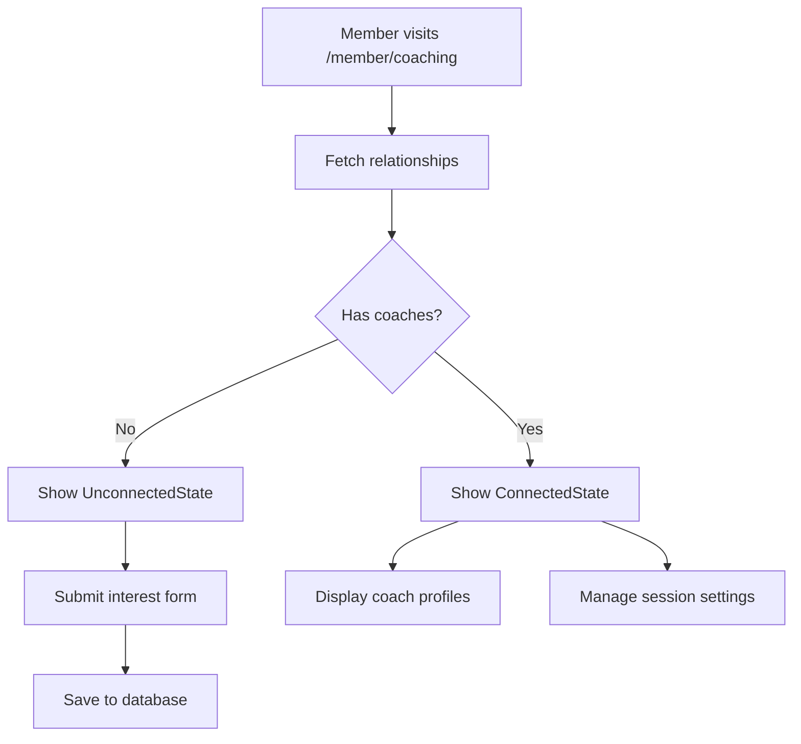
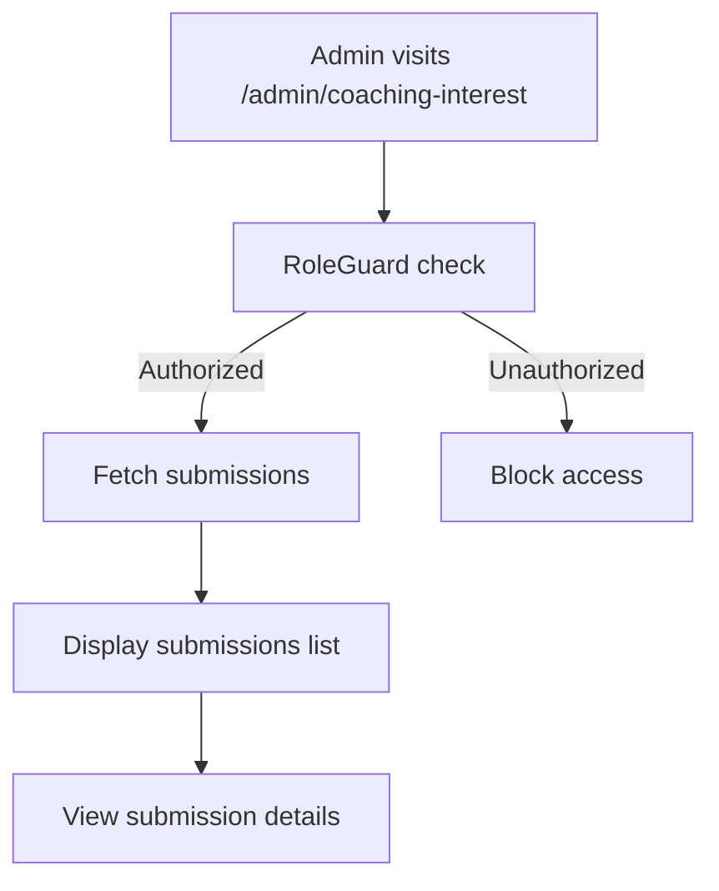

# Coaching Relationships Page - Architectural Decision Record

**Date:** July 14, 2025  
**Task:** Implement Coaching Relationships Page for Arete  
**Status:** Completed  

## Executive Summary

This document records the key architectural and technical design decisions made during the implementation of the `/member/coaching` page and related admin functionality. The implementation involved creating a dual-state coaching interface, resolving critical session synchronization issues, and establishing a robust admin workflow for managing coaching interest submissions.

## Core Architectural Decisions

### 1. **Dual-State Page Architecture**

**Decision:** Implement a single `/member/coaching` page with two distinct states based on relationship status.

**Rationale:**
- **User Experience:** Provides a consistent URL and navigation experience regardless of coaching status
- **Maintainability:** Single page component reduces code duplication and simplifies routing
- **Scalability:** Architecture supports future expansion to multiple coach relationships

**Implementation:**
- `UnconnectedState`: Interest form for members without coaches
- `ConnectedState`: Coach profile display and session settings for connected members
- Dynamic state switching based on API data from `/api/v1/member/coaching-relationships/`

**Files:**
- [`frontend/src/app/member/coaching/page.tsx`](frontend/src/app/member/coaching/page.tsx)
- [`frontend/src/components/coaching/UnconnectedState.tsx`](frontend/src/components/coaching/UnconnectedState.tsx)
- [`frontend/src/components/coaching/ConnectedState.tsx`](frontend/src/components/coaching/ConnectedState.tsx)

### 2. **Database-First Interest Management (vs. Email)**

**Decision:** Store coaching interest submissions directly in MongoDB instead of sending emails.

**Rationale:**
- **Reliability:** Eliminates dependency on external email service (SendGrid) configuration
- **Auditability:** Provides persistent record of all interest submissions with timestamps
- **Admin Workflow:** Enables real-time admin interface for managing submissions
- **MVP Simplicity:** Reduces external dependencies and potential failure points

**Implementation:**
- New `CoachingInterest` model with full CRUD operations
- Admin-only interface at `/admin/coaching-interest` for viewing submissions
- Form submissions saved to `coaching_interests` collection

**Files:**
- [`backend/app/models/coaching_interest.py`](backend/app/models/coaching_interest.py)
- [`backend/app/repositories/coaching_interest_repository.py`](backend/app/repositories/coaching_interest_repository.py)
- [`frontend/src/app/admin/coaching-interest/page.tsx`](frontend/src/app/admin/coaching-interest/page.tsx)

### 3. **Member-Specific API Endpoints**

**Decision:** Create dedicated `/api/v1/member/*` endpoints using `org_optional` dependency.

**Rationale:**
- **Permission Model:** Members don't require organization context to view their own relationships
- **Security:** Maintains proper access control while enabling member self-service
- **Clerk Compliance:** Preserves Clerk as single source of truth for identity

**Implementation:**
- `GET /api/v1/member/coaching-relationships/` - Member's own relationships
- `POST /api/v1/member/coaching-interest/` - Submit interest form
- `GET/PUT /api/v1/member/session-settings/` - Manage session preferences

**Files:**
- [`backend/app/api/v1/endpoints/member.py`](backend/app/api/v1/endpoints/member.py)

### 4. **Proactive JWT Refresh System**

**Decision:** Implement automatic session refresh when role mismatches are detected.

**Problem Solved:** Users with updated roles (e.g., member → admin) were blocked from accessing role-protected pages due to stale JWT tokens.

**Architecture:**
- **Backend Detection:** `SessionValidationMiddleware` detects role mismatches and adds `X-Session-Refresh-Required` header
- **Frontend Interception:** `useApiClient` hook monitors response headers and triggers automatic page reload
- **User Experience:** Toast notification informs users of session refresh process

**Key Principles:**
- **Non-Breaking:** Maintains Clerk as single source of truth
- **Transparent:** Automatic refresh without user intervention required
- **Secure:** Prevents access with stale credentials while enabling seamless role transitions

**Files:**
- [`backend/app/middleware/session_validation.py`](backend/app/middleware/session_validation.py)
- [`frontend/src/hooks/useApiClient.ts`](frontend/src/hooks/useApiClient.ts)

## Technical Design Decisions

### 5. **Component Architecture Pattern**

**Decision:** Implement modular, reusable component structure following established patterns.

**Structure:**
```
coaching/
├── UnconnectedState.tsx     # Empty state with interest form
├── ConnectedState.tsx       # Coach profile and settings
├── InterestForm.tsx         # Form with validation
├── CoachProfile.tsx         # Read-only coach display
└── SessionSettings.tsx      # Toggle for context sharing
```

**Benefits:**
- **Reusability:** Components can be used in other contexts
- **Testability:** Isolated components enable focused testing
- **Maintainability:** Clear separation of concerns

### 6. **State Management Strategy**

**Decision:** Use custom hooks with React Query for data fetching and state management.

**Implementation:**
- `useCoachingRelationships` - Fetch and cache relationship data
- `useSessionSettings` - Manage session preferences with optimistic updates
- `useCoachingInterestSubmissions` - Admin hook for viewing submissions

**Benefits:**
- **Performance:** Built-in caching and background updates
- **User Experience:** Optimistic updates for immediate feedback
- **Error Handling:** Centralized error states and retry logic

### 7. **Design System Compliance**

**Decision:** Strict adherence to existing design system tokens and patterns.

**Implementation:**
- **Colors:** Only OKLCH tokens from `/app/theme.css`
- **Typography:** Inter, Playfair Display, Roboto Mono only
- **Components:** Leverage existing Card, Button, Input components
- **Spacing:** Consistent with established Tailwind patterns

**Enforcement:**
- ESLint rules prevent hardcoded colors
- Design review process ensures consistency
- Component reuse over custom styling

### 8. **Security Architecture**

**Decision:** Implement defense-in-depth security model.

**Layers:**
1. **API Level:** Role-based endpoint access controls
2. **Component Level:** `RoleGuard` wrapper for admin pages
3. **Session Level:** Proactive refresh for stale sessions
4. **Data Level:** User-scoped queries prevent data leakage

**Admin Protection:**
- `RoleGuard` component with `requiredRoles={['admin']}`
- Backend `require_admin_role` dependency
- Graceful fallback for unauthorized access

## Data Flow Architecture

### 9. **Member Coaching Flow**



### 10. **Admin Management Flow**



## Performance Considerations

### 11. **Optimization Strategies**

**Frontend:**
- **Code Splitting:** Lazy load coaching components
- **Caching:** React Query caches relationship data
- **Optimistic UI:** Immediate feedback for setting changes

**Backend:**
- **Database Indexing:** Indexed queries on `member_id` and `coach_id`
- **Query Optimization:** Efficient relationship lookups
- **Session Caching:** Reduced Clerk API calls through caching

## Compliance with Core Principles

### 12. **Architectural Compliance**

✅ **Clerk Single Source of Truth:** All identity decisions flow through Clerk metadata  
✅ **Design System Adherence:** Strict compliance with established tokens and patterns  
✅ **Sustainable Engineering:** Root cause fixes over symptom patches  
✅ **Component-Driven Architecture:** Modular, reusable components  
✅ **Security First:** Defense-in-depth with multiple protection layers  

## Future Considerations

### 13. **Scalability Roadmap**

**Multiple Coaches Support:**
- Current architecture supports multiple coach relationships
- UI designed with card layouts suggesting expandability
- Database schema accommodates one-to-many relationships

**Enhanced Session Management:**
- Current refresh system provides foundation for more sophisticated session handling
- Metrics collection for refresh success rates
- Potential for background token refresh without page reload

**Admin Workflow Enhancement:**
- Current admin interface provides foundation for coach assignment workflow
- Integration points ready for notification systems
- Audit trail capabilities built into data model

## Conclusion

The coaching relationships implementation successfully balances user experience, security, and maintainability while adhering to established architectural principles. The proactive JWT refresh system solves a critical session synchronization issue, and the database-first approach to interest management provides a robust foundation for future coaching workflow enhancements.

The modular component architecture and comprehensive security model ensure the system can scale effectively while maintaining the high standards established in the existing codebase.