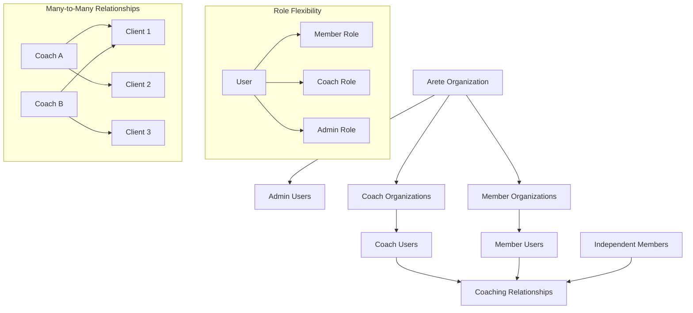

# Clerk Custom Roles and Permissions Integration Plan

## Executive Summary

This document outlines the comprehensive architectural plan for integrating Clerk's custom roles and permissions system into Arete's coaching platform. The integration will support a multi-organizational structure with flexible role assignments, many-to-many coaching relationships, and future-proof organization membership capabilities.

## Current State Analysis

### Existing Role Implementation

**Backend Current State:**
- **Role Service**: File-based role management using `backend/config/approved_users.json`
- **User Model**: Simple role field (`coach` or `client`) in `backend/app/models/user.py`
- **Webhook Handler**: Basic role assignment in `backend/app/api/v1/webhooks/clerk.py`
- **Organization Service**: Limited Clerk organization integration in `backend/app/services/clerk_organization_service.py`

**Frontend Current State:**
- **AuthContext**: Role fetching from backend API in `frontend/src/context/AuthContext.tsx`
- **Navigation**: Role-based filtering in `frontend/src/config/navigation.ts`
- **Access Control**: Component-level role checks throughout the application

### Limitations of Current System
1. **Static Role Assignment**: Roles are hardcoded in JSON configuration
2. **Single Role Per User**: No support for multiple roles
3. **No Organization Hierarchy**: Limited organization relationship management
4. **Manual Role Management**: No dynamic role assignment capabilities
5. **No Permission Granularity**: Binary role-based access only
6. **Simple Relationships**: No support for many-to-many coach-client relationships

## Target Architecture

### Organizational Structure



### Role Definitions

#### 1. **Admin Role**
- **Scope**: Arete Organization
- **Permissions**:
  - Manage all organizations
  - Manage all users and roles
  - Access platform analytics
  - Configure system settings
  - Manage billing and subscriptions

#### 2. **Coach Role**
- **Scope**: Coach Organization(s) + Individual Practice
- **Permissions**:
  - Manage coaching relationships (many-to-many)
  - Access client data (with consent)
  - Create and manage coaching resources
  - Invite and manage clients
  - View coaching analytics
  - Manage coach organization (if admin)
- **Organization Constraints**: 
  - Current: One primary organization
  - Future: Multiple organizations (boutique firm + independent practice)

#### 3. **Member Role** (formerly Client)
- **Scope**: Optional Member Organization + Individual
- **Permissions**:
  - Access personal coaching content
  - Manage personal profile and goals
  - Interact with multiple assigned coaches
  - View personal progress analytics
  - Manage member organization (if admin)
- **Organization Constraints**: Optional membership in Member Organizations

#### 4. **Organization Admin Role**
- **Scope**: Specific Organization (Coach or Member)
- **Permissions**:
  - Manage organization settings
  - Manage organization members
  - View organization analytics
  - Manage billing for organization

### Custom Permissions Structure

```typescript
interface Permission {
  resource: string;
  action: 'create' | 'read' | 'update' | 'delete' | 'manage';
  scope?: 'own' | 'organization' | 'global' | 'relationship';
}

// Example Permissions
const PERMISSIONS = {
  // Admin Permissions
  'platform:manage': { resource: 'platform', action: 'manage', scope: 'global' },
  'users:manage': { resource: 'users', action: 'manage', scope: 'global' },
  'organizations:manage': { resource: 'organizations', action: 'manage', scope: 'global' },
  
  // Coach Permissions
  'coaching_relationships:manage': { resource: 'coaching_relationships', action: 'manage', scope: 'relationship' },
  'client_data:read': { resource: 'client_data', action: 'read', scope: 'relationship' },
  'resources:create': { resource: 'resources', action: 'create', scope: 'organization' },
  'clients:invite': { resource: 'clients', action: 'create', scope: 'organization' },
  
  // Member Permissions
  'profile:manage': { resource: 'profile', action: 'manage', scope: 'own' },
  'goals:manage': { resource: 'goals', action: 'manage', scope: 'own' },
  'progress:read': { resource: 'progress', action: 'read', scope: 'own' },
  'coaches:connect': { resource: 'coaches', action: 'create', scope: 'own' },
  
  // Organization Admin Permissions
  'org_members:manage': { resource: 'org_members', action: 'manage', scope: 'organization' },
  'org_settings:manage': { resource: 'org_settings', action: 'manage', scope: 'organization' },
  'org_billing:manage': { resource: 'org_billing', action: 'manage', scope: 'organization' }
};
```

## Backend Architecture Changes

### 1. Enhanced User Model

```python
# backend/app/models/user.py
from pydantic import BaseModel, Field, ConfigDict
from datetime import datetime
from typing import Optional, List, Dict, Any
from bson import ObjectId

class User(BaseModel):
    model_config = ConfigDict(
        populate_by_name=True,
        arbitrary_types_allowed=True,
        json_encoders={ObjectId: str}
    )
    
    id: Optional[PyObjectId] = Field(default=None, alias="_id")
    clerk_user_id: str
    email: str
    
    # Enhanced role system
    primary_role: str  # "admin", "coach", "member"
    roles: List[str] = Field(default_factory=list)  # Multiple roles support
    
    # Organization memberships
    organization_memberships: List[Dict[str, Any]] = Field(default_factory=list)
    # Format: [{"org_id": "org_123", "role": "admin", "org_type": "coach"}]
    
    # Clerk integration
    clerk_organizations: List[str] = Field(default_factory=list)
    
    created_at: datetime = Field(default_factory=datetime.utcnow)
    updated_at: datetime = Field(default_factory=datetime.utcnow)
```

### 2. Enhanced Coaching Relationship Model

```python
# backend/app/models/coaching_relationship.py
from pydantic import BaseModel, Field, ConfigDict
from datetime import datetime
from typing import Optional, List, Dict, Any
from bson import ObjectId

class CoachingRelationship(BaseModel):
    model_config = ConfigDict(
        populate_by_name=True,
        arbitrary_types_allowed=True,
        json_encoders={ObjectId: str}
    )
    
    id: Optional[PyObjectId] = Field(default=None, alias="_id")
    
    # Many-to-many relationship support
    coach_id: str  # User ID of coach
    member_id: str  # User ID of member
    
    # Organization context
    coach_organization_id: Optional[str] = None
    member_organization_id: Optional[str] = None
    
    # Relationship metadata
    status: str = "active"  # "pending", "active", "paused", "ended"
    start_date: datetime = Field(default_factory=datetime.utcnow)
    end_date: Optional[datetime] = None
    
    # Permissions and access
    permissions: Dict[str, Any] = Field(default_factory=dict)
    
    created_at: datetime = Field(default_factory=datetime.utcnow)
    updated_at: datetime = Field(default_factory=datetime.utcnow)
```

### 3. Enhanced User Service

```python
# backend/app/services/user_service.py
from typing import Optional, List, Dict, Any
from app.models.user import User
from app.repositories.user_repository import UserRepository
from app.services.role_service import RoleService
import logging

logger = logging.getLogger(__name__)

class UserService:
    def __init__(self):
        self.user_repository = UserRepository()
        self.role_service = RoleService()

    async def create_user_from_clerk(self, clerk_user_id: str, email: str, 
                                   primary_role: str, roles: List[str] = None,
                                   organization_memberships: List[Dict[str, Any]] = None) -> User:
        """Create a new user from Clerk webhook data with enhanced role support"""
        try:
            # Check if user already exists
            existing_user = await self.user_repository.get_user_by_clerk_id(clerk_user_id)
            if existing_user:
                return existing_user
            
            # Create new user with enhanced role information
            user = User(
                clerk_user_id=clerk_user_id,
                email=email,
                primary_role=primary_role,
                roles=roles or [],
                organization_memberships=organization_memberships or [],
                clerk_organizations=[]
            )
            
            created_user = await self.user_repository.create_user(user)
            logger.info(f"✅ Successfully created enhanced user: {created_user}")
            return created_user
            
        except Exception as e:
            logger.error(f"❌ Error creating user from Clerk: {e}")
            raise

    async def get_user_roles(self, clerk_user_id: str) -> Dict[str, Any]:
        """Get comprehensive role information for a user"""
        try:
            user = await self.user_repository.get_user_by_clerk_id(clerk_user_id)
            if not user:
                return None
            
            # Get enhanced role information from role service
            roles_info = await self.role_service.get_user_roles(clerk_user_id)
            
            return {
                "user_id": str(user.id),
                "clerk_user_id": user.clerk_user_id,
                "email": user.email,
                "primary_role": user.primary_role,
                "organization_roles": roles_info.get("organization_roles", []),
                "permissions": roles_info.get("permissions", [])
            }
            
        except Exception as e:
            logger.error(f"Error getting user roles: {e}")
            raise

    async def add_organization_membership(self, clerk_user_id: str, org_id: str, role: str) -> bool:
        """Add organization membership to user"""
        try:
            user = await self.user_repository.get_user_by_clerk_id(clerk_user_id)
            if not user:
                return False
            
            # Add organization membership
            membership = {
                "org_id": org_id,
                "role": role,
                "joined_at": datetime.utcnow().isoformat()
            }
            
            user.organization_memberships.append(membership)
            user.clerk_organizations.append(org_id)
            
            await self.user_repository.update_user(str(user.id), {
                "organization_memberships": user.organization_memberships,
                "clerk_organizations": user.clerk_organizations
            })
            
            return True
            
        except Exception as e:
            logger.error(f"Error adding organization membership: {e}")
            return False
```

## Frontend Architecture Changes

### 1. Enhanced AuthContext

```typescript
// frontend/src/context/AuthContext.tsx
"use client";

import React, { createContext, useContext, useState, ReactNode } from 'react';
import { useAuth as useClerkAuth, useUser } from "@clerk/nextjs";

interface OrganizationRole {
  organizationId: string;
  organizationName: string;
  role: string;
  orgType: 'coach' | 'member' | 'arete';
  permissions: string[];
}

interface User {
  id: string;
  firstName: string;
  lastName: string;
  email: string;
  primaryRole: 'admin' | 'coach' | 'member';
  organizationRoles: OrganizationRole[];
  permissions: string[];
  clerkId: string;
}

interface AuthContextType {
  user: User | null;
  isAuthenticated: boolean;
  roleLoaded: boolean;
  currentRole: string | null;
  currentOrganization: string | null;
  login: (user: User) => void;
  logout: () => void;
  switchRole: (role: string, organizationId?: string) => void;
  hasPermission: (permission: string) => boolean;
  getAuthToken: () => Promise<string | null>;
}

export const AuthProvider: React.FC<{ children: ReactNode }> = ({ children }) => {
  const { isSignedIn, getToken } = useClerkAuth();
  const { user: clerkUser } = useUser();
  const [userRoles, setUserRoles] = useState<User | null>(null);
  const [roleLoaded, setRoleLoaded] = useState(false);
  const [currentRole, setCurrentRole] = useState<string | null>(null);
  const [currentOrganization, setCurrentOrganization] = useState<string | null>(null);

  // Fetch enhanced user roles from backend
  React.useEffect(() => {
    const fetchUserRoles = async () => {
      if (isSignedIn && clerkUser && !roleLoaded) {
        try {
          const token = await getToken();
          if (token) {
            const apiUrl = process.env.NEXT_PUBLIC_API_URL || 'http://localhost:8000';
            const response = await fetch(`${apiUrl}/api/v1/users/me/roles`, {
              headers: {
                'Authorization': `Bearer ${token}`,
                'Content-Type': 'application/json',
              },
            });
            
            if (response.ok) {
              const userData = await response.json();
              const enhancedUser: User = {
                id: clerkUser.id,
                firstName: clerkUser.firstName || '',
                lastName: clerkUser.lastName || '',
                email: clerkUser.emailAddresses[0]?.emailAddress || '',
                primaryRole: userData.primaryRole,
                organizationRoles: userData.organizationRoles,
                permissions: userData.permissions,
                clerkId: clerkUser.id
              };
              
              setUserRoles(enhancedUser);
              setCurrentRole(userData.primaryRole);
              setRoleLoaded(true);
            }
          }
        } catch (error) {
          console.error('Failed to fetch user roles:', error);
          setRoleLoaded(true);
        }
      }
    };

    fetchUserRoles();
  }, [isSignedIn, clerkUser, getToken, roleLoaded]);

  const switchRole = (role: string, organizationId?: string) => {
    setCurrentRole(role);
    setCurrentOrganization(organizationId || null);
  };

  const hasPermission = (permission: string): boolean => {
    if (!userRoles) return false;
    
    // If switching roles, check permissions for current role context
    if (currentRole && currentOrganization) {
      const orgRole = userRoles.organizationRoles.find(
        r => r.organizationId === currentOrganization && r.role === currentRole
      );
      return orgRole?.permissions.includes(permission) || false;
    }
    
    // Otherwise check all permissions
    return userRoles.permissions.includes(permission);
  };

  const value: AuthContextType = {
    user: userRoles,
    isAuthenticated: isSignedIn || false,
    roleLoaded,
    currentRole,
    currentOrganization,
    login: (userData: User) => setUserRoles(userData),
    logout: () => {
      setUserRoles(null);
      setCurrentRole(null);
      setCurrentOrganization(null);
    },
    switchRole,
    hasPermission,
    getAuthToken: async () => {
      if (!isSignedIn) return null;
      try {
        return await getToken();
      } catch (error) {
        console.error('Failed to get auth token:', error);
        return null;
      }
    },
  };

  return (
    <AuthContext.Provider value={value}>
      {children}
    </AuthContext.Provider>
  );
};
```

### 2. Role-Based Access Control Components

```typescript
// frontend/src/components/auth/RoleGuard.tsx
import React from 'react';
import { useAuth } from '@/context/AuthContext';

interface RoleGuardProps {
  children: React.ReactNode;
  requiredRole?: string;
  requiredPermission?: string;
  fallback?: React.ReactNode;
}

export const RoleGuard: React.FC<RoleGuardProps> = ({
  children,
  requiredRole,
  requiredPermission,
  fallback = null
}) => {
  const { user, hasPermission, currentRole } = useAuth();

  if (!user) {
    return <>{fallback}</>;
  }

  // Check role requirement
  if (requiredRole && currentRole !== requiredRole) {
    return <>{fallback}</>;
  }

  // Check permission requirement
  if (requiredPermission && !hasPermission(requiredPermission)) {
    return <>{fallback}</>;
  }

  return <>{children}</>;
};

// frontend/src/components/auth/RoleSwitcher.tsx
import React from 'react';
import { useAuth } from '@/context/AuthContext';
import { Select, SelectContent, SelectItem, SelectTrigger, SelectValue } from '@/components/ui/select';
import { Badge } from '@/components/ui/badge';

export const RoleSwitcher: React.FC = () => {
  const { user, currentRole, currentOrganization, switchRole } = useAuth();

  if (!user || user.organizationRoles.length <= 1) {
    return null;
  }

  const handleRoleSwitch = (value: string) => {
    const [role, orgId] = value.split('|');
    switchRole(role, orgId);
  };

  return (
    <div className="flex items-center gap-2">
      <span className="text-sm text-muted-foreground">Role:</span>
      <Select
        value={`${currentRole}|${currentOrganization || ''}`}
        onValueChange={handleRoleSwitch}
      >
        <SelectTrigger className="w-auto">
          <SelectValue />
        </SelectTrigger>
        <SelectContent>
          {user.organizationRoles.map((orgRole) => (
            <SelectItem
              key={`${orgRole.role}|${orgRole.organizationId}`}
              value={`${orgRole.role}|${orgRole.organizationId}`}
            >
              <div className="flex items-center gap-2">
                <Badge variant={orgRole.orgType === 'coach' ? 'default' : 'secondary'}>
                  {orgRole.role}
                </Badge>
                <span className="text-sm">{orgRole.organizationName}</span>
              </div>
            </SelectItem>
          ))}
        </SelectContent>
      </Select>
    </div>
  );
};
```

### 3. Enhanced Navigation Configuration

```typescript
// frontend/src/config/navigation.ts
import { LucideIcon } from 'lucide-react';
import {
  Route,
  Mic,
  User,
  Settings,
  BarChart3,
  Users,
  Building
} from 'lucide-react';

export interface MainNavigationItem {
  id: string;
  icon: LucideIcon;
  label: string;
  description: string;
  href?: string;
  action?: string;
  roles: string[];
  permissions?: string[];
}

export const MAIN_NAVIGATION: MainNavigationItem[] = [
  {
    id: 'console',
    icon: BarChart3,
    label: 'Console',
    description: 'Business management and analytics',
    href: '/console',
    roles: ['coach'],
    permissions: ['analytics:view']
  },
  {
    id: 'journey',
    icon: Route,
    label: 'Journey',
    description: 'Your timeline of growth and discovery',
    href: '/journey',
    roles: ['member'],
    permissions: ['profile:read']
  },
  {
    id: 'clients',
    icon: Users,
    label: 'Clients',
    description: 'Manage your coaching relationships',
    href: '/clients',
    roles: ['coach'],
    permissions: ['coaching_relationships:manage']
  },
  {
    id: 'organizations',
    icon: Building,
    label: 'Organizations',
    description: 'Manage organizations and memberships',
    href: '/organizations',
    roles: ['admin'],
    permissions: ['organizations:manage']
  }
];

// Helper function to filter navigation based on user permissions
export function getNavigationForUser(userRoles: string[], userPermissions: string[]): MainNavigationItem[] {
  return MAIN_NAVIGATION.filter(item => {
    // Check role requirement
    const hasRole = item.roles.some(role => userRoles.includes(role));
    
    // Check permission requirement
    const hasPermission = !item.permissions || 
      item.permissions.some(permission => userPermissions.includes(permission));
    
    return hasRole && hasPermission;
  });
}
```

## Implementation Phases

### Phase 1: Foundation (Weeks 1-2)
1. **Backend Setup**
   - Enhance User model with organization memberships
   - Update Clerk webhook handler for organization events
   - Create enhanced Role Service with Clerk integration

2. **Frontend Setup**
   - Update AuthContext with multi-role support
   - Create RoleGuard and RoleSwitcher components
   - Update navigation configuration

### Phase 2: Organization Management (Weeks 3-4)
1. **Organization Creation**
   - Implement organization creation workflows
   - Set up custom roles for each organization type
   - Create organization admin interfaces

2. **User Management**
   - Implement user invitation flows
   - Create role assignment interfaces
   - Build organization membership management

### Phase 3: Coaching Relationships (Weeks 5-6)
1. **Many-to-Many Relationships**
   - Implement enhanced coaching relationship model
   - Create relationship management interfaces
   - Build coach portability features

2. **Permission System**
   - Implement granular permission checking
   - Create permission-based UI components
   - Build audit logging for permission changes

### Phase 4: Advanced Features (Weeks 7-8)
1. **Role Switching**
   - Implement role switching UI
   - Create context-aware navigation
   - Build role-specific dashboards

2. **Analytics and Reporting**
   - Create organization-level analytics
   - Build role-based reporting
   - Implement usage tracking

## Migration Strategy

### Data Migration
1. **User Data**
   - Migrate existing users to new role structure
   - Create default organization memberships
   - Preserve existing coaching relationships

2. **Organization Setup**
   - Create Arete master organization
   - Set up initial coach and member organizations
   - Migrate existing relationships to new structure

### Rollout Plan
1. **Phase 1**: Internal testing with admin accounts
2. **Phase 2**: Beta testing with select coaches
3. **Phase 3**: Gradual rollout to all users
4. **Phase 4**: Full feature activation

## Security Considerations

### Access Control
- Implement principle of least privilege
- Use Clerk's built-in security features
- Regular permission audits

### Data Protection
- Encrypt sensitive organization data
- Implement data access logging
- Ensure GDPR compliance for organization data

### API Security
- Validate all role and permission checks server-side
- Implement rate limiting for role changes
- Use secure webhook verification

## Testing Strategy

### Unit Tests
- Role assignment logic
- Permission checking functions
- Organization membership management

### Integration Tests
- Clerk webhook processing
- Multi-organization workflows
- Role switching functionality

### End-to-End Tests
- Complete user onboarding flows
- Coaching relationship creation
- Organization management workflows

## Success Metrics

### Technical Metrics
- Zero security vulnerabilities in role system
- 99.9% uptime for role-related services
- <200ms response time for permission checks

### Business Metrics
- Successful migration of all existing users
- 95% user satisfaction with new role system
- Reduced support tickets for access issues

### User Experience Metrics
- Intuitive role switching (measured via user testing)
- Clear permission boundaries
- Seamless organization management

## Conclusion

This comprehensive integration plan provides a robust foundation for implementing Clerk's custom roles and permissions in Arete's coaching platform. The architecture supports current requirements while providing flexibility for future growth, including multi-organizational coaching relationships and advanced permission management.

The phased implementation approach ensures minimal disruption to existing users while gradually introducing powerful new capabilities that will enhance the platform's scalability and user experience.