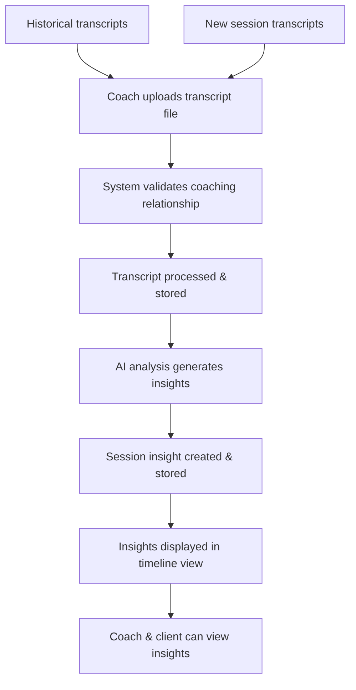
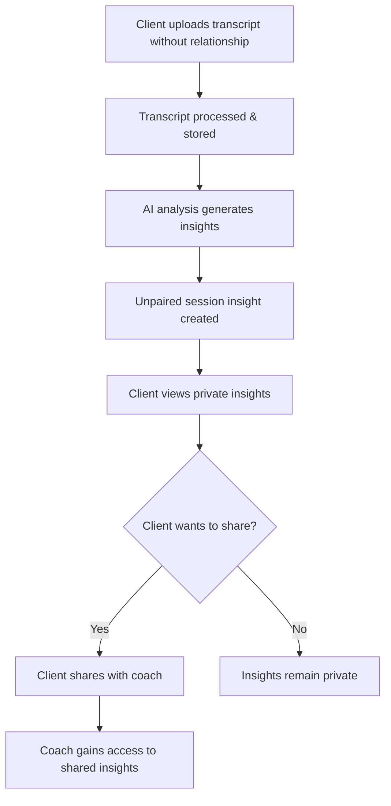

# Session Insights Comprehensive Specification

## Overview

This specification consolidates the session insights feature implementation, combining the comprehensive technical foundation from Sprint S7 with the unpaired client insights capabilities from Sprint S9. The feature provides coaches and clients with AI-powered analysis of coaching session transcripts, generating ICF-aligned insights to support ongoing development.

The system supports both **paired insights** (linked to coaching relationships) and **unpaired insights** (standalone client insights that can be shared later), making the platform accessible to users at all stages of their coaching journey.

## Architecture Integration

The feature builds directly on existing infrastructure:
- [`AnalysisService`](../backend/app/services/analysis_service.py) for AI processing
- Document upload infrastructure from [`DocumentService`](../backend/app/services/document_service.py)
- Coaching relationship model from [`CoachingRelationship`](../backend/app/models/coaching_relationship.py)
- Current API patterns from [`/api/v1/endpoints/`](../backend/app/api/v1/endpoints/)

## Core User Workflows

### Paired Insights Workflow (Traditional)


### Unpaired Insights Workflow (New)


## Key Requirements Summary

### MVP Scope
- **Input Methods**: File upload and text input (leveraging existing document infrastructure)
- **Relationship Linking**: Session insights can be linked to specific coaching relationships OR exist independently
- **ICF-Aligned Analysis**: Comprehensive insights including celebration, intention, discoveries, goal progress, coaching presence, powerful questions, action items, emotional shifts, values/beliefs, and communication patterns
- **Flexible Access Control**: 
  - Paired insights: Both coaches and clients can view insights for their relationships
  - Unpaired insights: Private to client by default, shareable with coaches
- **Timeline View**: Chronological display of session insights for each coaching relationship
- **Sharing System**: Clients can share unpaired insights with coaches with granular permissions

### Out of Scope for MVP
- Real-time scheduling or calendar integration
- In-session note-taking functionality
- Transcript URL import from platforms
- Bulk sharing operations
- Advanced permission management beyond basic view/share
- Insight collaboration features (commenting, co-editing)

---

## 1. Database Models & Schemas

### Updated Model: SessionInsight

```python
# backend/app/models/session_insight.py
from pydantic import BaseModel, Field, ConfigDict
from datetime import datetime
from typing import Optional, List, Dict, Any
from bson import ObjectId
from enum import Enum

class SessionInsightStatus(str, Enum):
    PENDING = "pending"
    PROCESSING = "processing" 
    COMPLETED = "completed"
    FAILED = "failed"

class Celebration(BaseModel):
    """A win or achievement to celebrate from the session"""
    description: str
    significance: str  # Why this is meaningful
    evidence: List[str]  # Supporting quotes from transcript

class Intention(BaseModel):
    """An intention for behavior change discussed during session"""
    behavior_change: str
    commitment_level: str  # "Strong", "Moderate", "Exploratory"
    timeline: Optional[str] = None
    support_needed: List[str] = []

class ClientDiscovery(BaseModel):
    """New insights the client gained about themselves"""
    insight: str
    depth_level: str  # "Surface", "Moderate", "Deep"
    emotional_response: str  # Client's reaction to the discovery
    evidence: List[str]

class GoalProgress(BaseModel):
    """Progress toward stated goals and commitments"""
    goal_area: str
    progress_description: str
    progress_level: str  # "Significant", "Moderate", "Minimal", "Setback"
    barriers_identified: List[str] = []
    next_steps: List[str] = []

class CoachingPresence(BaseModel):
    """Quality of coaching relationship and client engagement"""
    client_engagement_level: str  # "High", "Moderate", "Low"
    rapport_quality: str
    trust_indicators: List[str] = []
    partnership_dynamics: str

class PowerfulQuestion(BaseModel):
    """Questions that led to breakthroughs or deeper reflection"""
    question: str
    impact_description: str
    client_response_summary: str
    breakthrough_level: str  # "Major", "Moderate", "Minor"

class ActionItem(BaseModel):
    """Concrete next steps and commitments identified"""
    action: str
    timeline: Optional[str] = None
    accountability_measure: Optional[str] = None
    client_commitment_level: str  # "High", "Medium", "Low"

class EmotionalShift(BaseModel):
    """Changes in client's emotional state during session"""
    initial_state: str
    final_state: str
    shift_description: str
    catalyst: str  # What caused the shift

class ValuesBeliefs(BaseModel):
    """Core values or limiting beliefs that surfaced"""
    type: str  # "Core Value", "Limiting Belief", "Empowering Belief"
    description: str
    impact_on_goals: str
    exploration_depth: str

class CommunicationPattern(BaseModel):
    """How the client processes information and expresses themselves"""
    processing_style: str  # "Visual", "Auditory", "Kinesthetic", "Mixed"
    expression_patterns: List[str]
    communication_preferences: List[str]
    notable_changes: List[str] = []

class SessionMetadata(BaseModel):
    """Metadata about the session and analysis"""
    session_duration_minutes: Optional[int] = None
    transcript_word_count: int
    ai_provider: str
    model_version: str
    processing_time_seconds: float
    analysis_confidence: float = Field(ge=0.0, le=1.0)

class SessionInsight(BaseModel):
    model_config = ConfigDict(
        populate_by_name=True,
        arbitrary_types_allowed=True,
        json_encoders={ObjectId: str}
    )
    
    id: Optional[PyObjectId] = Field(default=None, alias="_id")
    
    # Relationships - NOW OPTIONAL for unpaired insights
    coaching_relationship_id: Optional[str] = None  # Links to CoachingRelationship
    client_user_id: str  # Client who owns the insight (always required)
    coach_user_id: Optional[str] = None   # Coach in the relationship (optional for unpaired)
    
    # Unpaired insight support
    is_unpaired: bool = False  # Flag to identify unpaired insights
    shared_with_coaches: List[str] = Field(default_factory=list)  # Coach user IDs with access
    sharing_permissions: Dict[str, Any] = Field(default_factory=dict)  # Granular permissions
    
    # Session Information
    session_date: Optional[datetime] = None  # When the session occurred
    session_title: Optional[str] = None  # Optional session title/topic
    transcript_source: str  # "file_upload", "text_input", "url_import"
    source_document_id: Optional[str] = None  # If uploaded as document
    
    # Core Insights (ICF-aligned)
    celebration: Optional[Celebration] = None
    intention: Optional[Intention] = None
    client_discoveries: List[ClientDiscovery] = Field(default_factory=list)
    goal_progress: List[GoalProgress] = Field(default_factory=list)
    coaching_presence: Optional[CoachingPresence] = None
    powerful_questions: List[PowerfulQuestion] = Field(default_factory=list)
    action_items: List[ActionItem] = Field(default_factory=list)
    emotional_shifts: List[EmotionalShift] = Field(default_factory=list)
    values_beliefs: List[ValuesBeliefs] = Field(default_factory=list)
    communication_patterns: Optional[CommunicationPattern] = None
    
    # Summary & Overview
    session_summary: str  # High-level session overview
    key_themes: List[str] = Field(default_factory=list)
    overall_session_quality: str  # "Excellent", "Good", "Average", "Needs Improvement"
    
    # Processing Information
    status: SessionInsightStatus = SessionInsightStatus.PENDING
    processing_error: Optional[str] = None
    metadata: Optional[SessionMetadata] = None
    
    # Access & Audit
    created_by: str  # User ID who created this insight
    visible_to_client: bool = True
    visible_to_coach: bool = True
    
    # Timestamps
    created_at: datetime = Field(default_factory=datetime.utcnow)
    updated_at: datetime = Field(default_factory=datetime.utcnow)
    completed_at: Optional[datetime] = None
```

### Updated Schemas: Session Insight Schemas

```python
# backend/app/schemas/session_insight.py
from pydantic import BaseModel
from typing import List, Optional, Dict, Any
from datetime import datetime

class SessionInsightCreateRequest(BaseModel):
    coaching_relationship_id: Optional[str] = None  # Now optional
    session_date: Optional[str] = None  # ISO format
    session_title: Optional[str] = None
    transcript_text: Optional[str] = None  # For direct text input

class UnpairedSessionInsightCreateRequest(BaseModel):
    session_date: Optional[str] = None
    session_title: Optional[str] = None
    transcript_text: str

class ShareInsightRequest(BaseModel):
    coach_user_id: str
    permissions: Dict[str, bool] = {
        "view": True,
        "comment": False,
        "export": False
    }

class SessionInsightResponse(BaseModel):
    id: str
    coaching_relationship_id: Optional[str] = None
    client_user_id: str
    coach_user_id: Optional[str] = None
    is_unpaired: bool = False
    session_date: Optional[str] = None
    session_title: Optional[str] = None
    session_summary: str
    key_themes: List[str]
    overall_session_quality: str
    status: str
    created_at: str
    completed_at: Optional[str] = None
    
    # Simplified insight counts for list view
    celebration_count: int = 0
    intention_count: int = 0
    discovery_count: int = 0
    action_item_count: int = 0
    
class SessionInsightDetailResponse(SessionInsightResponse):
    """Extended response with full insight details"""
    celebration: Optional[dict] = None
    intention: Optional[dict] = None
    client_discoveries: List[dict] = []
    goal_progress: List[dict] = []
    coaching_presence: Optional[dict] = None
    powerful_questions: List[dict] = []
    action_items: List[dict] = []
    emotional_shifts: List[dict] = []
    values_beliefs: List[dict] = []
    communication_patterns: Optional[dict] = None

class SessionInsightListResponse(BaseModel):
    insights: List[SessionInsightResponse]
    total_count: int
    relationship_id: Optional[str] = None
    client_name: str
    coach_name: Optional[str] = None

class MyInsightsResponse(BaseModel):
    paired_insights: List[SessionInsightResponse]
    unpaired_insights: List[SessionInsightResponse]
    total_count: int
```

---

## 2. API Endpoints

### Updated Endpoint File: Session Insights

```python
# backend/app/api/v1/endpoints/session_insights.py
from fastapi import APIRouter, Depends, HTTPException, status, UploadFile, File, Form
from app.api.v1.deps import get_current_user_clerk_id
from app.schemas.session_insight import (
    SessionInsightCreateRequest, 
    UnpairedSessionInsightCreateRequest,
    SessionInsightResponse, 
    SessionInsightDetailResponse,
    SessionInsightListResponse,
    MyInsightsResponse,
    ShareInsightRequest
)
from app.services.session_insight_service import SessionInsightService
from typing import Optional, List, Dict

router = APIRouter()

# Paired insights endpoints (original functionality)
@router.post("/", response_model=SessionInsightResponse)
async def create_session_insight_from_file(
    coaching_relationship_id: str = Form(...),
    session_date: Optional[str] = Form(None),
    session_title: Optional[str] = Form(None),
    transcript_file: UploadFile = File(...),
    current_user_id: str = Depends(get_current_user_clerk_id)
):
    """
    Create session insight from uploaded transcript file for a coaching relationship.
    
    Supports common text file formats (txt, docx, pdf) and processes
    them through the existing document processing pipeline.
    """
    # Implementation details...

@router.post("/from-text", response_model=SessionInsightResponse) 
async def create_session_insight_from_text(
    request: SessionInsightCreateRequest,
    current_user_id: str = Depends(get_current_user_clerk_id)
):
    """
    Create session insight from pasted transcript text for a coaching relationship.
    
    Alternative to file upload for direct text input.
    """
    # Implementation details...

# Unpaired insights endpoints (new functionality)
@router.post("/unpaired", response_model=SessionInsightResponse)
async def create_unpaired_session_insight_from_file(
    session_date: Optional[str] = Form(None),
    session_title: Optional[str] = Form(None),
    transcript_file: UploadFile = File(...),
    current_user_id: str = Depends(get_current_user_clerk_id)
):
    """
    Create unpaired session insight from uploaded transcript file.
    
    Does not require a coaching relationship. Insight is private to the client
    by default but can be shared with coaches later.
    """
    # Implementation details...

@router.post("/unpaired/from-text", response_model=SessionInsightResponse)
async def create_unpaired_session_insight_from_text(
    request: UnpairedSessionInsightCreateRequest,
    current_user_id: str = Depends(get_current_user_clerk_id)
):
    """
    Create unpaired session insight from pasted transcript text.
    
    Alternative to file upload for direct text input without coaching relationship.
    """
    # Implementation details...

# Unified insights retrieval
@router.get("/my-insights", response_model=MyInsightsResponse)
async def get_my_insights(
    include_unpaired: bool = True,
    include_paired: bool = True,
    limit: int = 20,
    offset: int = 0,
    current_user_id: str = Depends(get_current_user_clerk_id)
):
    """
    Get all insights for the current user (both paired and unpaired).
    
    Returns categorized insights with filtering options.
    """
    # Implementation details...

@router.get("/relationship/{relationship_id}", response_model=SessionInsightListResponse)
async def get_session_insights_for_relationship(
    relationship_id: str,
    limit: int = 20,
    offset: int = 0,
    current_user_id: str = Depends(get_current_user_clerk_id)
):
    """
    Get all session insights for a coaching relationship.
    
    Returns paginated list of insights ordered by session date (newest first).
    Includes summary data and insight counts for list display.
    """
    # Implementation details...

@router.get("/{insight_id}", response_model=SessionInsightDetailResponse)
async def get_session_insight_detail(
    insight_id: str,
    current_user_id: str = Depends(get_current_user_clerk_id)
):
    """
    Get detailed view of a specific session insight.
    
    Returns complete insight data including all ICF-aligned analysis sections.
    Handles both paired and unpaired insights with appropriate access controls.
    """
    # Implementation details...

# Sharing endpoints
@router.post("/{insight_id}/share", response_model=Dict[str, str])
async def share_insight_with_coach(
    insight_id: str,
    request: ShareInsightRequest,
    current_user_id: str = Depends(get_current_user_clerk_id)
):
    """
    Share an unpaired insight with a coach.
    
    Only the insight owner can share insights. Supports granular permissions.
    """
    # Implementation details...

@router.delete("/{insight_id}/share/{coach_user_id}")
async def revoke_insight_sharing(
    insight_id: str,
    coach_user_id: str,
    current_user_id: str = Depends(get_current_user_clerk_id)
):
    """
    Revoke sharing access for a specific coach.
    
    Only the insight owner can revoke sharing permissions.
    """
    # Implementation details...

@router.delete("/{insight_id}")
async def delete_session_insight(
    insight_id: str,
    current_user_id: str = Depends(get_current_user_clerk_id)
):
    """
    Delete a session insight.
    
    Only the creator or coach in the relationship can delete insights.
    """
    # Implementation details...
```

### API Integration Points

```python
# backend/app/main.py - Add to existing router includes
app.include_router(
    session_insights.router, 
    prefix="/api/v1/session-insights", 
    tags=["session-insights"]
)
```

---

## 3. Services & Business Logic

### Updated Service: SessionInsightService

```python
# backend/app/services/session_insight_service.py
from typing import List, Optional, Dict, Any
from app.models.session_insight import SessionInsight
from app.repositories.session_insight_repository import SessionInsightRepository
from app.repositories.coaching_relationship_repository import CoachingRelationshipRepository
from app.services.ai_service import AIService
from app.services.text_extraction_service import TextExtractionService
import logging

logger = logging.getLogger(__name__)

class SessionInsightService:
    def __init__(self, 
                 insight_repository: SessionInsightRepository,
                 relationship_repository: CoachingRelationshipRepository):
        self.insight_repository = insight_repository
        self.relationship_repository = relationship_repository
        self.ai_service = AIService()
        self.text_extraction_service = TextExtractionService()
    
    async def create_insight_from_transcript(
        self,
        coaching_relationship_id: str,
        transcript_content: str,
        created_by: str,
        session_date: Optional[str] = None,
        session_title: Optional[str] = None,
        source_document_id: Optional[str] = None
    ) -> SessionInsight:
        """
        Create session insight from transcript content for a coaching relationship.
        
        Validates relationship access, processes transcript through AI analysis,
        and creates structured insight record.
        """
        try:
            # Validate coaching relationship exists and user has access
            relationship = await self.relationship_repository.get_relationship_by_id(
                coaching_relationship_id
            )
            if not relationship:
                raise ValueError("Coaching relationship not found")
            
            # Validate user is part of the relationship
            if created_by not in [relationship.coach_user_id, relationship.client_user_id]:
                raise ValueError("User not authorized for this coaching relationship")
            
            # Create pending insight record
            pending_insight = SessionInsight(
                coaching_relationship_id=coaching_relationship_id,
                client_user_id=relationship.client_user_id,
                coach_user_id=relationship.coach_user_id,
                is_unpaired=False,
                session_date=datetime.fromisoformat(session_date) if session_date else None,
                session_title=session_title,
                transcript_source="file_upload" if source_document_id else "text_input",
                source_document_id=source_document_id,
                session_summary="Processing transcript...",
                status=SessionInsightStatus.PROCESSING,
                created_by=created_by
            )
            
            return await self._process_insight(pending_insight, transcript_content)
            
        except Exception as e:
            logger.error(f"❌ Error creating session insight: {e}")
            raise

    async def create_unpaired_insight_from_transcript(
        self,
        client_user_id: str,
        transcript_content: str,
        session_date: Optional[str] = None,
        session_title: Optional[str] = None,
        source_document_id: Optional[str] = None
    ) -> SessionInsight:
        """
        Create unpaired session insight from transcript content.
        
        Does not require a coaching relationship. Insight is private to the client
        by default but can be shared with coaches later.
        """
        try:
            # Create pending unpaired insight record
            pending_insight = SessionInsight(
                coaching_relationship_id=None,
                client_user_id=client_user_id,
                coach_user_id=None,
                is_unpaired=True,
                session_date=datetime.fromisoformat(session_date) if session_date else None,
                session_title=session_title,
                transcript_source="file_upload" if source_document_id else "text_input",
                source_document_id=source_document_id,
                session_summary="Processing transcript...",
                status=SessionInsightStatus.PROCESSING,
                created_by=client_user_id,
                visible_to_coach=False  # Private by default
            )
            
            return await self._process_insight(pending_insight, transcript_content)
            
        except Exception as e:
            logger.error(f"❌ Error creating unpaired session insight: {e}")
            raise

    async def _process_insight(
        self, 
        pending_insight: SessionInsight, 
        transcript_content: str
    ) -> SessionInsight:
        """
        Common processing logic for both paired and unpaired insights.
        """
        # Save pending insight
        saved_insight = await self.insight_repository.create_insight(pending_insight)
        logger.info(f"Created pending session insight: {saved_insight.id}")
        
        try:
            # Generate AI analysis
            session_context = {
                "relationship_duration": "Unknown",
                "previous_session_count": await self._get_previous_session_count(
                    saved_insight.coaching_relationship_id, saved_insight.client_user_id
                ),
                "is_unpaired": saved_insight.is_unpaired
            }
            
            analysis_result = await self.ai_service.generate_session_insights(
                transcript_content, 
                session_context
            )
            
            # Update insight with analysis results
            completed_insight = self._build_insight_from_analysis(
                saved_insight, 
                analysis_result, 
                transcript_content
            )
            
            # Save completed insight
            updated_insight = await self.insight_repository.update_insight(
                str(saved_insight.id),
                completed_insight.model_dump(exclude={"id"})
            )
            
            logger.info(f"✅ Successfully generated session insight: {updated_insight.id}")
            return updated_insight
            
        except Exception as e:
            logger.error(f"❌ Error processing session insight: {e}")
            # Update insight status to failed
            await self.insight_repository.update_insight(
                str(saved_insight.id),
                {"status": SessionInsightStatus.FAILED, "processing_error": str(e)}
            )
            raise
    
    async def get_insights_for_relationship(
        self,
        relationship_id: str,
        requesting_user_id: str,
        limit: int = 20,
        offset: int = 0
    ) -> List[SessionInsight]:
        """
        Get session insights for a coaching relationship.
        
        Validates user access and returns paginated insights.
        """
        # Validate relationship access
        relationship = await self.relationship_repository.get_relationship_by_id(relationship_id)
        if not relationship:
            raise ValueError("Coaching relationship not found")
        
        if requesting_user_id not in [relationship.coach_user_id, relationship.client_user_id]:
            raise ValueError("User not authorized for this coaching relationship")
        
        # Fetch insights
        insights = await self.insight_repository.get_insights_by_relationship(
            relationship_id, limit, offset
        )
        
        return insights

    async def get_user_insights(
        self,
        user_id: str,
        include_unpaired: bool = True,
        include_paired: bool = True,
        limit: int = 20,
        offset: int = 0
    ) -> Dict[str, List[SessionInsight]]:
        """
        Get all insights for a user (both paired and unpaired).
        
        Returns categorized insights based on their type.
        """
        insights = await self.insight_repository.get_insights_by_user(
            user_id, include_unpaired, include_paired, limit, offset
        )
        
        paired_insights = [i for i in insights if not i.is_unpaired]
        unpaired_insights = [i for i in insights if i.is_unpaired]
        
        return {
            "paired_insights": paired_insights,
            "unpaired_insights": unpaired_insights
        }

    async def share_insight_with_coach(
        self,
        insight_id: str,
        client_user_id: str,
        coach_user_id: str,
        permissions: Dict[str, bool]
    ) -> bool:
        """
        Share an unpaired insight with a coach.
        
        Only the insight owner can share insights.
        """
        # Validate insight ownership
        insight = await self.insight_repository.get_insight_by_id(insight_id)
        if not insight or insight.client_user_id != client_user_id:
            raise ValueError("Insight not found or access denied")
        
        if not insight.is_unpaired:
            raise ValueError("Only unpaired insights can be shared")
        
        # Update sharing permissions
        shared_coaches = insight.shared_with_coaches.copy()
        if coach_user_id not in shared_coaches:
            shared_coaches.append(coach_user_id)
        
        sharing_permissions = insight.sharing_permissions.copy()
        sharing_permissions[coach_user_id] = permissions
        
        success = await self.insight_repository.update_insight(
            insight_id,
            {
                "shared_with_coaches": shared_coaches,
                "sharing_permissions": sharing_permissions
            }
        )
        
        return success is not None

    async def get_shared_insights_for_coach(
        self,
        coach_user_id: str,
        limit: int = 20,
        offset: int = 0
    ) -> List[SessionInsight]:
        """
        Get insights that have been shared with a specific coach.
        """
        return await self.insight_repository.get_shared_insights_for_coach(
            coach_user_id, limit, offset
        )
    
    async def _get_previous_session_count(
        self, 
        relationship_id: Optional[str], 
        client_user_id: str
    ) -> int:
        """Get count of previous sessions for context"""
        if relationship_id:
            insights = await self.insight_repository.get_insights_by_relationship(
                relationship_id, limit=1000, offset=0
            )
        else:
            # For unpaired insights, count all insights for the client
            insights = await self.insight_repository.get_insights_by_user(
                client_user_id, include_unpaired=True, include_paired=True, limit=1000, offset=0
            )
        return len(insights)
    
    def _build_insight_from_analysis(
        self, 
        base_insight: SessionInsight, 
        analysis: dict, 
        transcript_content: str
    ) -> SessionInsight:
        """Build complete insight object from AI analysis results"""
        
        # Map analysis results to insight model
        base_insight.celebration = Celebration(**analysis["celebration"]) if analysis.get("celebration") else None
        base_insight.intention = Intention(**analysis["intention"]) if analysis.get("intention") else None
        base_insight.client_discoveries = [ClientDiscovery(**d) for d in analysis.get("client_discoveries", [])]
        base_insight.goal_progress = [GoalProgress(**g) for g in analysis.get("goal_progress", [])]
        base_insight.coaching_presence = CoachingPresence(**analysis["coaching_presence"]) if analysis.get("coaching_presence") else None
        base_insight.powerful_questions = [PowerfulQuestion(**q) for q in analysis.get("powerful_questions", [])]
        base_insight.action_items = [ActionItem(**a) for a in analysis.get("action_items", [])]
        base_insight.emotional_shifts = [EmotionalShift(**e) for e in analysis.get("emotional_shifts", [])]
        base_insight.values_beliefs = [ValuesBeliefs(**v) for v in analysis.get("values_beliefs", [])]
        base_insight.communication_patterns = CommunicationPattern(**analysis["communication_patterns"]) if analysis.get("communication_patterns") else None
        
        # Set summary fields
        base_insight.session_summary = analysis.get("session_summary", "")
        base_insight.key_themes = analysis.get("key_themes", [])
        base_insight.overall_session_quality = analysis.get("overall_session_quality", "Average")
        
        # Set completion status
        base_insight.status = SessionInsightStatus.COMPLETED
        base_insight.completed_at = datetime.utcnow()
        
        # Add metadata
        base_insight.metadata = SessionMetadata(
            transcript_word_count=len(transcript_content.split()),
            ai_provider=settings.ai_provider,
            model_version=settings.ai_model,
            processing_time_seconds=0.0,  # Would be calculated
            analysis_confidence=0.85  # Could be derived from AI response
        )
        
        return base_insight
```

---

## 4. Repository Layer

### Updated Repository: SessionInsightRepository

```python
# backend/app/repositories/session_insight_repository.py
from typing import List, Optional, Dict, Any
from app.models.session_insight import SessionInsight
from app.db.mongodb import get_database
from bson import ObjectId
from datetime import datetime
import logging

logger = logging.getLogger(__name__)

class SessionInsightRepository:
    def __init__(self):
        self.db = get_database()
        self.collection = self.db.session_insights
    
    async def create_insight(self, insight: SessionInsight) -> SessionInsight:
        """Create a new session insight"""
        try:
            insight_dict = insight.model_dump(by_alias=True, exclude={"id"})
            result = await self.collection.insert_one(insight_dict)
            
            # Fetch the created insight
            created_insight = await self.collection.find_one({"_id": result.inserted_id})
            return SessionInsight(**created_insight)
            
        except Exception as e:
            logger.error(f"Error creating session insight: {e}")
            raise
    
    async def get_insight_by_id(self, insight_id: str) -> Optional[SessionInsight]:
        """Get session insight by ID"""
        try:
            if not ObjectId.is_valid(insight_id):
                return None
                
            insight_data = await self.collection.find_one({"_id": ObjectId(insight_id)})
            return SessionInsight(**insight_data) if insight_data else None
            
        except Exception as e:
            logger.error(f"Error fetching insight {insight_id}: {e}")
            return None
    
    async def get_insights_by_relationship(
        self, 
        relationship_id: str,
        limit: int = 20,
        offset: int = 0
    ) -> List[SessionInsight]:
        """Get session insights for a coaching relationship"""
        try:
            cursor = self.collection.find(
                {"coaching_relationship_id": relationship_id}
            ).sort("session_date", -1).skip(offset).limit(limit)
            
            insights = []
            async for insight_data in cursor:
                insights.append(SessionInsight(**insight_data))
            
            return insights
            
        except Exception as e:
            logger.error(f"Error fetching insights for relationship {relationship_id}: {e}")
            return []

    async def get_insights_by_user(
        self,
        user_id: str,
        include_unpaired: bool = True,
        include_paired: bool = True,
        limit: int = 20,
        offset: int = 0
    ) -> List[SessionInsight]:
        """Get session insights for a user (both paired and unpaired)"""
        try:
            query_conditions = []
            
            if include_unpaired:
                query_conditions.append({"client_user_id": user_id, "is_unpaired": True})
            
            if include_paired:
                query_conditions.append({"client_user_id": user_id, "is_unpaired": False})
                query_conditions.append({"coach_user_id": user_id, "is_unpaired": False})
            
            if not query_conditions:
                return []
            
            query = {"$or": query_conditions} if len(query_conditions) > 1 else query_conditions[0]
            
            cursor = self.collection.find(query).sort("session_date", -1).skip(offset).limit(limit)
            
            insights = []
            async for insight_data in cursor:
                insights.append(SessionInsight(**insight_data))
            
            return insights
            
        except Exception as e:
            logger.error(f"Error fetching insights for user {user_id}: {e}")
            return []

    async def get_shared_insights_for_coach(
        self,
        coach_user_id: str,
        limit: int = 20,
        offset: int = 0
    ) -> List[SessionInsight]:
        """Get insights that have been shared with a specific coach"""
        try:
            cursor = self.collection.find(
                {"shared_with_coaches": coach_user_id}
            ).sort("session_date", -1).skip(offset).limit(limit)
            
            insights = []
            async for insight_data in cursor:
                insights.append(SessionInsight(**insight_data))
            
            return insights
            
        except Exception as e:
            logger.error(f"Error fetching shared insights for coach {coach_user_id}: {e}")
            return []
    
    async def update_insight(self, insight_id: str, update_data: Dict[str, Any]) -> Optional[SessionInsight]:
        """Update session insight"""
        try:
            if not ObjectId.is_valid(insight_id):
                return None
            
            update_data["updated_at"] = datetime.utcnow()
            
            result = await self.collection.update_one(
                {"_id": ObjectId(insight_id)},
                {"$set": update_data}
            )
            
            if result.modified_count > 0:
                return await self.get_insight_by_id(insight_id)
            return None
            
        except Exception as e:
            logger.error(f"Error updating insight {insight_id}: {e}")
            return None
    
    async def delete_insight(self, insight_id: str) -> bool:
        """Delete session insight"""
        try:
            if not ObjectId.is_valid(insight_id):
                return False
                
            result = await self.collection.delete_one({"_id": ObjectId(insight_id)})
            return result.deleted_count > 0
            
        except Exception as e:
            logger.error(f"Error deleting insight {insight_id}: {e}")
            return False
    
    async def get_insights_count_by_relationship(self, relationship_id: str) -> int:
        """Get total count of insights for a relationship"""
        try:
            return await self.collection.count_documents(
                {"coaching_relationship_id": relationship_id}
            )
        except Exception as e:
            logger.error(f"Error counting insights for relationship {relationship_id}: {e}")
            return 0
```

### Database Indexes

```python
# backend/app/db/mongodb.py - Add to database initialization
async def create_session_insight_indexes():
    """Create indexes for session insights collection"""
    db = get_database()
    collection = db.session_insights
    
    # Index for relationship queries
    await collection.create_index("coaching_relationship_id")
    
    # Index for date-based sorting
    await collection.create_index([("coaching_relationship_id", 1), ("session_date", -1)])
    
    # Index for status queries
    await collection.create_index("status")
    
    # Index for user access (both paired and unpaired)
    await collection.create_index("coach_user_id")
    await collection.create_index("client_user_id")
    
    # Index for unpaired insights
    await collection.create_index([("client_user_id", 1), ("is_unpaired", 1)])
    
    # Index for shared insights
    await collection.create_index("shared_with_coaches")
    
    logger.info("✅ Session insight indexes created")
```

---

## 5. Frontend Components

### Updated Page: Session Insights Dashboard

```typescript
// frontend/src/app/dashboard/insights/page.tsx
'use client';

import { useState, useEffect } from 'react';
import { useAuth } from '@clerk/nextjs';
import { Card, CardContent, CardHeader, CardTitle } from '@/components/ui/card';
import { Button } from '@/components/ui/button';
import { Tabs, TabsContent, TabsList, TabsTrigger } from '@/components/ui/tabs';
import { Badge } from '@/components/ui/badge';
import { MyInsightsDashboard } from '@/components/insights/MyInsightsDashboard';
import { UnpairedInsightUpload } from '@/components/insights/UnpairedInsightUpload';
import { SessionInsightDetail } from '@/components/insights/SessionInsightDetail';
import { sessionInsightService } from '@/services/sessionInsightService';
import { SessionInsight, MyInsightsResponse } from '@/types/sessionInsight';

type ViewState = 'my-insights' | 'relationship-insights' | 'upload-unpaired' | 'upload-paired' | 'detail';

export default function InsightsPage() {
  const { getToken } = useAuth();
  const [currentView, setCurrentView] = useState<ViewState>('my-insights');
  const [selectedInsight, setSelectedInsight] = useState<SessionInsight | null>(null);
  const [myInsights, setMyInsights] = useState<MyInsightsResponse | null>(null);
  const [loading, setLoading] = useState(true);

  useEffect(() => {
    loadMyInsights();
  }, []);

  const loadMyInsights = async () => {
    try {
      setLoading(true);
      const token = await getToken();
      if (token) {
        const insights = await sessionInsightService.getMyInsights(token);
        setMyInsights(insights);
      }
    } catch (error) {
      console.error('Error loading insights:', error);
    } finally {
      setLoading(false);
    }
  };

  const handleViewInsight = (insight: SessionInsight) => {
    setSelectedInsight(insight);
    setCurrentView('detail');
  };

  const handleBackToList = () => {
    setCurrentView('my-insights');
    setSelectedInsight(null);
  };

  const handleUnpairedUploadSuccess = () => {
    loadMyInsights();
    setCurrentView('my-insights');
  };

  if (loading) {
    return (
      <div className="container mx-auto py-8">
        <div className="flex items-center justify-center h-64">
          <div className="text-lg">Loading insights...</div>
        </div>
      </div>
    );
  }

  return (
    <div className="container mx-auto py-8">
      {currentView === 'detail' && selectedInsight ? (
        <SessionInsightDetail 
          insight={selectedInsight} 
          onBack={handleBackToList}
        />
      ) : currentView === 'upload-unpaired' ? (
        <div className="max-w-2xl mx-auto">
          <div className="mb-6">
            <Button variant="outline" onClick={() => setCurrentView('my-insights')}>
              ← Back to Insights
            </Button>
          </div>
          <UnpairedInsightUpload onSuccess={handleUnpairedUploadSuccess} />
        </div>
      ) : (
        <>
          <div className="flex items-center justify-between mb-8">
            <div>
              <h1 className="text-3xl font-bold">Session Insights</h1>
              <p className="text-gray-600 mt-2">
                AI-powered analysis of your coaching sessions
              </p>
            </div>
            <div className="flex space-x-3">
              <Button 
                onClick={() => setCurrentView('upload-unpaired')}
                className="bg-blue-600 hover:bg-blue-700"
              >
                Upload Session
              </Button>
            </div>
          </div>

          <Tabs defaultValue="all" className="w-full">
            <TabsList className="grid w-full grid-cols-3">
              <TabsTrigger value="all">All Insights</TabsTrigger>
              <TabsTrigger value="paired">
                Paired ({myInsights?.paired_insights.length || 0})
              </TabsTrigger>
              <TabsTrigger value="unpaired">
                Unpaired ({myInsights?.unpaired_insights.length || 0})
              </TabsTrigger>
            </TabsList>

            <TabsContent value="all" className="mt-6">
              <MyInsightsDashboard
                insights={[
                  ...(myInsights?.paired_insights || []),
                  ...(myInsights?.unpaired_insights || [])
                ]}
                onViewInsight={handleViewInsight}
                showType={true}
              />
            </TabsContent>

            <TabsContent value="paired" className="mt-6">
              <MyInsightsDashboard
                insights={myInsights?.paired_insights || []}
                onViewInsight={handleViewInsight}
                showType={false}
              />
            </TabsContent>

            <TabsContent value="unpaired" className="mt-6">
              <MyInsightsDashboard
                insights={myInsights?.unpaired_insights || []}
                onViewInsight={handleViewInsight}
                showType={false}
                showSharing={true}
              />
            </TabsContent>
          </Tabs>
        </>
      )}
    </div>
  );
}
```

### Navigation Integration

```typescript
// frontend/src/app/layout.tsx - Add to navigation
const navigationItems = [
  // ... existing items
  {
    name: 'Session Insights',
    href: '/dashboard/insights',
    icon: '🧠',
    description: 'AI-powered session analysis'
  }
];
```

---

## 6. Development Sequence

### Phase 1: Core Infrastructure (Week 1)
**Days 1-2: Database Models**
- Update [`SessionInsight`](backend/app/models/session_insight.py) model to support optional relationship fields
- Add `is_unpaired`, `shared_with_coaches`, `sharing_permissions` fields
- Create [`SessionInsightRepository`](backend/app/repositories/session_insight_repository.py) with unpaired support
- Add database indexes for performance
- Write unit tests for models and repository

**Days 3-4: AI Service Extension**
- Extend [`AIService`](backend/app/services/ai_service.py) with session analysis capabilities
- Update session analysis to work without coaching relationship context
- Test AI response parsing and validation with sample transcripts
- Handle edge cases and error scenarios

**Days 5-7: Basic API Endpoints**
- Update [`session_insights.py`](backend/app/api/v1/endpoints/session_insights.py) endpoint file
- Implement unpaired insight endpoints (`/unpaired`, `/unpaired/from-text`)
- Add sharing endpoints (`/share`, `/share/{coach_id}`)
- Update existing endpoints to handle optional relationship fields
- Test endpoints with Postman/curl

### Phase 2: Business Logic (Week 2)
**Days 1-3: Session Insight Service**
- Update [`SessionInsightService`](backend/app/services/session_insight_service.py)
- Implement `create_unpaired_insight_from_transcript()` method
- Add insight sharing and permission management logic
- Handle async processing for large transcripts

**Days 4-5: Integration with Existing Systems**
- Ensure backward compatibility with existing paired insights
- Update relationship validation to handle optional fields
- Leverage existing document processing for file uploads
- Test integration points thoroughly

**Days 6-7: API Completion**
- Complete all endpoint implementations
- Add proper error handling and validation
- Implement pagination for insight lists
- Add comprehensive API documentation

### Phase 3: Frontend Implementation (Week 3)
**Days 1-2: Core Components**
- Create [`MyInsightsDashboard`](frontend/src/components/insights/MyInsightsDashboard.tsx) component
- Build [`UnpairedInsightUpload`](frontend/src/components/insights/UnpairedInsightUpload.tsx) component
- Update insights dashboard page with tabbed interface

**Days 3-4: Sharing Features**
- Create [`InsightSharingModal`](frontend/src/components/insights/InsightSharingModal.tsx) component
- Implement coach selection and permission controls
- Add sharing status indicators and management

**Days 5-7: Integration & Polish**
- Update [`sessionInsightService.ts`](frontend/src/services/sessionInsightService.ts) with new methods
- Connect frontend to backend APIs
- Add loading states and error handling
- Implement responsive design

### Phase 4: Testing & Refinement (Week 4)
**Days 1-2: End-to-End Testing**
- Test complete workflow for both paired and unpaired insights
- Validate sharing permissions work correctly
- Test backward compatibility with existing insights
- Cross-browser compatibility testing

**Days 3-4: Performance Optimization**
- Optimize database queries with proper indexing
- Implement caching for frequently accessed insights
- Test with larger transcript files
- Monitor API response times

**Days 5-7: User Experience Polish**
- Refine insight display and organization
- Add helpful tooltips and guidance
- Implement insight export/sharing features
- User acceptance testing and feedback incorporation

---

## 7. Integration Points

### Leveraging Existing Infrastructure
- **Document Processing**: Reuse file upload, text extraction, and storage patterns from [`DocumentService`](backend/app/services/document_service.py)
- **AI Analysis**: Extend [`AnalysisService`](backend/app/services/analysis_service.py) patterns for session-specific analysis
- **Authentication**: Use existing Clerk integration and permission patterns
- **Database**: Follow established Mongo Atlas patterns and [`PyObjectId`](backend/app/models/user.py:7-25) usage
- **API Structure**: Match existing endpoint patterns and response formats

### New Integrations Required
- **Optional Coaching Relationships**: Handle insights with and without coaching relationships
- **User Profiles**: Connect with [`Profile`](backend/app/models/profile.py) model for coach/client context
- **Sharing System**: New permission management for unpaired insights
- **Navigation**: Add session insights to existing dashboard navigation

---

## 8. Technical Considerations

### Performance
- **Database Indexing**: Index on `client_user_id`, `is_unpaired`, `shared_with_coaches`, and `status` fields
- **AI Processing**: Implement async processing for large transcripts with status tracking
- **Caching**: Cache frequently accessed insights and sharing permissions
- **File Processing**: Stream large files to prevent memory issues

### Security
- **Access Control**: Ensure proper access controls for both paired and unpaired insights
- **Data Privacy**: Implement robust data handling for sensitive transcript content
- **Sharing Permissions**: Granular control over insight sharing with audit trail
- **File Validation**: Strict validation of uploaded file types and sizes

### Scalability
- **Pagination**: Implement proper pagination for all insight lists
- **File Size Limits**: Set reasonable limits for transcript file uploads (10MB)
- **Rate Limiting**: Prevent abuse of AI analysis endpoints
- **Background Processing**: Use task queues for AI analysis to prevent timeouts

---

## 9. Success Metrics

### Technical Metrics
- **Processing Time**: Average time from upload to completed insight < 2 minutes
- **Success Rate**: >95% successful insight generation from valid transcripts
- **API Response Time**: <500ms for list endpoints, <2s for detail endpoints
- **Error Rate**: <5% error rate across all endpoints

### User Experience Metrics
- **Upload Success**: >90% successful transcript uploads (both paired and unpaired)
- **Insight Quality**: User satisfaction rating >4/5 for insight relevance
- **Feature Adoption**: >70% of users try unpaired insights within first month
- **Sharing Usage**: >30% of unpaired insights are shared with coaches

### Business Metrics
- **User Onboarding**: Increased user registration through unpaired insights
- **Engagement**: Higher session frequency and platform usage
- **Conversion**: >40% of unpaired users form coaching relationships within 3 months
- **Retention**: Higher user retention rates with insight usage

---

## 10. Future Enhancements (Post-MVP)

### Phase 2 Features
- **Bulk Operations**: Multiple session upload and bulk sharing capabilities
- **Advanced Permissions**: More granular sharing controls and time-limited access
- **Insight Trends**: Progress tracking across multiple sessions
- **Export Features**: PDF export of insights and trends

### Phase 3 Features
- **Integration APIs**: Connect with Zoom, Teams, etc. for automatic transcript import
- **Real-time Analysis**: Live session analysis capabilities
- **Custom Prompts**: User-specific analysis templates
- **Collaboration Features**: Commenting and co-editing on insights

### Advanced Analytics
- **Longitudinal Analysis**: Track client development over time
- **Coaching Effectiveness**: Measure coaching impact through insights
- **Predictive Analytics**: Identify patterns and recommend interventions
- **Benchmarking**: Compare progress against coaching best practices

---

This comprehensive specification provides a complete roadmap for implementing both paired and unpaired session insights, ensuring the `coaching_relationship_id` field is optional as implemented in Sprint S9 while maintaining all the rich technical details and ICF-aligned analysis capabilities from Sprint S7. The unified approach supports users at all stages of their coaching journey while maintaining backward compatibility with existing functionality.