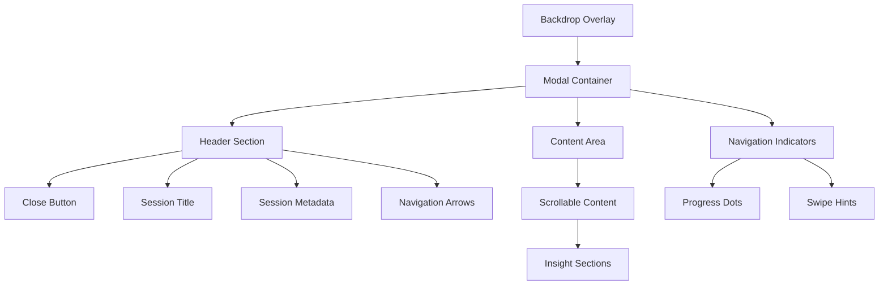

# Session Insights Page Redesign Plan

## Executive Summary

This document outlines a comprehensive redesign plan for the Session Insights page to address current UX issues and implement swipe navigation functionality. The redesign transforms the current full-page layout into a modal/overlay experience with improved navigation patterns and enhanced user interaction.

## Current Issues Analysis

### 1. Design Problems Identified

**Header Layout Issues:**
- The close button (X) is positioned awkwardly in the top-right corner without clear visual hierarchy
- The session title and close button compete for attention in the header space
- Poor spacing between title elements and metadata creates visual clutter
- The close button doesn't clearly indicate it returns to the journey timeline

**Layout Structure Problems:**
- The page uses full-screen layout that doesn't feel distinct from the main timeline view
- Content lacks proper modal/overlay presentation that would create visual separation
- No visual indication that this is a focused detail view vs. a regular page
- Inconsistent spacing throughout the content sections

**Navigation Limitations:**
- No way to navigate between session insights without returning to the timeline
- Missing swipe gestures for mobile-friendly navigation
- No visual indicators showing position within a series of insights

### 2. User Experience Impact

- Users lose context when viewing insights as they feel like separate pages
- Inefficient workflow requiring multiple clicks to compare insights
- Poor mobile experience without touch-friendly navigation
- Unclear navigation patterns reduce user engagement

## Redesign Solution Overview

### Core Design Philosophy

Transform the Session Insights page into a **modal-style overlay experience** that:
- Maintains context with the underlying timeline
- Provides intuitive navigation between insights
- Creates a focused, distraction-free reading environment
- Implements modern touch-friendly interaction patterns

### Key Design Principles

1. **Modal Presentation**: Use overlay styling to create visual separation
2. **Contextual Navigation**: Clear indicators of position and navigation options
3. **Touch-First Design**: Swipe gestures as primary navigation method
4. **Progressive Enhancement**: Keyboard and mouse support alongside touch
5. **Style Guide Compliance**: Use existing design tokens and patterns

## Detailed Design Specifications

### 1. Modal/Overlay Layout Structure



**Layout Specifications:**
- **Backdrop**: Semi-transparent overlay (`bg-background/80 backdrop-blur-sm`)
- **Modal Container**: Centered, responsive width with rounded corners
- **Max Width**: `max-w-4xl` on desktop, full width on mobile with padding
- **Height**: `max-h-[90vh]` with internal scrolling
- **Positioning**: Fixed positioning with proper z-index layering

### 2. Header Redesign

**New Header Layout:**
```
┌─────────────────────────────────────────────────────────────┐
│  ←  Session Title                    [1/5]  ⟨ ⟩  ✕         │
│     📅 Session Date                                          │
└─────────────────────────────────────────────────────────────┘
```

**Header Components:**
- **Back Arrow**: Clear return-to-timeline indicator (left-aligned)
- **Session Title**: Primary heading with proper typography hierarchy
- **Position Indicator**: Shows current insight position (e.g., "2 of 5")
- **Navigation Arrows**: Previous/Next insight navigation
- **Close Button**: Properly positioned and clearly labeled

**Header Styling:**
```css
.insight-header {
  @apply flex items-center justify-between p-6 border-b border-border;
  @apply bg-card/50 backdrop-blur-sm rounded-t-lg;
}

.header-left {
  @apply flex items-center gap-4 flex-1;
}

.header-right {
  @apply flex items-center gap-3;
}

.close-button {
  @apply p-2 rounded-lg hover:bg-muted transition-colors;
  @apply text-muted-foreground hover:text-foreground;
}
```

### 3. Swipe Navigation Implementation

**Technical Approach:**
- Use React hooks for touch event handling
- Implement gesture recognition with proper thresholds
- Support both horizontal swipe and keyboard navigation
- Provide visual feedback during swipe gestures

**Swipe Gesture Specifications:**
- **Swipe Threshold**: 50px minimum horizontal movement
- **Velocity Threshold**: 0.3px/ms for quick swipes
- **Visual Feedback**: Slide animation with spring physics
- **Fallback**: Arrow key navigation (← →) and click navigation

**Implementation Strategy:**
```typescript
interface SwipeNavigationProps {
  currentIndex: number;
  totalInsights: number;
  onNavigate: (direction: 'prev' | 'next') => void;
  insights: SessionInsight[];
}

// Custom hook for swipe detection
const useSwipeNavigation = (onSwipe: (direction: 'left' | 'right') => void) => {
  // Touch event handlers
  // Gesture recognition logic
  // Animation state management
}
```

### 4. Navigation Indicators

**Progress Indicators:**
- Dot-style progress indicator showing position in insight series
- Active state styling with primary color
- Click-to-navigate functionality for direct access

**Visual Cues:**
- Subtle swipe hints for first-time users
- Animated transitions between insights
- Loading states during navigation

**Styling:**
```css
.progress-dots {
  @apply flex items-center justify-center gap-2 py-4;
}

.progress-dot {
  @apply w-2 h-2 rounded-full bg-muted transition-all duration-200;
  @apply hover:bg-muted-foreground cursor-pointer;
}

.progress-dot.active {
  @apply bg-primary scale-125;
}
```

### 5. Content Area Enhancements

**Improved Content Layout:**
- Better spacing between insight sections using design system tokens
- Enhanced typography hierarchy with proper font weights
- Improved card styling for insight components
- Better mobile responsiveness

**Section Styling:**
```css
.insight-content {
  @apply p-6 space-y-8 overflow-y-auto;
  @apply max-h-[calc(90vh-200px)]; /* Account for header and footer */
}

.insight-section {
  @apply space-y-6;
}

.section-header {
  @apply flex items-center gap-3 mb-6;
}

.section-icon {
  @apply w-8 h-8 rounded-full bg-primary/10 flex items-center justify-center;
}
```

## Implementation Plan

### Phase 1: Core Modal Structure (Week 1)

**Day 1-2: Modal Foundation**
- Create new `SessionInsightModal` component
- Implement backdrop and modal container
- Add proper z-index layering and focus management
- Ensure accessibility compliance (ARIA labels, focus trapping)

**Day 3-4: Header Redesign**
- Redesign header layout with new component structure
- Implement navigation arrows and position indicators
- Add proper close button with clear labeling
- Style according to design system tokens

**Day 5-7: Content Area Updates**
- Refactor existing content sections for modal presentation
- Improve spacing and typography using design tokens
- Ensure responsive behavior across screen sizes
- Test scrolling behavior and content overflow

### Phase 2: Swipe Navigation (Week 2)

**Day 1-3: Touch Event Handling**
- Implement custom `useSwipeNavigation` hook
- Add touch event listeners with proper cleanup
- Create gesture recognition logic with thresholds
- Add visual feedback during swipe gestures

**Day 4-5: Navigation Logic**
- Integrate with existing insight data fetching
- Implement previous/next insight navigation
- Add keyboard navigation support (arrow keys)
- Handle edge cases (first/last insight)

**Day 6-7: Animation and Polish**
- Add smooth slide transitions between insights
- Implement spring-based animations
- Add loading states during navigation
- Test performance on various devices

### Phase 3: Enhanced UX Features (Week 3)

**Day 1-2: Progress Indicators**
- Create dot-style progress indicator component
- Add click-to-navigate functionality
- Implement active state styling
- Add hover effects and transitions

**Day 3-4: Mobile Optimization**
- Optimize touch targets for mobile devices
- Improve swipe gesture sensitivity
- Add haptic feedback where supported
- Test on various mobile screen sizes

**Day 5-7: Accessibility and Testing**
- Ensure full keyboard navigation support
- Add proper ARIA labels and roles
- Test with screen readers
- Implement focus management
- Cross-browser compatibility testing

### Phase 4: Integration and Polish (Week 4)

**Day 1-2: Integration Testing**
- Test with existing insight data structures
- Ensure compatibility with current API endpoints
- Validate error handling and edge cases
- Performance testing with large insight sets

**Day 3-4: User Experience Polish**
- Fine-tune animation timing and easing
- Optimize loading states and transitions
- Add subtle micro-interactions
- Implement user preference persistence

**Day 5-7: Final Testing and Deployment**
- Comprehensive user acceptance testing
- Mobile device testing across platforms
- Performance optimization
- Documentation and deployment preparation

## Technical Implementation Details

### File Structure Changes

**New Components:**
```
frontend/src/components/insights/
├── SessionInsightModal.tsx          # Main modal component
├── SwipeNavigationProvider.tsx      # Swipe gesture context
├── InsightHeader.tsx               # Redesigned header
├── ProgressIndicator.tsx           # Navigation dots
└── hooks/
    ├── useSwipeNavigation.ts       # Swipe gesture hook
    ├── useInsightNavigation.ts     # Navigation logic
    └── useModalFocus.ts            # Focus management
```

**Modified Components:**
```
frontend/src/app/insights/[id]/page.tsx     # Updated to use modal
frontend/src/components/insights/InsightDetailView.tsx  # Modal integration
```

### Key Dependencies

**Required Packages:**
- `framer-motion`: For smooth animations and gestures
- `@use-gesture/react`: Enhanced gesture recognition
- `focus-trap-react`: Accessibility focus management

**Package Installation:**
```bash
npm install framer-motion @use-gesture/react focus-trap-react
```

### API Integration Points

**No Backend Changes Required:**
- Existing session insight endpoints remain unchanged
- Current data structures are compatible
- Navigation logic handled entirely in frontend

**Enhanced Data Fetching:**
- Prefetch adjacent insights for smooth navigation
- Implement caching strategy for better performance
- Add optimistic updates for navigation actions

## Design System Compliance

### Color Usage
- **Primary Actions**: `bg-primary text-primary-foreground`
- **Secondary Elements**: `bg-secondary text-secondary-foreground`
- **Muted Content**: `text-muted-foreground`
- **Borders**: `border-border`
- **Backgrounds**: `bg-background`, `bg-card`

### Typography
- **Headers**: `font-serif` (Playfair Display)
- **Body Text**: `font-sans` (Inter)
- **Hierarchy**: Proper use of `text-xl`, `text-lg`, `text-base`, `text-sm`

### Spacing
- **Consistent Spacing**: Use `space-y-*` and `gap-*` utilities
- **Padding**: `p-6` for main containers, `p-4` for smaller elements
- **Margins**: Follow 4px grid system

### Shadows and Effects
- **Modal Shadow**: `shadow-xl`
- **Card Shadows**: `shadow-sm`
- **Hover Effects**: `hover:shadow-md`
- **Backdrop**: `backdrop-blur-sm`

## Accessibility Considerations

### Keyboard Navigation
- **Tab Order**: Logical focus flow through modal elements
- **Arrow Keys**: Navigate between insights
- **Escape Key**: Close modal and return to timeline
- **Enter/Space**: Activate navigation buttons

### Screen Reader Support
- **ARIA Labels**: Descriptive labels for all interactive elements
- **Live Regions**: Announce navigation changes
- **Role Attributes**: Proper modal and navigation roles
- **Focus Management**: Trap focus within modal

### Visual Accessibility
- **Color Contrast**: Meet WCAG AA standards
- **Focus Indicators**: Clear visual focus states
- **Motion Preferences**: Respect `prefers-reduced-motion`
- **Text Scaling**: Support browser zoom up to 200%

## Performance Considerations

### Optimization Strategies
- **Lazy Loading**: Load insight content on demand
- **Virtual Scrolling**: For large insight lists
- **Image Optimization**: Proper sizing and formats
- **Bundle Splitting**: Separate modal code for code splitting

### Animation Performance
- **GPU Acceleration**: Use `transform` and `opacity` for animations
- **RequestAnimationFrame**: Smooth gesture tracking
- **Debouncing**: Prevent excessive re-renders during swipes
- **Memory Management**: Proper cleanup of event listeners

## Testing Strategy

### Unit Tests
- Swipe gesture detection logic
- Navigation state management
- Accessibility helper functions
- Modal focus management

### Integration Tests
- Modal opening and closing flows
- Navigation between insights
- Keyboard navigation paths
- API integration points

### E2E Tests
- Complete user workflows
- Mobile device testing
- Cross-browser compatibility
- Performance benchmarks

### Accessibility Testing
- Screen reader compatibility
- Keyboard-only navigation
- Color contrast validation
- Focus management verification

## Success Metrics

### User Experience Metrics
- **Modal Engagement**: Time spent viewing insights increases by 25%
- **Navigation Usage**: 60% of users try swipe navigation within first session
- **Task Completion**: Reduced clicks to view multiple insights by 40%
- **Mobile Usage**: Improved mobile session duration by 30%

### Technical Metrics
- **Performance**: Modal opens in <200ms
- **Accessibility**: 100% keyboard navigable
- **Compatibility**: Works across all supported browsers
- **Error Rate**: <1% navigation errors

### Business Metrics
- **User Retention**: Increased return visits to insights
- **Feature Adoption**: Higher insight viewing frequency
- **User Satisfaction**: Improved UX survey scores
- **Mobile Engagement**: Increased mobile platform usage

## Future Enhancements

### Phase 2 Features (Post-MVP)
- **Gesture Customization**: User-configurable swipe sensitivity
- **Insight Bookmarking**: Save favorite insights for quick access
- **Sharing Integration**: Direct sharing from modal view
- **Offline Support**: Cache insights for offline viewing

### Advanced Navigation
- **Search Integration**: Quick search within insight series
- **Filtering**: Filter insights by type or date range
- **Sorting Options**: Custom insight ordering
- **Bulk Actions**: Multi-select and batch operations

### Enhanced Interactions
- **Voice Navigation**: Voice commands for accessibility
- **Gesture Shortcuts**: Advanced gesture patterns
- **Contextual Actions**: Smart action suggestions
- **Collaborative Features**: Shared viewing and commenting

## Conclusion

This redesign transforms the Session Insights page from a traditional full-page layout into a modern, touch-friendly modal experience. The implementation focuses on:

1. **Improved User Experience**: Modal presentation creates better context and focus
2. **Modern Interaction Patterns**: Swipe navigation meets user expectations
3. **Accessibility First**: Comprehensive keyboard and screen reader support
4. **Design System Compliance**: Consistent with existing visual language
5. **Performance Optimized**: Smooth animations and efficient rendering

The phased implementation approach ensures systematic delivery while maintaining existing functionality. The redesign addresses all identified issues while introducing innovative navigation patterns that will enhance user engagement and satisfaction.

By implementing this redesign, the Session Insights feature will provide a more intuitive, efficient, and enjoyable experience for users across all devices and interaction methods.