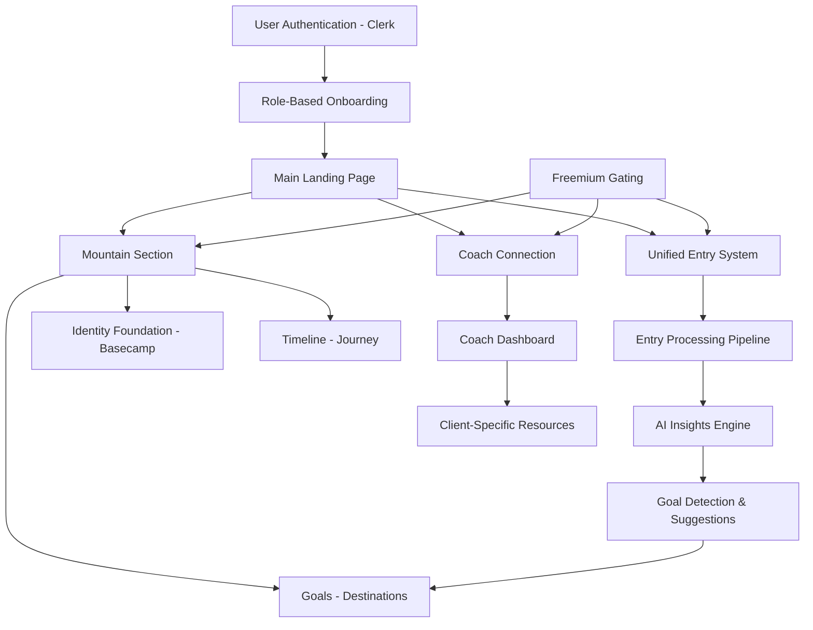
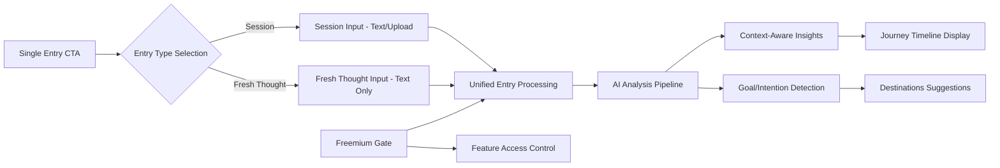

# Sprint S10: Application Redesign Epic

## Epic Overview

This epic represents a **major application redesign** based on comprehensive wireframe analysis. This document serves as the master reference containing all context from the original planning conversation, with individual sprints broken out for focused implementation.

## Key Design Principles

1. **Human-Centered Language**: "Destinations" instead of "Goals", "Three Big Ideas" instead of "Goal List"
2. **Unified Entry System**: Single interface for both session transcripts and fresh thoughts
3. **Freemium Model**: 3 free entries for non-coached users, full access with coach
4. **Progressive Disclosure**: Simple navigation with powerful features underneath
5. **AI-Powered Insights**: Context-aware analysis for both entry types

## Wireframe Analysis Summary

### User Flows Covered
1. **Onboarding**: Coach vs Client flows with role selection and organization management
2. **Main Landing**: Quote carousel with bottom navigation (Mountain/Microphone/Compass)
3. **Unified Entries**: Single creation flow for sessions and fresh thoughts
4. **Mountain Section**: Three tabs - Basecamp (identity), Journey (timeline), Destinations (goals)
5. **Coach Connection**: Coach resources and communication tools
6. **Freemium Gating**: Feature limitations for users without coaches

## High-Level Architecture

### System Architecture Overview

### Data Flow Architecture

## Sprint Breakdown

### Sprint S10.1: Foundation & Database Migration
**Duration**: 2 weeks  
**Priority**: Critical  
**Document**: [`docs/sprints/sprint_s10_1_foundation.md`](./sprint_s10_1_foundation.md)

**Key Deliverables**:
- Rename collections: `goals` → `destinations`, `session_insights` → `entries`
- Create new collections: `quotes`, `small_steps`, `coach_resources`, etc.
- Backend service refactoring and API endpoint updates
- Comprehensive migration scripts with rollback capability

### Sprint S10.2: Landing Page & Quote System
**Duration**: 1 week  
**Priority**: High  
**Document**: [`docs/sprints/sprint_s10_2_landing.md`](./sprint_s10_2_landing.md)

**Key Deliverables**:
- Quote carousel with heart functionality
- Bottom navigation (Mountain/Microphone/Compass)
- Quote management system and admin interface
- First-time user tooltips

### Sprint S10.3: Unified Entry System
**Duration**: 2 weeks  
**Priority**: High  
**Document**: [`docs/sprints/sprint_s10_3_entries.md`](./sprint_s10_3_entries.md)

**Key Deliverables**:
- Unified entry creation modal
- Session and fresh thought forms
- AI title generation and goal detection
- Freemium gating integration

### Sprint S10.4: Mountain Navigation
**Duration**: 2 weeks  
**Priority**: High  
**Document**: [`docs/sprints/sprint_s10_4_mountain.md`](./sprint_s10_4_mountain.md)

**Key Deliverables**:
- Three-tab navigation (Basecamp/Journey/Destinations)
- Identity foundation (Basecamp) with AI assistance
- Timeline interface (Journey) with unified entry display
- Destinations management with Three Big Ideas

### Sprint S10.5: Coach Features & Freemium
**Duration**: 2 weeks  
**Priority**: Medium  
**Document**: [`docs/sprints/sprint_s10_5_coach.md`](./sprint_s10_5_coach.md)

**Key Deliverables**:
- Coach dashboard and resource management
- Client-specific content and notes
- Enhanced onboarding flows
- Freemium upgrade paths

## Core Data Model Changes

### Key Collection Renames
- `session_insights` → `entries` (with `entry_type` field)
- `goals` → `destinations` (with Three Big Ideas support)

### New Collections
- `quotes` - Inspirational quote system
- `user_quote_likes` - User quote preferences
- `small_steps` - AI-derived intentions/tasks
- `coach_resources` - Coach resource library
- `coach_client_notes` - Client-specific coach content

### Enhanced Collections
- **User Profiles**: Identity foundation, freemium status, preferences
- **Coaching Relationships**: Pending status, invitation tracking

## Technical Considerations

### Backward Compatibility
- Maintain existing API endpoints during transition
- Gradual feature flag rollout
- Data migration with rollback capability

### Performance
- Optimize new query patterns
- Efficient timeline loading for large datasets
- Quote caching and personalization

### AI Enhancements
- Context-aware insights for different entry types
- Goal detection and suggestion system
- AI assistance for identity foundation

## Success Metrics

### User Experience
- Reduced time to create entries
- Increased engagement with destinations
- Positive feedback on new navigation

### Business Metrics
- Freemium to coached conversion rate
- Entry creation frequency
- Coach resource utilization

### Technical Metrics
- Migration success rate
- API performance improvements
- Feature adoption rates

## Risk Mitigation

### Data Migration Risks
- Comprehensive testing in staging
- Rollback procedures documented
- Gradual rollout with feature flags

### User Experience Risks
- A/B testing for major changes
- User feedback collection
- Gradual feature introduction

### Technical Risks
- Performance monitoring
- Error tracking and alerting
- Backward compatibility maintenance

## Dependencies

### External Dependencies
- Clerk organization management
- AI service enhancements
- File upload infrastructure

### Internal Dependencies
- Existing session insights system
- Current goal management
- User profile system

## Next Steps

1. **Review and approve** this epic breakdown
2. **Start with Sprint S10.1** (Foundation & Database Migration)
3. **Create detailed sprint documents** as we progress
4. **Establish success criteria** for each sprint
5. **Set up monitoring** and feedback collection

---

*This epic document serves as the master reference for the S10 redesign project. Individual sprint documents will contain detailed implementation specifications while referencing this document for context and overall architecture.*