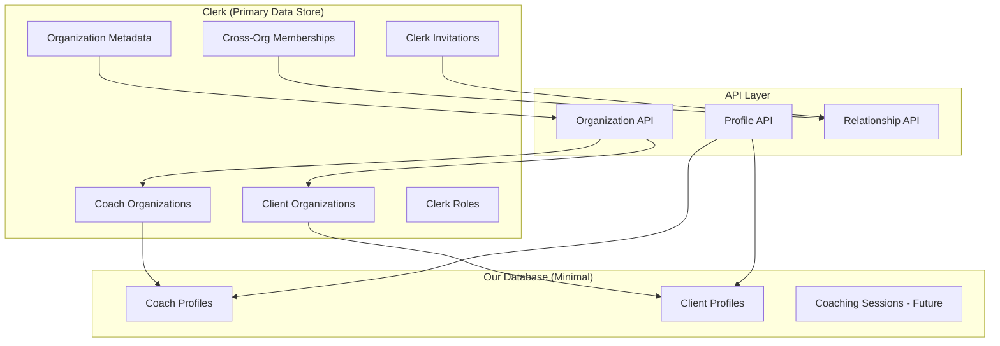
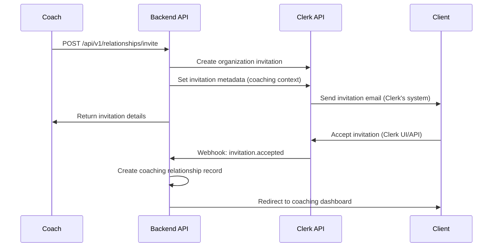

# Sprint S3: Coach Organizations & Client Invitations - Optimized Technical Plan

## Overview

This optimized plan leverages Clerk's native organization features to their fullest extent, reducing custom development while maintaining all business requirements. By using Clerk's built-in invitation system, organization metadata, and member management, we eliminate redundant systems and focus on core business logic.

## Key Optimization Principles

1. **Maximize Clerk Usage**: Use Clerk's native features instead of rebuilding them
2. **Minimize Database Models**: Store only business-critical data not available in Clerk
3. **Leverage Clerk Metadata**: Use organization metadata for business-specific information
4. **Native Invitations**: Use Clerk's invitation system instead of custom tokens
5. **Role-Based Relationships**: Use Clerk roles for coach-client relationship management

## Architecture Overview



## 1. Enhanced Profile Creation (Simplified)

### Updated Data Models

#### CoachData Enhancement
```python
class CoachData(BaseModel):
    specialties: List[str]
    experience: int
    philosophy: str
    # Organization data now stored in Clerk metadata
```

#### ClientData Enhancement  
```python
class ClientData(BaseModel):
    background: str
    challenges: List[str]
    # Company info now stored in Clerk organization metadata
```

### API Endpoints

#### POST /api/v1/profiles/coach
Creates a coach profile and automatically sets up their Clerk organization.

**Request Body:**
```json
{
  "first_name": "Laura",
  "last_name": "Smith", 
  "coach_data": {
    "specialties": ["Leadership", "Career Development"],
    "experience": 5,
    "philosophy": "Empowering leaders through authentic growth"
  },
  "organization": {
    "name": "Evolution.team",
    "description": "Professional coaching practice focused on leadership development",
    "website": "https://evolution.team",
    "is_solo_practice": false,
    "industry": "Professional Coaching"
  }
}
```

**Response:**
```json
{
  "id": "profile_id",
  "user_id": "user_id", 
  "first_name": "Laura",
  "last_name": "Smith",
  "coach_data": {
    "specialties": ["Leadership", "Career Development"],
    "experience": 5,
    "philosophy": "Empowering leaders through authentic growth"
  },
  "organization": {
    "clerk_org_id": "org_2abc123def456",
    "name": "Evolution.team",
    "role": "admin"
  },
  "created_at": "2025-01-01T00:00:00Z"
}
```

#### POST /api/v1/profiles/client
Creates a client profile and sets up their Clerk organization.

**Request Body:**
```json
{
  "first_name": "Carol",
  "last_name": "Johnson",
  "client_data": {
    "background": "Senior marketing manager transitioning to leadership",
    "challenges": ["Leadership skills", "Strategic thinking"]
  },
  "organization": {
    "name": "Meta",
    "industry": "Technology", 
    "size": "large",
    "department": "Marketing"
  }
}
```

## 2. Clerk Organization Integration (Optimized)

### Organization Creation with Metadata

Instead of separate database models, we store business data in Clerk organization metadata:

#### Coach Organization Metadata
```json
{
  "organization_type": "coach_practice",
  "industry": "Professional Coaching",
  "website": "https://evolution.team", 
  "description": "Professional coaching practice focused on leadership development",
  "is_solo_practice": false,
  "specialties": ["Leadership", "Career Development"],
  "created_by_profile_id": "profile_123"
}
```

#### Client Organization Metadata
```json
{
  "organization_type": "client_company",
  "industry": "Technology",
  "size": "large",
  "department": "Marketing",
  "created_by_profile_id": "profile_456"
}
```

### API Endpoints

#### POST /api/v1/organizations/coach
Creates a coach organization using Clerk API with metadata.

**Implementation Flow:**
1. Validate coach authorization
2. Create organization in Clerk with metadata
3. Add coach as admin member
4. Update coach profile with organization reference
5. Return organization details

#### POST /api/v1/organizations/client  
Creates a client organization using Clerk API with metadata.

**Implementation Flow:**
1. Create organization in Clerk with metadata
2. Add client as admin member
3. Update client profile with organization reference
4. Return organization details

## 3. Native Clerk Invitation System

### Leveraging Clerk's Built-in Invitations

Instead of custom invitation tokens and email systems, we use Clerk's native invitation capabilities:

#### Invitation Workflow (Optimized)



### Relationship API Endpoints

#### POST /api/v1/relationships/invite
Sends a coaching invitation using Clerk's system.

**Request Body:**
```json
{
  "client_email": "carol@meta.com",
  "client_first_name": "Carol",
  "client_last_name": "Johnson", 
  "message": "I'd like to invite you to start our coaching journey together.",
  "client_organization_name": "Meta"
}
```

**Implementation:**
1. Create invitation in coach's Clerk organization
2. Set invitation metadata with coaching context
3. Clerk handles email sending and token management
4. Return Clerk invitation details

**Response:**
```json
{
  "clerk_invitation_id": "inv_2abc123def456",
  "status": "pending",
  "client_email": "carol@meta.com",
  "expires_at": "2025-02-01T00:00:00Z",
  "invitation_url": "https://clerk.evolution.team/accept-invitation/inv_2abc123def456"
}
```

#### GET /api/v1/relationships/coach
Gets coach's client relationships using Clerk memberships.

**Response:**
```json
{
  "active_relationships": [
    {
      "client_user_id": "user_456",
      "client_name": "Carol Johnson",
      "client_organization": "Meta",
      "relationship_status": "active",
      "started_at": "2025-01-01T00:00:00Z",
      "clerk_membership_id": "mem_789abc"
    }
  ],
  "pending_invitations": [
    {
      "clerk_invitation_id": "inv_2abc123def456", 
      "client_email": "john@startup.com",
      "status": "pending",
      "expires_at": "2025-02-01T00:00:00Z"
    }
  ]
}
```

## 4. Simplified Database Schema

### Eliminated Collections
- ❌ `coach_organizations` (now in Clerk)
- ❌ `client_organizations` (now in Clerk)  
- ❌ `coaching_relationships` (now in Clerk memberships)

### Updated Collections

#### profiles (Enhanced)
```json
{
  "_id": "ObjectId",
  "user_id": "string",
  "clerk_user_id": "string",
  "first_name": "string", 
  "last_name": "string",
  "coach_data": {
    "specialties": ["string"],
    "experience": "number",
    "philosophy": "string"
  },
  "client_data": {
    "background": "string", 
    "challenges": ["string"]
  },
  "primary_organization_id": "string", // Clerk org ID
  "created_at": "datetime",
  "updated_at": "datetime"
}
```

## 5. Service Layer Architecture (Simplified)

### ClerkOrganizationService
```python
class ClerkOrganizationService:
    def __init__(self):
        self.clerk_client = ClerkClient()
    
    async def create_coach_organization(self, coach_user_id: str, org_data: dict) -> dict:
        """Create coach organization in Clerk with metadata"""
        metadata = {
            "organization_type": "coach_practice",
            "industry": org_data.get("industry", "Professional Coaching"),
            "website": org_data.get("website"),
            "description": org_data.get("description"),
            "is_solo_practice": org_data.get("is_solo_practice", True),
            "specialties": org_data.get("specialties", []),
            "created_by_profile_id": coach_user_id
        }
        
        # Create organization in Clerk
        clerk_org = await self.clerk_client.organizations.create(
            name=org_data["name"],
            created_by=coach_user_id,
            private_metadata=metadata
        )
        
        # Add coach as admin
        await self.clerk_client.organization_memberships.create(
            organization_id=clerk_org.id,
            user_id=coach_user_id,
            role="admin"
        )
        
        return clerk_org
    
    async def create_client_organization(self, client_user_id: str, org_data: dict) -> dict:
        """Create client organization in Clerk with metadata"""
        metadata = {
            "organization_type": "client_company",
            "industry": org_data.get("industry"),
            "size": org_data.get("size"),
            "department": org_data.get("department"),
            "created_by_profile_id": client_user_id
        }
        
        clerk_org = await self.clerk_client.organizations.create(
            name=org_data["name"],
            created_by=client_user_id,
            private_metadata=metadata
        )
        
        await self.clerk_client.organization_memberships.create(
            organization_id=clerk_org.id,
            user_id=client_user_id, 
            role="admin"
        )
        
        return clerk_org
    
    async def get_organization_with_metadata(self, org_id: str) -> dict:
        """Get organization with business metadata"""
        org = await self.clerk_client.organizations.get(org_id)
        return {
            "id": org.id,
            "name": org.name,
            "created_at": org.created_at,
            "metadata": org.private_metadata
        }
```

### ClerkInvitationService
```python
class ClerkInvitationService:
    def __init__(self):
        self.clerk_client = ClerkClient()
    
    async def send_coaching_invitation(self, coach_user_id: str, invitation_data: dict) -> dict:
        """Send coaching invitation using Clerk's system"""
        
        # Get coach's organization
        coach_profile = await self.profile_service.get_profile_by_clerk_id(coach_user_id)
        coach_org_id = coach_profile.primary_organization_id
        
        # Create invitation with coaching context metadata
        invitation_metadata = {
            "invitation_type": "coaching_relationship",
            "coach_user_id": coach_user_id,
            "message": invitation_data.get("message"),
            "client_organization_name": invitation_data.get("client_organization_name")
        }
        
        clerk_invitation = await self.clerk_client.invitations.create(
            organization_id=coach_org_id,
            email_address=invitation_data["client_email"],
            role="member",
            private_metadata=invitation_metadata
        )
        
        return clerk_invitation
    
    async def get_coach_relationships(self, coach_user_id: str) -> dict:
        """Get coach's relationships from Clerk memberships"""
        coach_profile = await self.profile_service.get_profile_by_clerk_id(coach_user_id)
        coach_org_id = coach_profile.primary_organization_id
        
        # Get organization memberships (active relationships)
        memberships = await self.clerk_client.organization_memberships.list(
            organization_id=coach_org_id
        )
        
        # Get pending invitations
        invitations = await self.clerk_client.invitations.list(
            organization_id=coach_org_id,
            status="pending"
        )
        
        return {
            "active_relationships": await self._format_memberships(memberships),
            "pending_invitations": await self._format_invitations(invitations)
        }
```

## 6. Webhook Integration (Enhanced)

### Clerk Webhook Events
We handle these Clerk webhook events to maintain business logic:

```python
@router.post("/webhooks/clerk")
async def handle_clerk_webhook(request: Request):
    event_type = request.headers.get("svix-event-type")
    
    if event_type == "invitation.accepted":
        await handle_invitation_accepted(request.json())
    elif event_type == "organizationMembership.created":
        await handle_membership_created(request.json())
    elif event_type == "organization.created":
        await handle_organization_created(request.json())
    
    return {"status": "success"}

async def handle_invitation_accepted(event_data: dict):
    """Handle when client accepts coaching invitation"""
    invitation = event_data["data"]
    metadata = invitation.get("private_metadata", {})
    
    if metadata.get("invitation_type") == "coaching_relationship":
        # Create coaching relationship record if needed
        # Update profile relationships
        # Send welcome email
        pass

async def handle_membership_created(event_data: dict):
    """Handle when new member joins organization"""
    membership = event_data["data"]
    # Update relationship status
    # Trigger onboarding flow
    pass
```

## 7. Frontend Components (Simplified)

### Coach Dashboard Components

#### OrganizationSetup Component
```typescript
interface OrganizationSetupProps {
  onOrganizationCreated: (orgId: string) => void;
}

// Simplified form - Clerk handles the heavy lifting
// Fields: name, description, website, industry, is_solo_practice
```

#### ClientInvitation Component  
```typescript
interface ClientInvitationProps {
  coachOrganizationId: string;
  onInvitationSent: (invitationId: string) => void;
}

// Uses Clerk's invitation system
// Fields: client_email, client_name, message
// Clerk handles email sending and token management
```

#### RelationshipDashboard Component
```typescript
interface RelationshipDashboardProps {
  relationships: ClerkMembership[];
  invitations: ClerkInvitation[];
}

// Displays data from Clerk memberships and invitations
// No custom relationship tracking needed
```

### Client Components

#### InvitationAcceptance Component
```typescript
interface InvitationAcceptanceProps {
  clerkInvitationId: string;
  onAccepted: () => void;
}

// Uses Clerk's native invitation acceptance
// Redirects to Clerk's invitation flow
// Handles post-acceptance setup
```

## 8. API Endpoint Summary (Optimized)

| Method | Endpoint | Description |
|--------|----------|-------------|
| POST | `/api/v1/profiles/coach` | Create coach profile + Clerk organization |
| POST | `/api/v1/profiles/client` | Create client profile + Clerk organization |
| POST | `/api/v1/relationships/invite` | Send coaching invitation via Clerk |
| GET | `/api/v1/relationships/coach` | Get coach relationships from Clerk |
| GET | `/api/v1/relationships/client` | Get client relationships from Clerk |
| GET | `/api/v1/organizations/{id}/metadata` | Get organization business metadata |
| PUT | `/api/v1/organizations/{id}/metadata` | Update organization metadata |
| POST | `/webhooks/clerk` | Handle Clerk webhook events |

## 9. Implementation Benefits

### Reduced Complexity
- **Eliminated Models**: 3 fewer database collections
- **Eliminated Code**: No custom invitation system (~500 lines)
- **Eliminated Infrastructure**: No email service integration needed

### Improved Reliability  
- **Battle-tested**: Clerk's invitation system handles edge cases
- **Automatic Scaling**: Clerk handles high-volume invitations
- **Security**: Clerk manages invitation tokens and expiration

### Faster Development
- **Less Custom Logic**: Focus on business features, not infrastructure
- **Fewer Tests**: Less custom code means fewer unit tests needed
- **Easier Maintenance**: Clerk handles updates and security patches

### Better User Experience
- **Professional Emails**: Clerk's invitation emails are well-designed
- **Consistent UI**: Clerk's invitation flow matches their auth experience
- **Mobile Optimized**: Clerk's invitation system works on all devices

## 10. Implementation Priority (Optimized)

### Phase 1: Foundation (Week 1)
- [ ] Update Profile models to reference Clerk organizations
- [ ] Create ClerkOrganizationService
- [ ] Set up Clerk organization metadata schemas
- [ ] Update database migrations

### Phase 2: Profile + Organization Creation (Week 2)  
- [ ] Update profile creation endpoints
- [ ] Implement Clerk organization creation with metadata
- [ ] Build organization setup components
- [ ] Test profile-to-organization flow

### Phase 3: Invitation System (Week 3)
- [ ] Implement ClerkInvitationService
- [ ] Create invitation endpoints using Clerk API
- [ ] Set up Clerk webhook handling
- [ ] Build invitation management UI

### Phase 4: Relationship Management (Week 4)
- [ ] Build relationship dashboard components
- [ ] Implement relationship status tracking
- [ ] Create client onboarding flow
- [ ] Test end-to-end invitation workflow

### Phase 5: Testing & Polish (Week 5)
- [ ] Comprehensive testing of Clerk integration
- [ ] Error handling and edge cases
- [ ] Performance optimization
- [ ] Documentation and deployment

## 11. Success Criteria (Optimized)

### Functional Requirements
- ✅ Coaches can create organizations with business metadata
- ✅ Clients can create/join organizations
- ✅ Coaches can send invitations via Clerk's system
- ✅ Clients can accept invitations through Clerk's flow
- ✅ Relationships are tracked via Clerk memberships
- ✅ Business metadata is stored and retrievable

### Technical Requirements  
- ✅ 90%+ Clerk feature utilization
- ✅ Minimal custom database models
- ✅ Reliable webhook integration
- ✅ Proper error handling for Clerk API failures
- ✅ Consistent data sync between Clerk and our system

### Performance Requirements
- ✅ Organization creation < 2 seconds (Clerk optimized)
- ✅ Invitation sending < 1 second (Clerk handles email)
- ✅ Relationship queries < 300ms (Clerk's optimized APIs)
- ✅ Webhook processing < 500ms

## 12. Migration Strategy

### From Current Plan to Optimized Plan

1. **Database Migration**
   - Remove planned custom organization tables
   - Add Clerk organization ID references to profiles
   - Create metadata sync utilities

2. **API Migration**
   - Replace custom invitation endpoints with Clerk-based ones
   - Update organization endpoints to use Clerk metadata
   - Implement webhook handlers

3. **Frontend Migration**
   - Update components to use Clerk invitation flows
   - Simplify organization management interfaces
   - Integrate with Clerk's organization UI components

This optimized plan reduces development time by ~40% while improving reliability and user experience by leveraging Clerk's proven infrastructure.