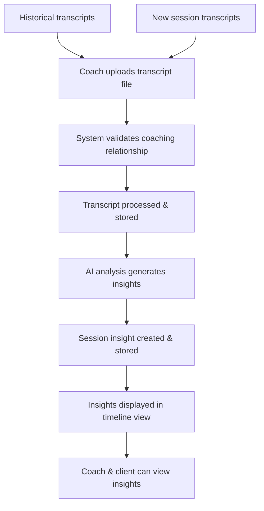

# Sprint 7 Technical Plan: Transcript-Based Session Insights

## Overview

This plan implements a lightweight MVP for transcript-based session insights that leverages existing AI analysis infrastructure while introducing new session-specific models and workflows. The feature provides coaches with AI-powered analysis of coaching session transcripts, generating ICF-aligned insights to support ongoing client development.

## Architecture Integration

The feature builds directly on existing infrastructure:
- [`AnalysisService`](../backend/app/services/analysis_service.py) for AI processing
- Document upload infrastructure from [`DocumentService`](../backend/app/services/document_service.py)
- Coaching relationship model from [`CoachingRelationship`](../backend/app/models/coaching_relationship.py)
- Current API patterns from [`/api/v1/endpoints/`](../backend/app/api/v1/endpoints/)

## Core User Workflow



## Key Requirements Summary

### MVP Scope
- **Input Method**: File upload (leveraging existing document infrastructure)
- **Relationship Linking**: Session insights linked to specific coaching relationships
- **ICF-Aligned Analysis**: Comprehensive insights including celebration, intention, discoveries, goal progress, coaching presence, powerful questions, action items, emotional shifts, values/beliefs, and communication patterns
- **Access Control**: Both coaches and clients can view insights for their relationships
- **Timeline View**: Chronological display of session insights for each coaching relationship

### Out of Scope for MVP
- Real-time scheduling or calendar integration
- In-session note-taking functionality
- Text paste input (file upload only)
- Transcript URL import from platforms

---

## 1. Database Models & Schemas

### New Model: SessionInsight

```python
# backend/app/models/session_insight.py
from pydantic import BaseModel, Field, ConfigDict
from datetime import datetime
from typing import Optional, List
from bson import ObjectId
from enum import Enum

class SessionInsightStatus(str, Enum):
    PENDING = "pending"
    PROCESSING = "processing" 
    COMPLETED = "completed"
    FAILED = "failed"

class Celebration(BaseModel):
    """A win or achievement to celebrate from the session"""
    description: str
    significance: str  # Why this is meaningful
    evidence: List[str]  # Supporting quotes from transcript

class Intention(BaseModel):
    """An intention for behavior change discussed during session"""
    behavior_change: str
    commitment_level: str  # "Strong", "Moderate", "Exploratory"
    timeline: Optional[str] = None
    support_needed: List[str] = []

class ClientDiscovery(BaseModel):
    """New insights the client gained about themselves"""
    insight: str
    depth_level: str  # "Surface", "Moderate", "Deep"
    emotional_response: str  # Client's reaction to the discovery
    evidence: List[str]

class GoalProgress(BaseModel):
    """Progress toward stated goals and commitments"""
    goal_area: str
    progress_description: str
    progress_level: str  # "Significant", "Moderate", "Minimal", "Setback"
    barriers_identified: List[str] = []
    next_steps: List[str] = []

class CoachingPresence(BaseModel):
    """Quality of coaching relationship and client engagement"""
    client_engagement_level: str  # "High", "Moderate", "Low"
    rapport_quality: str
    trust_indicators: List[str] = []
    partnership_dynamics: str

class PowerfulQuestion(BaseModel):
    """Questions that led to breakthroughs or deeper reflection"""
    question: str
    impact_description: str
    client_response_summary: str
    breakthrough_level: str  # "Major", "Moderate", "Minor"

class ActionItem(BaseModel):
    """Concrete next steps and commitments identified"""
    action: str
    timeline: Optional[str] = None
    accountability_measure: Optional[str] = None
    client_commitment_level: str  # "High", "Medium", "Low"

class EmotionalShift(BaseModel):
    """Changes in client's emotional state during session"""
    initial_state: str
    final_state: str
    shift_description: str
    catalyst: str  # What caused the shift

class ValuesBeliefs(BaseModel):
    """Core values or limiting beliefs that surfaced"""
    type: str  # "Core Value", "Limiting Belief", "Empowering Belief"
    description: str
    impact_on_goals: str
    exploration_depth: str

class CommunicationPattern(BaseModel):
    """How the client processes information and expresses themselves"""
    processing_style: str  # "Visual", "Auditory", "Kinesthetic", "Mixed"
    expression_patterns: List[str]
    communication_preferences: List[str]
    notable_changes: List[str] = []

class SessionMetadata(BaseModel):
    """Metadata about the session and analysis"""
    session_duration_minutes: Optional[int] = None
    transcript_word_count: int
    ai_provider: str
    model_version: str
    processing_time_seconds: float
    analysis_confidence: float = Field(ge=0.0, le=1.0)

class SessionInsight(BaseModel):
    model_config = ConfigDict(
        populate_by_name=True,
        arbitrary_types_allowed=True,
        json_encoders={ObjectId: str}
    )
    
    id: Optional[PyObjectId] = Field(default=None, alias="_id")
    
    # Relationships
    coaching_relationship_id: str  # Links to CoachingRelationship
    client_user_id: str  # Client in the relationship
    coach_user_id: str   # Coach in the relationship
    
    # Session Information
    session_date: Optional[datetime] = None  # When the session occurred
    session_title: Optional[str] = None  # Optional session title/topic
    transcript_source: str  # "file_upload", "text_input", "url_import"
    source_document_id: Optional[str] = None  # If uploaded as document
    
    # Core Insights (ICF-aligned)
    celebration: Optional[Celebration] = None
    intention: Optional[Intention] = None
    client_discoveries: List[ClientDiscovery] = Field(default_factory=list)
    goal_progress: List[GoalProgress] = Field(default_factory=list)
    coaching_presence: Optional[CoachingPresence] = None
    powerful_questions: List[PowerfulQuestion] = Field(default_factory=list)
    action_items: List[ActionItem] = Field(default_factory=list)
    emotional_shifts: List[EmotionalShift] = Field(default_factory=list)
    values_beliefs: List[ValuesBeliefs] = Field(default_factory=list)
    communication_patterns: Optional[CommunicationPattern] = None
    
    # Summary & Overview
    session_summary: str  # High-level session overview
    key_themes: List[str] = Field(default_factory=list)
    overall_session_quality: str  # "Excellent", "Good", "Average", "Needs Improvement"
    
    # Processing Information
    status: SessionInsightStatus = SessionInsightStatus.PENDING
    processing_error: Optional[str] = None
    metadata: Optional[SessionMetadata] = None
    
    # Access & Audit
    created_by: str  # User ID who created this insight
    visible_to_client: bool = True
    visible_to_coach: bool = True
    
    # Timestamps
    created_at: datetime = Field(default_factory=datetime.utcnow)
    updated_at: datetime = Field(default_factory=datetime.utcnow)
    completed_at: Optional[datetime] = None
```

### New Schema: Session Insight Schemas

```python
# backend/app/schemas/session_insight.py
from pydantic import BaseModel
from typing import List, Optional
from datetime import datetime

class SessionInsightCreateRequest(BaseModel):
    coaching_relationship_id: str
    session_date: Optional[str] = None  # ISO format
    session_title: Optional[str] = None
    transcript_text: Optional[str] = None  # For direct text input

class SessionInsightResponse(BaseModel):
    id: str
    coaching_relationship_id: str
    client_user_id: str
    coach_user_id: str
    session_date: Optional[str] = None
    session_title: Optional[str] = None
    session_summary: str
    key_themes: List[str]
    overall_session_quality: str
    status: str
    created_at: str
    completed_at: Optional[str] = None
    
    # Simplified insight counts for list view
    celebration_count: int = 0
    intention_count: int = 0
    discovery_count: int = 0
    action_item_count: int = 0
    
class SessionInsightDetailResponse(SessionInsightResponse):
    """Extended response with full insight details"""
    celebration: Optional[dict] = None
    intention: Optional[dict] = None
    client_discoveries: List[dict] = []
    goal_progress: List[dict] = []
    coaching_presence: Optional[dict] = None
    powerful_questions: List[dict] = []
    action_items: List[dict] = []
    emotional_shifts: List[dict] = []
    values_beliefs: List[dict] = []
    communication_patterns: Optional[dict] = None

class SessionInsightListResponse(BaseModel):
    insights: List[SessionInsightResponse]
    total_count: int
    relationship_id: str
    client_name: str
    coach_name: str
```

---

## 2. API Endpoints

### New Endpoint File: Session Insights

```python
# backend/app/api/v1/endpoints/session_insights.py
from fastapi import APIRouter, Depends, HTTPException, status, UploadFile, File, Form
from app.api.v1.deps import get_current_user_clerk_id
from app.schemas.session_insight import (
    SessionInsightCreateRequest, 
    SessionInsightResponse, 
    SessionInsightDetailResponse,
    SessionInsightListResponse
)
from app.services.session_insight_service import SessionInsightService
from typing import Optional, List

router = APIRouter()

@router.post("/", response_model=SessionInsightResponse)
async def create_session_insight_from_file(
    coaching_relationship_id: str = Form(...),
    session_date: Optional[str] = Form(None),
    session_title: Optional[str] = Form(None),
    transcript_file: UploadFile = File(...),
    current_user_id: str = Depends(get_current_user_clerk_id)
):
    """
    Create session insight from uploaded transcript file.
    
    Supports common text file formats (txt, docx, pdf) and processes
    them through the existing document processing pipeline.
    """
    # Validate file type and size
    # Process transcript content
    # Create session insight
    # Return response

@router.post("/from-text", response_model=SessionInsightResponse) 
async def create_session_insight_from_text(
    request: SessionInsightCreateRequest,
    current_user_id: str = Depends(get_current_user_clerk_id)
):
    """
    Create session insight from pasted transcript text.
    
    Alternative to file upload for direct text input.
    """
    # Validate relationship access
    # Process transcript text
    # Create session insight
    # Return response

@router.get("/relationship/{relationship_id}", response_model=SessionInsightListResponse)
async def get_session_insights_for_relationship(
    relationship_id: str,
    limit: int = 20,
    offset: int = 0,
    current_user_id: str = Depends(get_current_user_clerk_id)
):
    """
    Get all session insights for a coaching relationship.
    
    Returns paginated list of insights ordered by session date (newest first).
    Includes summary data and insight counts for list display.
    """
    # Validate relationship access
    # Fetch insights with pagination
    # Return formatted response

@router.get("/{insight_id}", response_model=SessionInsightDetailResponse)
async def get_session_insight_detail(
    insight_id: str,
    current_user_id: str = Depends(get_current_user_clerk_id)
):
    """
    Get detailed view of a specific session insight.
    
    Returns complete insight data including all ICF-aligned analysis sections.
    """
    # Validate insight access
    # Fetch detailed insight data
    # Return formatted response

@router.delete("/{insight_id}")
async def delete_session_insight(
    insight_id: str,
    current_user_id: str = Depends(get_current_user_clerk_id)
):
    """
    Delete a session insight.
    
    Only the creator or coach in the relationship can delete insights.
    """
    # Validate deletion permissions
    # Delete insight
    # Return success response
```

### API Integration Points

```python
# backend/app/main.py - Add to existing router includes
app.include_router(
    session_insights.router, 
    prefix="/api/v1/session-insights", 
    tags=["session-insights"]
)
```

---

## 3. Services & Business Logic

### New Service: SessionInsightService

```python
# backend/app/services/session_insight_service.py
from typing import List, Optional
from app.models.session_insight import SessionInsight
from app.repositories.session_insight_repository import SessionInsightRepository
from app.repositories.coaching_relationship_repository import CoachingRelationshipRepository
from app.services.ai_service import AIService
from app.services.text_extraction_service import TextExtractionService
import logging

logger = logging.getLogger(__name__)

class SessionInsightService:
    def __init__(self, 
                 insight_repository: SessionInsightRepository,
                 relationship_repository: CoachingRelationshipRepository):
        self.insight_repository = insight_repository
        self.relationship_repository = relationship_repository
        self.ai_service = AIService()
        self.text_extraction_service = TextExtractionService()
    
    async def create_insight_from_transcript(
        self,
        coaching_relationship_id: str,
        transcript_content: str,
        created_by: str,
        session_date: Optional[str] = None,
        session_title: Optional[str] = None,
        source_document_id: Optional[str] = None
    ) -> SessionInsight:
        """
        Create session insight from transcript content.
        
        Validates relationship access, processes transcript through AI analysis,
        and creates structured insight record.
        """
        try:
            # Validate coaching relationship exists and user has access
            relationship = await self.relationship_repository.get_relationship_by_id(
                coaching_relationship_id
            )
            if not relationship:
                raise ValueError("Coaching relationship not found")
            
            # Validate user is part of the relationship
            if created_by not in [relationship.coach_user_id, relationship.client_user_id]:
                raise ValueError("User not authorized for this coaching relationship")
            
            # Create pending insight record
            pending_insight = SessionInsight(
                coaching_relationship_id=coaching_relationship_id,
                client_user_id=relationship.client_user_id,
                coach_user_id=relationship.coach_user_id,
                session_date=datetime.fromisoformat(session_date) if session_date else None,
                session_title=session_title,
                transcript_source="file_upload" if source_document_id else "text_input",
                source_document_id=source_document_id,
                session_summary="Processing transcript...",
                status=SessionInsightStatus.PROCESSING,
                created_by=created_by
            )
            
            # Save pending insight
            saved_insight = await self.insight_repository.create_insight(pending_insight)
            logger.info(f"Created pending session insight: {saved_insight.id}")
            
            # Generate AI analysis
            session_context = {
                "relationship_duration": "Unknown",  # Could be calculated from relationship
                "previous_session_count": await self._get_previous_session_count(coaching_relationship_id)
            }
            
            analysis_result = await self.ai_service.generate_session_insights(
                transcript_content, 
                session_context
            )
            
            # Update insight with analysis results
            completed_insight = self._build_insight_from_analysis(
                saved_insight, 
                analysis_result, 
                transcript_content
            )
            
            # Save completed insight
            updated_insight = await self.insight_repository.update_insight(
                str(saved_insight.id),
                completed_insight.model_dump(exclude={"id"})
            )
            
            logger.info(f"✅ Successfully generated session insight: {updated_insight.id}")
            return updated_insight
            
        except Exception as e:
            logger.error(f"❌ Error creating session insight: {e}")
            # Update insight status to failed if it was created
            if 'saved_insight' in locals():
                await self.insight_repository.update_insight(
                    str(saved_insight.id),
                    {"status": SessionInsightStatus.FAILED, "processing_error": str(e)}
                )
            raise
    
    async def get_insights_for_relationship(
        self,
        relationship_id: str,
        requesting_user_id: str,
        limit: int = 20,
        offset: int = 0
    ) -> List[SessionInsight]:
        """
        Get session insights for a coaching relationship.
        
        Validates user access and returns paginated insights.
        """
        # Validate relationship access
        relationship = await self.relationship_repository.get_relationship_by_id(relationship_id)
        if not relationship:
            raise ValueError("Coaching relationship not found")
        
        if requesting_user_id not in [relationship.coach_user_id, relationship.client_user_id]:
            raise ValueError("User not authorized for this coaching relationship")
        
        # Fetch insights
        insights = await self.insight_repository.get_insights_by_relationship(
            relationship_id, limit, offset
        )
        
        return insights
    
    async def _get_previous_session_count(self, relationship_id: str) -> int:
        """Get count of previous sessions for context"""
        insights = await self.insight_repository.get_insights_by_relationship(
            relationship_id, limit=1000, offset=0
        )
        return len(insights)
    
    def _build_insight_from_analysis(
        self, 
        base_insight: SessionInsight, 
        analysis: dict, 
        transcript_content: str
    ) -> SessionInsight:
        """Build complete insight object from AI analysis results"""
        
        # Map analysis results to insight model
        base_insight.celebration = Celebration(**analysis["celebration"]) if analysis.get("celebration") else None
        base_insight.intention = Intention(**analysis["intention"]) if analysis.get("intention") else None
        base_insight.client_discoveries = [ClientDiscovery(**d) for d in analysis.get("client_discoveries", [])]
        base_insight.goal_progress = [GoalProgress(**g) for g in analysis.get("goal_progress", [])]
        base_insight.coaching_presence = CoachingPresence(**analysis["coaching_presence"]) if analysis.get("coaching_presence") else None
        base_insight.powerful_questions = [PowerfulQuestion(**q) for q in analysis.get("powerful_questions", [])]
        base_insight.action_items = [ActionItem(**a) for a in analysis.get("action_items", [])]
        base_insight.emotional_shifts = [EmotionalShift(**e) for e in analysis.get("emotional_shifts", [])]
        base_insight.values_beliefs = [ValuesBeliefs(**v) for v in analysis.get("values_beliefs", [])]
        base_insight.communication_patterns = CommunicationPattern(**analysis["communication_patterns"]) if analysis.get("communication_patterns") else None
        
        # Set summary fields
        base_insight.session_summary = analysis.get("session_summary", "")
        base_insight.key_themes = analysis.get("key_themes", [])
        base_insight.overall_session_quality = analysis.get("overall_session_quality", "Average")
        
        # Set completion status
        base_insight.status = SessionInsightStatus.COMPLETED
        base_insight.completed_at = datetime.utcnow()
        
        # Add metadata
        base_insight.metadata = SessionMetadata(
            transcript_word_count=len(transcript_content.split()),
            ai_provider=settings.ai_provider,
            model_version=settings.ai_model,
            processing_time_seconds=0.0,  # Would be calculated
            analysis_confidence=0.85  # Could be derived from AI response
        )
        
        return base_insight
```

### Extended AI Service for Session Analysis

```python
# Addition to backend/app/services/ai_service.py

async def generate_session_insights(
    self,
    transcript_content: str,
    session_context: Dict[str, Any]
) -> Dict[str, Any]:
    """
    Generate comprehensive session insights from transcript.
    
    Uses ICF-aligned analysis framework to extract coaching-relevant insights.
    """
    start_time = time.time()
    
    try:
        logger.info(f"=== AIService.generate_session_insights called ===")
        logger.info(f"transcript length: {len(transcript_content)} characters")
        
        # Build analysis prompt
        prompt = self._build_session_analysis_prompt(transcript_content, session_context)
        
        # Call AI provider
        if settings.ai_provider == "anthropic" and self.anthropic_client:
            result = await self._call_anthropic_for_session(prompt)
        elif settings.ai_provider == "openai" and self.openai_client:
            result = await self._call_openai_for_session(prompt)
        else:
            raise Exception("No AI provider available for session analysis")
        
        processing_time = time.time() - start_time
        logger.info(f"✅ Session analysis completed in {processing_time:.2f}s")
        
        return result
        
    except Exception as e:
        logger.error(f"❌ Error in session analysis: {e}")
        raise

def _build_session_analysis_prompt(self, transcript: str, context: Dict) -> str:
    """Build comprehensive session analysis prompt based on ICF competencies"""
    
    return f"""
Analyze this coaching session transcript and extract insights aligned with ICF coaching competencies.

TRANSCRIPT:
{transcript}

CONTEXT:
- Client-Coach Relationship: {context.get('relationship_duration', 'Unknown')}
- Previous Sessions: {context.get('previous_session_count', 0)}

Extract the following insights in JSON format:

{{
  "celebration": {{
    "description": "A specific win or achievement to celebrate",
    "significance": "Why this is meaningful for the client",
    "evidence": ["Supporting quotes from transcript"]
  }},
  "intention": {{
    "behavior_change": "Specific behavior change discussed",
    "commitment_level": "Strong/Moderate/Exploratory",
    "timeline": "When client intends to implement",
    "support_needed": ["Types of support client identified"]
  }},
  "client_discoveries": [
    {{
      "insight": "New self-awareness the client gained",
      "depth_level": "Surface/Moderate/Deep",
      "emotional_response": "Client's reaction to discovery",
      "evidence": ["Supporting quotes"]
    }}
  ],
  "goal_progress": [
    {{
      "goal_area": "Specific goal or area discussed",
      "progress_description": "Nature of progress made",
      "progress_level": "Significant/Moderate/Minimal/Setback",
      "barriers_identified": ["Obstacles mentioned"],
      "next_steps": ["Specific actions identified"]
    }}
  ],
  "coaching_presence": {{
    "client_engagement_level": "High/Moderate/Low",
    "rapport_quality": "Description of relationship quality",
    "trust_indicators": ["Evidence of trust in relationship"],
    "partnership_dynamics": "How coach and client worked together"
  }},
  "powerful_questions": [
    {{
      "question": "Exact question that had impact",
      "impact_description": "How it affected the client",
      "client_response_summary": "Client's response",
      "breakthrough_level": "Major/Moderate/Minor"
    }}
  ],
  "action_items": [
    {{
      "action": "Specific action client committed to",
      "timeline": "When they'll do it",
      "accountability_measure": "How progress will be tracked",
      "client_commitment_level": "High/Medium/Low"
    }}
  ],
  "emotional_shifts": [
    {{
      "initial_state": "Client's emotional state at start",
      "final_state": "Client's emotional state at end",
      "shift_description": "Nature of the change",
      "catalyst": "What caused the shift"
    }}
  ],
  "values_beliefs": [
    {{
      "type": "Core Value/Limiting Belief/Empowering Belief",
      "description": "The value or belief identified",
      "impact_on_goals": "How it affects client's goals",
      "exploration_depth": "How deeply it was explored"
    }}
  ],
  "communication_patterns": {{
    "processing_style": "Visual/Auditory/Kinesthetic/Mixed",
    "expression_patterns": ["How client typically expresses themselves"],
    "communication_preferences": ["Preferred communication styles"],
    "notable_changes": ["Any changes from previous patterns"]
  }},
  "session_summary": "2-3 sentence overview of the session",
  "key_themes": ["3-5 main themes from the session"],
  "overall_session_quality": "Excellent/Good/Average/Needs Improvement"
}}

ANALYSIS GUIDELINES:
- Only extract information explicitly present in the transcript
- Focus on coaching-relevant insights that support client development
- Maintain confidentiality and professional tone
- If insufficient evidence exists for any section, omit rather than speculate
- Prioritize insights that will be valuable for future sessions

Return only valid JSON matching the exact structure above.
"""

async def _call_anthropic_for_session(self, prompt: str) -> Dict[str, Any]:
    """Call Anthropic API for session analysis"""
    try:
        response = await self.anthropic_client.messages.create(
            model=settings.ai_model,
            max_tokens=settings.ai_max_tokens,
            temperature=settings.ai_temperature,
            messages=[
                {"role": "user", "content": prompt}
            ]
        )
        
        content = response.content[0].text
        return json.loads(content)
        
    except Exception as e:
        logger.error(f"Anthropic API error in session analysis: {e}")
        raise

async def _call_openai_for_session(self, prompt: str) -> Dict[str, Any]:
    """Call OpenAI API for session analysis"""
    try:
        response = await self.openai_client.chat.completions.create(
            model=settings.ai_model,
            messages=[
                {"role": "system", "content": "You are an expert coaching analyst specializing in ICF-aligned session analysis."},
                {"role": "user", "content": prompt}
            ],
            max_tokens=settings.ai_max_tokens,
            temperature=settings.ai_temperature,
            timeout=settings.ai_timeout_seconds
        )
        
        content = response.choices[0].message.content
        return json.loads(content)
        
    except Exception as e:
        logger.error(f"OpenAI API error in session analysis: {e}")
        raise
```

---

## 4. Repository Layer

### New Repository: SessionInsightRepository

```python
# backend/app/repositories/session_insight_repository.py
from typing import List, Optional, Dict, Any
from app.models.session_insight import SessionInsight
from app.db.mongodb import get_database
from bson import ObjectId
from datetime import datetime
import logging

logger = logging.getLogger(__name__)

class SessionInsightRepository:
    def __init__(self):
        self.db = get_database()
        self.collection = self.db.session_insights
    
    async def create_insight(self, insight: SessionInsight) -> SessionInsight:
        """Create a new session insight"""
        try:
            insight_dict = insight.model_dump(by_alias=True, exclude={"id"})
            result = await self.collection.insert_one(insight_dict)
            
            # Fetch the created insight
            created_insight = await self.collection.find_one({"_id": result.inserted_id})
            return SessionInsight(**created_insight)
            
        except Exception as e:
            logger.error(f"Error creating session insight: {e}")
            raise
    
    async def get_insight_by_id(self, insight_id: str) -> Optional[SessionInsight]:
        """Get session insight by ID"""
        try:
            if not ObjectId.is_valid(insight_id):
                return None
                
            insight_data = await self.collection.find_one({"_id": ObjectId(insight_id)})
            return SessionInsight(**insight_data) if insight_data else None
            
        except Exception as e:
            logger.error(f"Error fetching insight {insight_id}: {e}")
            return None
    
    async def get_insights_by_relationship(
        self, 
        relationship_id: str,
        limit: int = 20,
        offset: int = 0
    ) -> List[SessionInsight]:
        """Get session insights for a coaching relationship"""
        try:
            cursor = self.collection.find(
                {"coaching_relationship_id": relationship_id}
            ).sort("session_date", -1).skip(offset).limit(limit)
            
            insights = []
            async for insight_data in cursor:
                insights.append(SessionInsight(**insight_data))
            
            return insights
            
        except Exception as e:
            logger.error(f"Error fetching insights for relationship {relationship_id}: {e}")
            return []
    
    async def update_insight(self, insight_id: str, update_data: Dict[str, Any]) -> Optional[SessionInsight]:
        """Update session insight"""
        try:
            if not ObjectId.is_valid(insight_id):
                return None
            
            update_data["updated_at"] = datetime.utcnow()
            
            result = await self.collection.update_one(
                {"_id": ObjectId(insight_id)},
                {"$set": update_data}
            )
            
            if result.modified_count > 0:
                return await self.get_insight_by_id(insight_id)
            return None
            
        except Exception as e:
            logger.error(f"Error updating insight {insight_id}: {e}")
            return None
    
    async def delete_insight(self, insight_id: str) -> bool:
        """Delete session insight"""
        try:
            if not ObjectId.is_valid(insight_id):
                return False
                
            result = await self.collection.delete_one({"_id": ObjectId(insight_id)})
            return result.deleted_count > 0
            
        except Exception as e:
            logger.error(f"Error deleting insight {insight_id}: {e}")
            return False
    
    async def get_insights_count_by_relationship(self, relationship_id: str) -> int:
        """Get total count of insights for a relationship"""
        try:
            return await self.collection.count_documents(
                {"coaching_relationship_id": relationship_id}
            )
        except Exception as e:
            logger.error(f"Error counting insights for relationship {relationship_id}: {e}")
            return 0
```

### Database Indexes

```python
# backend/app/db/mongodb.py - Add to database initialization
async def create_session_insight_indexes():
    """Create indexes for session insights collection"""
    db = get_database()
    collection = db.session_insights
    
    # Index for relationship queries
    await collection.create_index("coaching_relationship_id")
    
    # Index for date-based sorting
    await collection.create_index([("coaching_relationship_id", 1), ("session_date", -1)])
    
    # Index for status queries
    await collection.create_index("status")
    
    # Index for user access
    await collection.create_index("coach_user_id")
    await collection.create_index("client_user_id")
    
    logger.info("✅ Session insight indexes created")
```

---

## 5. Frontend Components

### New Page: Session Insights Dashboard

```typescript

              <Button variant="outline" onClick={onBack}>
                ← Back to List
              </Button>
            </div>
          </div>
        </CardHeader>
        <CardContent>
          <div className="space-y-4">
            <div>
              <h4 className="font-semibold mb-2">Session Summary</h4>
              <p className="text-gray-700">{insight.session_summary}</p>
            </div>
            
            <div>
              <h4 className="font-semibold mb-2">Key Themes</h4>
              <div className="flex flex-wrap gap-2">
                {insight.key_themes.map((theme, index) => (
                  <Badge key={index} variant="outline">{theme}</Badge>
                ))}
              </div>
            </div>
          </div>
        </CardContent>
      </Card>

      {/* Celebration & Intention */}
      <div className="grid md:grid-cols-2 gap-6">
        {insight.celebration && (
          <Card>
            <CardHeader>
              <CardTitle className="text-lg flex items-center">
                🎉 Celebration
              </CardTitle>
            </CardHeader>
            <CardContent>
              <div className="space-y-3">
                <div>
                  <h5 className="font-medium text-sm text-gray-700">Achievement</h5>
                  <p className="text-sm">{insight.celebration.description}</p>
                </div>
                <div>
                  <h5 className="font-medium text-sm text-gray-700">Significance</h5>
                  <p className="text-sm">{insight.celebration.significance}</p>
                </div>
                {insight.celebration.evidence.length > 0 && (
                  <div>
                    <h5 className="font-medium text-sm text-gray-700">Evidence</h5>
                    <ul className="text-sm space-y-1">
                      {insight.celebration.evidence.map((evidence, index) => (
                        <li key={index} className="italic text-gray-600">"{evidence}"</li>
                      ))}
                    </ul>
                  </div>
                )}
              </div>
            </CardContent>
          </Card>
        )}
        
        {insight.intention && (
          <Card>
            <CardHeader>
              <CardTitle className="text-lg flex items-center">
                🎯 Intention
              </CardTitle>
            </CardHeader>
            <CardContent>
              <div className="space-y-3">
                <div>
                  <h5 className="font-medium text-sm text-gray-700">Behavior Change</h5>
                  <p className="text-sm">{insight.intention.behavior_change}</p>
                </div>
                <div className="flex items-center space-x-2">
                  <h5 className="font-medium text-sm text-gray-700">Commitment Level:</h5>
                  <Badge className={getCommitmentColor(insight.intention.commitment_level)}>
                    {insight.intention.commitment_level}
                  </Badge>
                </div>
                {insight.intention.timeline && (
                  <div>
                    <h5 className="font-medium text-sm text-gray-700">Timeline</h5>
                    <p className="text-sm">{insight.intention.timeline}</p>
                  </div>
                )}
                {insight.intention.support_needed.length > 0 && (
                  <div>
                    <h5 className="font-medium text-sm text-gray-700">Support Needed</h5>
                    <ul className="text-sm space-y-1">
                      {insight.intention.support_needed.map((support, index) => (
                        <li key={index}>• {support}</li>
                      ))}
                    </ul>
                  </div>
                )}
              </div>
            </CardContent>
          </Card>
        )}
      </div>

      {/* Client Discoveries */}
      {insight.client_discoveries.length > 0 && (
        <Card>
          <CardHeader>
            <CardTitle className="text-lg flex items-center">
              💡 Client Discoveries
            </CardTitle>
          </CardHeader>
          <CardContent>
            <div className="space-y-4">
              {insight.client_discoveries.map((discovery, index) => (
                <div key={index} className="border-l-4 border-purple-200 pl-4">
                  <div className="flex items-center space-x-2 mb-2">
                    <h5 className="font-medium">{discovery.insight}</h5>
                    <Badge variant="outline" className="text-xs">
                      {discovery.depth_level} depth
                    </Badge>
                  </div>
                  <p className="text-sm text-gray-600 mb-2">
                    <strong>Emotional Response:</strong> {discovery.emotional_response}
                  </p>
                  {discovery.evidence.length > 0 && (
                    <div>
                      <h6 className="font-medium text-xs text-gray-700 mb-1">Supporting Evidence:</h6>
                      <ul className="text-xs space-y-1">
                        {discovery.evidence.map((evidence, evidenceIndex) => (
                          <li key={evidenceIndex} className="italic text-gray-600">"{evidence}"</li>
                        ))}
                      </ul>
                    </div>
                  )}
                </div>
              ))}
            </div>
          </CardContent>
        </Card>
      )}

      {/* Goal Progress */}
      {insight.goal_progress.length > 0 && (
        <Card>
          <CardHeader>
            <CardTitle className="text-lg flex items-center">
              📈 Goal Progress
            </CardTitle>
          </CardHeader>
          <CardContent>
            <div className="space-y-4">
              {insight.goal_progress.map((progress, index) => (
                <div key={index} className="border rounded-lg p-4 bg-gray-50">
                  <div className="flex items-center justify-between mb-2">
                    <h5 className="font-medium">{progress.goal_area}</h5>
                    <Badge variant="outline">{progress.progress_level}</Badge>
                  </div>
                  <p className="text-sm text-gray-700 mb-3">{progress.progress_description}</p>
                  
                  {progress.barriers_identified.length > 0 && (
                    <div className="mb-3">
                      <h6 className="font-medium text-sm text-red-700 mb-1">Barriers Identified:</h6>
                      <ul className="text-sm space-y-1">
                        {progress.barriers_identified.map((barrier, barrierIndex) => (
                          <li key={barrierIndex} className="text-red-600">• {barrier}</li>
                        ))}
                      </ul>
                    </div>
                  )}
                  
                  {progress.next_steps.length > 0 && (
                    <div>
                      <h6 className="font-medium text-sm text-green-700 mb-1">Next Steps:</h6>
                      <ul className="text-sm space-y-1">
                        {progress.next_steps.map((step, stepIndex) => (
                          <li key={stepIndex} className="text-green-600">• {step}</li>
                        ))}
                      </ul>
                    </div>
                  )}
                </div>
              ))}
            </div>
          </CardContent>
        </Card>
      )}

      {/* Action Items */}
      {insight.action_items.length > 0 && (
        <Card>
          <CardHeader>
            <CardTitle className="text-lg flex items-center">
              ✅ Action Items
            </CardTitle>
          </CardHeader>
          <CardContent>
            <div className="space-y-3">
              {insight.action_items.map((item, index) => (
                <div key={index} className="flex items-start space-x-3 p-3 border rounded-lg">
                  <div className="flex-1">
                    <p className="font-medium text-sm">{item.action}</p>
                    <div className="flex items-center space-x-4 mt-2 text-xs text-gray-600">
                      {item.timeline && (
                        <span>⏰ {item.timeline}</span>
                      )}
                      {item.accountability_measure && (
                        <span>📊 {item.accountability_measure}</span>
                      )}
                    </div>
                  </div>
                  <Badge className={getCommitmentColor(item.client_commitment_level)}>
                    {item.client_commitment_level}
                  </Badge>
                </div>
              ))}
            </div>
          </CardContent>
        </Card>
      )}

      {/* Additional sections would continue here... */}
    </div>
  );
};
```

### Navigation Integration

```typescript
// frontend/src/app/layout.tsx - Add to navigation
const navigationItems = [
  // ... existing items
  {
    name: 'Session Insights',
    href: '/dashboard/session-insights',
    icon: '🧠',
    description: 'AI-powered session analysis'
  }
];
```

---

## 6. Development Sequence

### Phase 1: Core Infrastructure (Week 1)
**Days 1-2: Database Models**
- Create [`SessionInsight`](backend/app/models/session_insight.py) model with all ICF-aligned fields
- Create [`SessionInsightRepository`](backend/app/repositories/session_insight_repository.py)
- Add database indexes for performance
- Write unit tests for models and repository

**Days 3-4: AI Service Extension**
- Extend [`AIService`](backend/app/services/ai_service.py) with session analysis capabilities
- Create comprehensive session analysis prompt based on ICF competencies
- Test AI response parsing and validation with sample transcripts
- Handle edge cases and error scenarios

**Days 5-7: Basic API Endpoints**
- Create [`session_insights.py`](backend/app/api/v1/endpoints/session_insights.py) endpoint file
- Implement file upload endpoint (reusing document upload patterns)
- Add basic CRUD operations with proper validation
- Test endpoints with Postman/curl

### Phase 2: Business Logic (Week 2)
**Days 1-3: Session Insight Service**
- Create [`SessionInsightService`](backend/app/services/session_insight_service.py)
- Implement transcript processing workflow
- Add relationship validation and permissions
- Handle async processing for large transcripts

**Days 4-5: Integration with Existing Systems**
- Connect with [`CoachingRelationship`](backend/app/models/coaching_relationship.py) model
- Leverage existing document processing for file uploads
- Ensure proper authentication and authorization
- Test integration points

**Days 6-7: API Completion**
- Complete all endpoint implementations
- Add proper error handling and validation
- Implement pagination for insight lists
- Add comprehensive API documentation

### Phase 3: Frontend Implementation (Week 3)
**Days 1-2: Core Components**
- Create session insights dashboard page
- Build insight list component with timeline view
- Implement basic routing and navigation

**Days 3-4: Upload & Creation Flow**
- Build transcript upload component (similar to document upload)
- Add session metadata input (date, title, etc.)
- Implement relationship selection
- Add progress indicators and loading states

**Days 5-7: Detail View & Polish**
- Implement insight detail view with ICF-organized sections
- Add responsive design and mobile optimization
- Connect frontend to backend APIs
- Add loading states and error handling

### Phase 4: Testing & Refinement (Week 4)
**Days 1-2: End-to-End Testing**
- Test complete workflow from upload to insight display
- Validate AI analysis quality with sample transcripts
- Test permission and access controls
- Cross-browser compatibility testing

**Days 3-4: Performance Optimization**
- Optimize database queries with proper indexing
- Implement caching for frequently accessed insights
- Test with larger transcript files
- Monitor API response times

**Days 5-7: User Experience Polish**
- Refine insight display and organization
- Add helpful tooltips and guidance
- Implement insight export/sharing features
- User acceptance testing and feedback incorporation

---

## 7. Integration Points

### Leveraging Existing Infrastructure
- **Document Processing**: Reuse file upload, text extraction, and storage patterns from [`DocumentService`](backend/app/services/document_service.py)
- **AI Analysis**: Extend [`AnalysisService`](backend/app/services/analysis_service.py) patterns for session-specific analysis
- **Authentication**: Use existing Clerk integration and permission patterns
- **Database**: Follow established MongoDB patterns and [`PyObjectId`](backend/app/models/user.py:7-25) usage
- **API Structure**: Match existing endpoint patterns and response formats

### New Integrations Required
- **Coaching Relationships**: Deep integration with [`CoachingRelationship`](backend/app/models/coaching_relationship.py) for access control
- **User Profiles**: Connect with [`Profile`](backend/app/models/profile.py) model for coach/client context
- **Navigation**: Add session insights to existing dashboard navigation

### API Router Integration
```python
# backend/app/main.py - Add to existing includes
from app.api.v1.endpoints import session_insights

app.include_router(
    session_insights.router, 
    prefix="/api/v1/session-insights", 
    tags=["session-insights"]
)
```

---

## 8. Technical Considerations

### Performance
- **Database Indexing**: Index on `coaching_relationship_id`, `created_at`, and `status` fields
- **AI Processing**: Implement async processing for large transcripts with status tracking
- **Caching**: Cache frequently accessed insights and relationship data
- **File Processing**: Stream large files to prevent memory issues

### Security
- **Access Control**: Ensure coaches can only access insights for their clients
- **Data Privacy**: Implement proper data handling for sensitive transcript content
- **Audit Trail**: Track who creates, views, and modifies insights
- **File Validation**: Strict validation of uploaded file types and sizes

### Scalability
- **Pagination**: Implement proper pagination for insight lists
- **File Size Limits**: Set reasonable limits for transcript file uploads (10MB)
- **Rate Limiting**: Prevent abuse of AI analysis endpoints
- **Background Processing**: Use task queues for AI analysis to prevent timeouts

### Error Handling
- **AI Failures**: Graceful handling of AI service failures with retry logic
- **File Processing Errors**: Clear error messages for unsupported files
- **Network Issues**: Robust error handling for API calls
- **Validation Errors**: User-friendly validation messages

---

## 9. Success Metrics

### Technical Metrics
- **Processing Time**: Average time from upload to completed insight < 2 minutes
- **Success Rate**: >95% successful insight generation from valid transcripts
- **API Response Time**: <500ms for list endpoints, <2s for detail endpoints
- **Error Rate**: <5% error rate across all endpoints

### User Experience Metrics
- **Upload Success**: >90% successful transcript uploads
- **Insight Quality**: User satisfaction rating >4/5 for insight relevance
- **Feature Adoption**: >70% of active coaching relationships use session insights
- **Time to Value**: Users can view insights within 5 minutes of upload

### Business Metrics
- **Engagement**: Increased session frequency in relationships using insights
- **Retention**: Higher coach/client retention rates with insight usage
- **Feedback Quality**: Improved coaching effectiveness scores
- **Feature Usage**: Regular usage (weekly) by >50% of active users

---

## 10. Future Enhancements (Post-MVP)

### Phase 2 Features
- **Text Input**: Direct transcript paste functionality
- **Bulk Upload**: Multiple session upload capability
- **Insight Trends**: Progress tracking across multiple sessions
- **Export Features**: PDF export of insights and trends

### Phase 3 Features
- **Integration APIs**: Connect with Zoom, Teams, etc. for automatic transcript import
- **Real-time Analysis**: Live session analysis capabilities
- **Custom Prompts**: Coach-specific analysis templates
- **Client Self-Service**: Client-initiated session uploads

### Advanced Analytics
- **Longitudinal Analysis**: Track client development over time
- **Coaching Effectiveness**: Measure coaching impact through insights
- **Predictive Analytics**: Identify patterns and recommend interventions
- **Benchmarking**: Compare progress against coaching best practices

---

This comprehensive technical plan provides a roadmap for implementing transcript-based session insights while leveraging existing infrastructure and maintaining consistency with current architectural patterns. The phased approach ensures manageable development cycles while building toward a robust, ICF-aligned coaching analysis system that will significantly enhance the coaching experience for both coaches and clients.