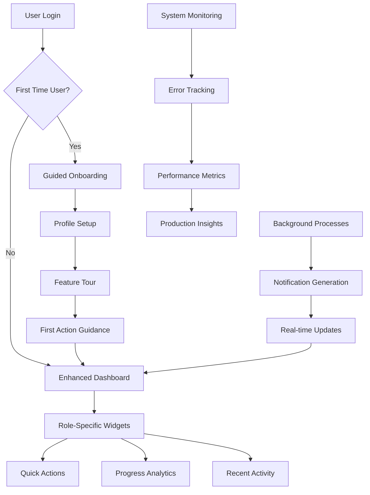

# Sprint S8: Enhanced User Experience & Polish - Technical Plan

## Sprint Goal

**"Enhance user experience with improved onboarding, dashboard analytics, notification system, and comprehensive testing to prepare for production deployment."**

## Overview

Sprint S8 focuses on polishing the existing feature set and enhancing the user experience to create a production-ready coaching platform. This sprint builds upon the solid foundation of Sprints S6-S7 by adding user-centric improvements, analytics, notifications, and production readiness features.

## Architecture Integration

The enhancements integrate seamlessly with existing infrastructure:
- **Dashboard Widgets**: Extend existing [`DashboardNav`](frontend/src/components/navigation/DashboardNav.tsx) and layout system
- **Notification System**: New real-time notification infrastructure with WebSocket support
- **Analytics Service**: Extend [`AnalysisService`](backend/app/services/analysis_service.py) with dashboard analytics
- **Onboarding Flow**: Enhance existing authentication and profile creation flows
- **Production Features**: Error boundaries, monitoring, and deployment optimization

## Core User Workflows



## Key Features Summary

### MVP Scope
- **Enhanced Dashboard**: Role-specific widgets with analytics and quick actions
- **Notification System**: Real-time notifications for key events and milestones
- **Improved Onboarding**: Guided tour and progressive feature disclosure
- **Analytics Dashboard**: Progress tracking and relationship health metrics
- **Production Readiness**: Error handling, monitoring, and deployment optimization

### Out of Scope for MVP
- Advanced reporting and data export
- Third-party integrations (calendar, email)
- Mobile app development
- Advanced customization options

---

## 1. Enhanced Dashboard System

### Dashboard Widget Framework

Create new file: [`frontend/src/components/dashboard/DashboardWidget.tsx`](frontend/src/components/dashboard/DashboardWidget.tsx)

```typescript
"use client";

import { ReactNode } from 'react';
import { Card, CardContent, CardDescription, CardHeader, CardTitle } from '@/components/ui/card';
import { Button } from '@/components/ui/button';
import { LucideIcon } from 'lucide-react';

export interface DashboardWidgetProps {
  title: string;
  description?: string;
  icon?: LucideIcon;
  children: ReactNode;
  actions?: {
    label: string;
    href?: string;
    onClick?: () => void;
    variant?: 'default' | 'outline' | 'ghost';
  }[];
  className?: string;
  loading?: boolean;
  error?: string;
}

export function DashboardWidget({
  title,
  description,
  icon: Icon,
  children,
  actions,
  className,
  loading,
  error
}: DashboardWidgetProps) {
  if (loading) {
    return (
      <Card className={className}>
        <CardHeader>
          <div className="flex items-center space-x-2">
            {Icon && <Icon className="h-5 w-5 text-muted-foreground" />}
            <div className="h-5 w-32 bg-muted animate-pulse rounded" />
          </div>
        </CardHeader>
        <CardContent>
          <div className="space-y-2">
            <div className="h-4 w-full bg-muted animate-pulse rounded" />
            <div className="h-4 w-3/4 bg-muted animate-pulse rounded" />
          </div>
        </CardContent>
      </Card>
    );
  }

  if (error) {
    return (
      <Card className={className}>
        <CardHeader>
          <div className="flex items-center space-x-2">
            {Icon && <Icon className="h-5 w-5 text-muted-foreground" />}
            <CardTitle className="text-lg">{title}</CardTitle>
          </div>
        </CardHeader>
        <CardContent>
          <div className="text-center py-4">
            <p className="text-sm text-red-600">{error}</p>
            <Button variant="outline" size="sm" className="mt-2">
              Retry
            </Button>
          </div>
        </CardContent>
      </Card>
    );
  }

  return (
    <Card className={className}>
      <CardHeader>
        <div className="flex items-center justify-between">
          <div className="flex items-center space-x-2">
            {Icon && <Icon className="h-5 w-5 text-muted-foreground" />}
            <div>
              <CardTitle className="text-lg">{title}</CardTitle>
              {description && <CardDescription>{description}</CardDescription>}
            </div>
          </div>
          {actions && actions.length > 0 && (
            <div className="flex space-x-2">
              {actions.map((action, index) => (
                <Button
                  key={index}
                  variant={action.variant || 'outline'}
                  size="sm"
                  onClick={action.onClick}
                  asChild={!!action.href}
                >
                  {action.href ? (
                    <a href={action.href}>{action.label}</a>
                  ) : (
                    action.label
                  )}
                </Button>
              ))}
            </div>
          )}
        </div>
      </CardHeader>
      <CardContent>
        {children}
      </CardContent>
    </Card>
  );
}
```

### Enhanced Dashboard Page

Update [`frontend/src/app/dashboard/page.tsx`](frontend/src/app/dashboard/page.tsx):

```typescript
"use client";

import { useState, useEffect } from 'react';
import { useAuth } from '@/context/AuthContext';
import { PageHeader } from '@/components/navigation/NavigationUtils';
import { DashboardWidget } from '@/components/dashboard/DashboardWidget';
import { QuickActionsWidget } from '@/components/dashboard/QuickActionsWidget';
import { ProgressOverviewWidget } from '@/components/dashboard/ProgressOverviewWidget';
import { RecentActivityWidget } from '@/components/dashboard/RecentActivityWidget';
import { RelationshipHealthWidget } from '@/components/dashboard/RelationshipHealthWidget';
import { UpcomingTasksWidget } from '@/components/dashboard/UpcomingTasksWidget';
import { AnalyticsWidget } from '@/components/dashboard/AnalyticsWidget';

export default function DashboardPage() {
  const { user, isAuthenticated } = useAuth();
  const [dashboardData, setDashboardData] = useState(null);
  const [loading, setLoading] = useState(true);

  useEffect(() => {
    if (isAuthenticated && user) {
      fetchDashboardData();
    }
  }, [isAuthenticated, user]);

  const fetchDashboardData = async () => {
    try {
      setLoading(true);
      // Fetch dashboard analytics and data
      // This will be implemented with the analytics service
      setLoading(false);
    } catch (error) {
      console.error('Error fetching dashboard data:', error);
      setLoading(false);
    }
  };

  if (!isAuthenticated || !user) {
    return (
      <div className="text-center py-12">
        <div className="animate-spin rounded-full h-12 w-12 border-b-2 border-blue-600 mx-auto mb-4"></div>
        <p className="text-gray-600">Loading dashboard...</p>
      </div>
    );
  }

  const isCoach = user.role === 'coach';

  return (
    <div className="space-y-6">
      <PageHeader />
      
      {/* Welcome Section */}
      <div className="bg-gradient-to-r from-blue-50 to-purple-50 rounded-lg p-6">
        <h2 className="text-2xl font-bold text-gray-900 mb-2">
          Welcome back, {user.firstName || user.email}!
        </h2>
        <p className="text-gray-600">
          {isCoach 
            ? "Here's an overview of your coaching practice and client progress."
            : "Track your coaching journey and see your progress toward your goals."
          }
        </p>
      </div>

      {/* Dashboard Grid */}
      <div className="grid grid-cols-1 lg:grid-cols-3 gap-6">
        {/* Left Column - Primary Widgets */}
        <div className="lg:col-span-2 space-y-6">
          <QuickActionsWidget userRole={user.role} />
          <ProgressOverviewWidget userRole={user.role} loading={loading} />
          <RecentActivityWidget userRole={user.role} loading={loading} />
        </div>

        {/* Right Column - Secondary Widgets */}
        <div className="space-y-6">
          <RelationshipHealthWidget userRole={user.role} loading={loading} />
          <UpcomingTasksWidget userRole={user.role} loading={loading} />
          {isCoach && <AnalyticsWidget loading={loading} />}
        </div>
      </div>
    </div>
  );
}
```

### Dashboard Widget Components

Create new file: [`frontend/src/components/dashboard/QuickActionsWidget.tsx`](frontend/src/components/dashboard/QuickActionsWidget.tsx)

```typescript
"use client";

import { DashboardWidget } from './DashboardWidget';
import { Button } from '@/components/ui/button';
import { Plus, Upload, Target, Brain, Users } from 'lucide-react';
import { useRouter } from 'next/navigation';

interface QuickActionsWidgetProps {
  userRole: 'coach' | 'client';
}

export function QuickActionsWidget({ userRole }: QuickActionsWidgetProps) {
  const router = useRouter();

  const coachActions = [
    {
      label: 'New Session Insight',
      icon: Brain,
      href: '/dashboard/insights',
      description: 'Analyze a coaching session'
    },
    {
      label: 'View Clients',
      icon: Users,
      href: '/dashboard/connections',
      description: 'Manage client relationships'
    },
    {
      label: 'Upload Document',
      icon: Upload,
      href: '/dashboard/documents/upload',
      description: 'Add client documents'
    }
  ];

  const clientActions = [
    {
      label: 'Set New Goal',
      icon: Target,
      href: '/dashboard/goals',
      description: 'Create a new goal'
    },
    {
      label: 'Upload Document',
      icon: Upload,
      href: '/dashboard/documents/upload',
      description: 'Share documents with coach'
    },
    {
      label: 'View Insights',
      icon: Brain,
      href: '/dashboard/insights',
      description: 'Review session insights'
    }
  ];

  const actions = userRole === 'coach' ? coachActions : clientActions;

  return (
    <DashboardWidget
      title="Quick Actions"
      description="Common tasks and shortcuts"
      icon={Plus}
    >
      <div className="grid grid-cols-1 sm:grid-cols-3 gap-3">
        {actions.map((action, index) => (
          <Button
            key={index}
            variant="outline"
            className="h-auto p-4 flex flex-col items-center space-y-2"
            onClick={() => router.push(action.href)}
          >
            <action.icon className="h-6 w-6 text-blue-600" />
            <div className="text-center">
              <div className="font-medium text-sm">{action.label}</div>
              <div className="text-xs text-muted-foreground">{action.description}</div>
            </div>
          </Button>
        ))}
      </div>
    </DashboardWidget>
  );
}
```

---

## 2. Notification System

### Notification Models

Create new file: [`backend/app/models/notification.py`](backend/app/models/notification.py)

```python
from pydantic import BaseModel, Field, ConfigDict
from datetime import datetime
from typing import Optional, Dict, Any
from bson import ObjectId
from enum import Enum

class PyObjectId(ObjectId):
    @classmethod
    def __get_pydantic_core_schema__(cls, source_type, handler):
        from pydantic_core import core_schema
        return core_schema.no_info_after_validator_function(
            cls.validate,
            core_schema.str_schema(),
            serialization=core_schema.to_string_ser_schema(),
        )

    @classmethod
    def validate(cls, v):
        if isinstance(v, ObjectId):
            return v
        if isinstance(v, str):
            if ObjectId.is_valid(v):
                return ObjectId(v)
        raise ValueError("Invalid ObjectId")

class NotificationType(str, Enum):
    """Types of notifications"""
    COACHING_RELATIONSHIP = "coaching_relationship"
    SESSION_INSIGHT = "session_insight"
    GOAL_UPDATE = "goal_update"
    BASELINE_GENERATED = "baseline_generated"
    DOCUMENT_PROCESSED = "document_processed"
    SYSTEM_UPDATE = "system_update"

class NotificationPriority(str, Enum):
    """Notification priority levels"""
    LOW = "low"
    MEDIUM = "medium"
    HIGH = "high"
    URGENT = "urgent"

class NotificationAction(BaseModel):
    """Action that can be taken from a notification"""
    label: str
    url: str
    action_type: str  # "navigate", "api_call", "modal"

class Notification(BaseModel):
    model_config = ConfigDict(
        populate_by_name=True,
        arbitrary_types_allowed=True,
        json_encoders={ObjectId: str}
    )
    
    id: Optional[PyObjectId] = Field(default=None, alias="_id")
    
    # Target user
    user_id: str  # Who should receive this notification
    
    # Notification content
    title: str
    message: str
    type: NotificationType
    priority: NotificationPriority = NotificationPriority.MEDIUM
    
    # Related entities
    related_entity_id: Optional[str] = None  # ID of related object (session, goal, etc.)
    related_entity_type: Optional[str] = None  # Type of related object
    
    # Actions
    actions: list[NotificationAction] = Field(default_factory=list)
    
    # Metadata
    metadata: Dict[str, Any] = Field(default_factory=dict)
    
    # Status
    is_read: bool = False
    is_dismissed: bool = False
    read_at: Optional[datetime] = None
    dismissed_at: Optional[datetime] = None
    
    # Delivery
    delivery_method: list[str] = Field(default_factory=lambda: ["in_app"])  # in_app, email, push
    delivered_at: Optional[datetime] = None
    
    # Timestamps
    created_at: datetime = Field(default_factory=datetime.utcnow)
    expires_at: Optional[datetime] = None  # Auto-dismiss after this time
```

### Notification Service

Create new file: [`backend/app/services/notification_service.py`](backend/app/services/notification_service.py)

```python
from typing import List, Optional, Dict, Any
from datetime import datetime, timedelta
from app.models.notification import Notification, NotificationType, NotificationPriority, NotificationAction
from app.repositories.notification_repository import NotificationRepository
from app.services.user_service import UserService
import logging

logger = logging.getLogger(__name__)

class NotificationService:
    def __init__(self):
        self.notification_repository = NotificationRepository()
        self.user_service = UserService()
    
    async def create_notification(
        self,
        user_id: str,
        title: str,
        message: str,
        notification_type: NotificationType,
        priority: NotificationPriority = NotificationPriority.MEDIUM,
        related_entity_id: Optional[str] = None,
        related_entity_type: Optional[str] = None,
        actions: List[NotificationAction] = None,
        metadata: Dict[str, Any] = None,
        expires_in_days: Optional[int] = 30
    ) -> Notification:
        """Create a new notification"""
        try:
            logger.info(f"=== NotificationService.create_notification called ===")
            logger.info(f"user_id: {user_id}, type: {notification_type}")
            
            expires_at = None
            if expires_in_days:
                expires_at = datetime.utcnow() + timedelta(days=expires_in_days)
            
            notification = Notification(
                user_id=user_id,
                title=title,
                message=message,
                type=notification_type,
                priority=priority,
                related_entity_id=related_entity_id,
                related_entity_type=related_entity_type,
                actions=actions or [],
                metadata=metadata or {},
                expires_at=expires_at
            )
            
            saved_notification = await self.notification_repository.create_notification(notification)
            logger.info(f"✅ Created notification: {saved_notification.id}")
            
            # TODO: Trigger real-time delivery (WebSocket, etc.)
            await self._deliver_notification(saved_notification)
            
            return saved_notification
            
        except Exception as e:
            logger.error(f"❌ Error creating notification: {e}")
            raise
    
    async def get_user_notifications(
        self,
        user_id: str,
        limit: int = 20,
        offset: int = 0,
        unread_only: bool = False
    ) -> List[Notification]:
        """Get notifications for a user"""
        try:
            return await self.notification_repository.get_user_notifications(
                user_id, limit, offset, unread_only
            )
        except Exception as e:
            logger.error(f"Error fetching notifications for user {user_id}: {e}")
            return []
    
    async def mark_as_read(self, notification_id: str, user_id: str) -> bool:
        """Mark notification as read"""
        try:
            return await self.notification_repository.mark_as_read(notification_id, user_id)
        except Exception as e:
            logger.error(f"Error marking notification as read: {e}")
            return False
    
    async def mark_all_as_read(self, user_id: str) -> int:
        """Mark all notifications as read for a user"""
        try:
            return await self.notification_repository.mark_all_as_read(user_id)
        except Exception as e:
            logger.error(f"Error marking all notifications as read: {e}")
            return 0
    
    async def dismiss_notification(self, notification_id: str, user_id: str) -> bool:
        """Dismiss a notification"""
        try:
            return await self.notification_repository.dismiss_notification(notification_id, user_id)
        except Exception as e:
            logger.error(f"Error dismissing notification: {e}")
            return False
    
    # Notification creation helpers for common events
    
    async def notify_session_insight_completed(
        self,
        user_id: str,
        insight_id: str,
        session_title: Optional[str] = None
    ):
        """Notify when session insight is completed"""
        title = "Session Insight Ready"
        message = f"Your session insight{f' for {session_title}' if session_title else ''} has been generated and is ready to view."
        
        actions = [
            NotificationAction(
                label="View Insight",
                url=f"/dashboard/insights/{insight_id}",
                action_type="navigate"
            )
        ]
        
        await self.create_notification(
            user_id=user_id,
            title=title,
            message=message,
            notification_type=NotificationType.SESSION_INSIGHT,
            priority=NotificationPriority.MEDIUM,
            related_entity_id=insight_id,
            related_entity_type="session_insight",
            actions=actions
        )
    
    async def notify_baseline_generated(
        self,
        user_id: str,
        baseline_id: str
    ):
        """Notify when baseline is generated"""
        title = "Baseline Analysis Complete"
        message = "Your AI-powered baseline analysis has been completed and is ready to review."
        
        actions = [
            NotificationAction(
                label="View Baseline",
                url="/dashboard/documents",
                action_type="navigate"
            )
        ]
        
        await self.create_notification(
            user_id=user_id,
            title=title,
            message=message,
            notification_type=NotificationType.BASELINE_GENERATED,
            priority=NotificationPriority.HIGH,
            related_entity_id=baseline_id,
            related_entity_type="baseline",
            actions=actions
        )
    
    async def notify_coaching_relationship_update(
        self,
        user_id: str,
        relationship_id: str,
        update_type: str,
        other_user_name: str
    ):
        """Notify about coaching relationship updates"""
        title_map = {
            "request_received": "New Coaching Request",
            "request_accepted": "Coaching Request Accepted",
            "request_declined": "Coaching Request Declined"
        }
        
        message_map = {
            "request_received": f"{other_user_name} has sent you a coaching relationship request.",
            "request_accepted": f"{other_user_name} has accepted your coaching relationship request.",
            "request_declined": f"{other_user_name} has declined your coaching relationship request."
        }
        
        title = title_map.get(update_type, "Coaching Relationship Update")
        message = message_map.get(update_type, f"Update from {other_user_name}")
        
        actions = [
            NotificationAction(
                label="View Connections",
                url="/dashboard/connections",
                action_type="navigate"
            )
        ]
        
        await self.create_notification(
            user_id=user_id,
            title=title,
            message=message,
            notification_type=NotificationType.COACHING_RELATIONSHIP,
            priority=NotificationPriority.HIGH,
            related_entity_id=relationship_id,
            related_entity_type="coaching_relationship",
            actions=actions
        )
    
    async def _deliver_notification(self, notification: Notification):
        """Handle notification delivery (WebSocket, email, etc.)"""
        # TODO: Implement real-time delivery
        # This would integrate with WebSocket connections, email service, etc.
        logger.info(f"Delivering notification {notification.id} to user {notification.user_id}")
        pass
```

---

## 3. Analytics and Progress Tracking

### Analytics Service Extension

Create new file: [`backend/app/services/dashboard_analytics_service.py`](backend/app/services/dashboard_analytics_service.py)

```python
from typing import Dict, Any, List, Optional
from datetime import datetime, timedelta
from app.repositories.session_insight_repository import SessionInsightRepository
from app.repositories.baseline_repository import BaselineRepository
from app.repositories.goal_repository import GoalRepository
from app.repositories.coaching_relationship_repository import CoachingRelationshipRepository
from app.repositories.document_repository import DocumentRepository
import logging

logger = logging.getLogger(__name__)

class DashboardAnalyticsService:
    def __init__(self):
        self.session_insight_repository = SessionInsightRepository()
        self.baseline_repository = BaselineRepository()
        self.goal_repository = GoalRepository()
        self.relationship_repository = CoachingRelationshipRepository()
        self.document_repository = DocumentRepository()
    
    async def get_user_dashboard_analytics(
        self,
        user_id: str,
        user_role: str,
        days_back: int = 30
    ) -> Dict[str, Any]:
        """Get comprehensive dashboard analytics for a user"""
        try:
            logger.info(f"=== DashboardAnalyticsService.get_user_dashboard_analytics called ===")
            logger.info(f"user_id: {user_id}, role: {user_role}")
            
            since_date = datetime.utcnow() - timedelta(days=days_back)
            
            if user_role == 'coach':
                return await self._get_coach_analytics(user_id, since_date)
            else:
                return await self._get_client_analytics(user_id, since_date)
                
        except Exception as e:
            logger.error(f"❌ Error getting dashboard analytics: {e}")
            return {}
    
    async def _get_coach_analytics(self, coach_user_id: str, since_date: datetime) -> Dict[str, Any]:
        """Get analytics specific to coaches"""
        try:
            # Get active relationships
            relationships = await self.relationship_repository.get_active_relationships_for_user(coach_user_id)
            client_ids = [rel.client_user_id for rel in relationships]
            
            # Session insights analytics
            total_insights = 0
            recent_insights = 0
            for client_id in client_ids:
                client_insights = await self.session_insight_repository.get_insights_by_user(client_id)
                total_insights += len(client_insights)
                recent_insights += len([i for i in client_insights if i.created_at >= since_date])
            
            # Goal progress analytics
            total_goals = 0
            active_goals = 0
            for client_id in client_ids:
                client_goals = await self.goal_repository.get_goals_by_user_id(client_id)
                total_goals += len(client_goals)
                active_goals += len([g for g in client_goals if g.status == 'active'])
            
            # Document analytics
            total_documents = 0
            for client_id in client_ids:
                client_docs = await self.document_repository.get_documents_by_user_id(client_id)
                total_documents += len(client_docs)
            
            return {
                "overview": {
                    "active_clients": len(relationships),
                    "total_session_insights": total_insights,
                    "recent_session_insights": recent_insights,
                    "total_client_goals": total_goals,
                    "active_client_goals": active_goals,
                    "total_client_documents": total_documents
                },
                "recent_activity": await self._get_recent_activity(coach_user_id, since_date, "coach"),
                "client_progress": await self._get_client_progress_summary(client_ids),
                "relationship_health": await self._get_relationship_health(relationships)
            }
            
        except Exception as e:
            logger.error(f"Error getting coach analytics: {e}")
            return {}
    
    async def _get_client_analytics(self, client_user_id: str, since_date: datetime) -> Dict[str, Any]:
        """Get analytics specific to clients"""
        try:
            # Get coaching relationships
            relationships = await self.relationship_repository.get_active_relationships_for_user(client_user_id)
            
            # Session insights
            insights = await self.session_insight_repository.get_insights_by_user(client_user_id)
            recent_insights = [i for i in insights if i.created_at >= since_date]
            
            # Goals
            goals = await self.goal_repository.get_goals_by_user_id(client_user_id)
            active_goals = [g for g in goals if g.status == 'active']
            completed_goals = [g for g in goals if g.status == 'completed']
            
            # Documents
            documents = await self.document_repository.get_documents_by_user_id(client_user_id)
            processed_docs = [d for d in documents if d.is_processed]
            
            # Baseline
            baseline = await self.baseline_repository.get_baseline_by_user_id(client_user_id)
            
            return {
                "overview": {
                    "active_coaching_relationships": len(relationships),
                    "total_session_insights": len(insights),
                    "recent_session_insights": len(recent_insights),
                    "active_goals": len(active_goals),
                    "completed_goals": len(completed_goals),
                    "uploaded_documents": len(documents),
                    "processed_documents": len(processed_docs),
                    "has_baseline": baseline is not None
                },
                "recent_activity": await self._get_recent_activity(client_user_id, since_date, "client"),
                "goal_progress": await self._get_goal_progress_summary(goals),
                "coaching_journey": await self._get_coaching_journey_summary(client_user_id, insights, goals)
            }
            
        except Exception as e:
            logger.error(f"Error getting client analytics: {e}")
            return {}
    
    async def _get_recent_activity(
        self, 
        user_id: str, 
        since_date: datetime, 
        user_role: str
    ) -> List[Dict[str, Any]]:
        """Get recent activity for dashboard"""
        activities = []
        
        try:
            # Recent session insights
            if user_role == "client":
                insights = await self.session_insight_repository.get_insights_by_user(user_id)
            else:
                # For coaches, get insights from all their clients
                relationships = await self.relationship_repository.get_active_relationships_for_user(user_id)
                insights = []
                for rel in relationships:
                    client_insights = await self.session_insight_repository.get_insights_by_user(rel.client_user_id)
                    insights.extend(client_insights)
            
            recent_insights = [i for i in insights if i.created_at >= since_date]
            for insight in recent_insights[-5:]:  # Last 5
                activities.append({
                    "type": "session_insight",
                    "title": f"Session insight generated",
                    "description": insight.session_title or "Untitled session",
                    "timestamp": insight.created_at,
                    "url": f"/dashboard/insights/{insight.id}"
                })
            
            # Recent goals (for clients)
            if user_role == "client":
                goals = await self.goal_repository.get_goals_by_user_id(user_id)
                recent_goals = [g for g in goals if g.created_at >= since_date]
                for goal in recent_goals[-3:]:  # Last 3
                    activities.append({
                        "type": "goal",
                        "title": f"New goal created",
                        "description": goal.title,
                        "timestamp": goal.created_at,
                        "url": f"/dashboard/goals"
                    })
            
            # Sort by timestamp
            activities.sort(key=lambda x: x["timestamp"], reverse=True)
            return activities[:10]  # Return top 10
            
        except Exception as e:
            logger.error(f"Error getting recent activity: {e}")
            return []
    
    async def _get_client_progress_summary(self, client_ids: List[str]) -> List[Dict[str, Any]]:
        """Get progress summary for coach's clients"""
        progress_data = []
        
        for client_id in client_ids:
            try:
                # Get client goals
                goals = await self.goal_repository.get_goals_by_user_id(client_id)
                active_goals = [g for g in goals if g.status == 'active']
                completed_goals = [g for g in goals if g.status == 'completed']
                
                # Get recent insights
                insights = await self.session_insight_repository.get_insights_by_user(client_id)
                recent_insights = [i for i in insights if i.created_at >= datetime.utcnow() - timedelta(days=30)]
                
                # Calculate progress score (simple algorithm)
                progress_score = min(100, (len(completed_goals) * 20) + (len(recent_insights) * 10))
                
                progress_data.append({
                    "client_id": client_id,
                    "active_goals": len(active_goals),
                    "completed_goals": len(completed_goals),
                    "recent_insights": len(recent_insights),
                    "progress_score": progress_score
                })
                
            except Exception as e:
                logger.error(f"Error getting progress for client {client_id}: {e}")
                continue
        
        return progress_data
    
    async def _get_relationship_health(self, relationships: List) -> Dict[str, Any]:
        """Calculate relationship health metrics"""
        if not relationships:
            return {"overall_health": "No relationships", "health_score": 0}
        
        total_score = 0
        for relationship in relationships:
            # Simple health calculation based on activity
            days_since_created = (datetime.utcnow() - relationship.created_at).days
            if days_since_created < 7:
                score = 100  # New relationship
            elif days_since_created < 30:
                score = 80   # Active relationship
            else:
                score = 60   # Established relationship
            
            total_score += score
        
        avg_score = total_score / len(relationships)
        
        if avg_score >= 80:
            health_status = "Excellent"
        elif avg_score >= 60:
            health_status = "Good"
        else:
            health_status = "Needs Attention"
        
        return {
            "overall_health": health_status,
            "health_score": avg_score,
            "total_relationships": len(relationships)
        }
    
    async def _get_goal_progress_summary(self, goals: List) -> Dict[str, Any]:
        """Get goal progress summary for clients"""
        if not goals:
            return {"total_goals": 0, "completion_rate": 0, "active_goals": 0}
        
        active_goals = [g for g in goals if g.status == 'active']
        completed_goals = [g for g in goals if g.status == 'completed']
        
        completion_rate = (len(completed_goals) / len(goals)) * 100 if goals else 0
        
        return {
            "total_goals": len(goals),
            "active_goals": len(active_goals),
            "completed_goals": len(completed_goals),
            "completion_rate": round(completion_rate, 1)
        }
    
    async def _get_coaching_journey_summary(
        self, 
        client_id: str, 
        insights: List, 
        goals: List
    ) -> Dict[str, Any]:
        """Get coaching journey summary for clients"""
        journey_start = None
        if insights:
            journey_start = min(insight.created_at for insight in insights)
        elif goals:
            journey_start = min(goal.created_at for goal in goals)
        
        if not journey_start:
            return {"journey_length_days": 0, "milestones": []}
        
        journey_days = (datetime.utcnow() - journey_start).days
        
        # Calculate milestones
        milestones = []
        if len(insights) >= 1:
            milestones.append("First session insight generated")
        if len(goals) >= 1:
            milestones.append("First goal created")
        if len([g for g in goals if g.status == 'completed']) >= 1:
            milestones.append("First goal completed")
        if len(insights) >= 5:
            milestones.append("5+ session insights generated")
        
        return {
            "journey_length_days": journey_days,
            "milestones": milestones,
            "total_insights": len(insights),
            "total_goals": len(goals)
        }
```

---

## 4. Implementation Plan

### Phase 1: Dashboard Enhancement (Week 1)
**Days 1-2: Widget Framework**
- [ ] Create [`DashboardWidget`](frontend/src/components/dashboard/DashboardWidget.tsx) base component
- [ ] Implement [`QuickActionsWidget`](frontend/src/components/dashboard/QuickActionsWidget.tsx)
- [ ] Create [`ProgressOverviewWidget`](frontend/src/components/dashboard/ProgressOverviewWidget.tsx)
- [ ] Update main dashboard page with new layout

**Days 3-4: Analytics Backend**
- [ ] Create [`DashboardAnalyticsService`](backend/app/services/dashboard_analytics_service.py)
- [ ] Implement analytics API endpoints
- [ ] Add dashboard data aggregation logic
- [ ] Test analytics with sample data

**Days 5-7: Dashboard Widgets**
- [ ] Create [`RecentActivityWidget`](frontend/src/components/dashboard/RecentActivityWidget.tsx)
- [ ] Implement [`RelationshipHealthWidget`](frontend/src/components/dashboard/RelationshipHealthWidget.tsx)
- [ ] Add [`AnalyticsWidget`](frontend/src/components/dashboard/AnalyticsWidget.tsx) for coaches
- [ ] Connect all widgets to backend APIs

### Phase 2: Notification System (Week 2)
**Days 1-3: Backend Infrastructure**
- [ ] Create [`Notification`](backend/app/models/notification.py) model
- [ ] Implement [`NotificationRepository`](backend/app/repositories/notification_repository.py)
- [ ] Create [`NotificationService`](backend/app/services/notification_service.py)
- [ ] Add notification API endpoints

**Days 4-5: Frontend Components**
- [ ] Create notification display components
- [ ] Implement notification center/dropdown
- [ ] Add real-time notification updates
- [ ] Integrate with existing workflows

**Days 6-7: Integration**
- [ ] Add notification triggers to existing services
- [ ] Test notification delivery and display
- [ ] Implement notification preferences
- [ ] Add notification history and management

### Phase 3: Onboarding Experience (Week 3)
**Days 1-2: Onboarding Flow**
- [ ] Create [`OnboardingFlow`](frontend/src/components/onboarding/OnboardingFlow.tsx) component
- [ ] Implement individual step components
- [ ] Add progress tracking and navigation
- [ ] Create onboarding completion logic

**Days 3-4: Integration**
- [ ] Integrate onboarding with authentication flow
- [ ] Add onboarding status tracking
- [ ] Implement skip and resume functionality
- [ ] Test complete onboarding experience

**Days 5-7: Feature Tours**
- [ ] Create guided tour components
- [ ] Add contextual help and tooltips
- [ ] Implement progressive disclosure
- [ ] Add help documentation links

### Phase 4: Production Readiness (Week 4)
**Days 1-2: Error Handling**
- [ ] Create [`ErrorBoundary`](frontend/src/components/error/ErrorBoundary.tsx) component
- [ ] Implement global error handling
- [ ] Add error logging and monitoring
- [ ] Create user-friendly error pages

**Days 3-4: Performance Optimization**
- [ ] Implement performance monitoring hooks
- [ ] Add loading states and skeleton screens
- [ ] Optimize bundle size and code splitting
- [ ] Add performance metrics tracking

**Days 5-7: Deployment Preparation**
- [ ] Environment configuration management
- [ ] Security hardening and audit
- [ ] Database optimization and indexing
- [ ] Production deployment testing

---

## 5. Success Criteria

### MVP Requirements
- ✅ Enhanced dashboard with role-specific widgets and analytics
- ✅ Real-time notification system for key events and milestones
- ✅ Guided onboarding flow for new users
- ✅ Comprehensive error handling and user feedback
- ✅ Performance monitoring and optimization
- ✅ Production-ready deployment configuration

### Quality Requirements
- ✅ Smooth, responsive user interface across all devices
- ✅ Fast loading times and optimized performance
- ✅ Comprehensive error handling with graceful degradation
- ✅ Accessible design following WCAG guidelines
- ✅ Scalable architecture supporting future growth

### Technical Requirements
- ✅ TypeScript implementation with proper type safety
- ✅ Comprehensive testing coverage (unit, integration, e2e)
- ✅ Security best practices and vulnerability assessment
- ✅ Monitoring and observability in production
- ✅ Automated deployment and rollback capabilities

---

## 6. Future Enhancements (Post-MVP)

### Advanced Analytics
- **Custom Dashboards**: User-configurable dashboard layouts
- **Advanced Reporting**: Detailed analytics and trend analysis
- **Data Export**: CSV/PDF export capabilities
- **Benchmarking**: Industry and peer comparisons

### Enhanced Notifications
- **Email Integration**: Email notification delivery
- **Push Notifications**: Mobile push notification support
- **Smart Scheduling**: Intelligent notification timing
- **Digest Summaries**: Weekly/monthly summary emails

### Advanced Onboarding
- **Personalized Paths**: Role and goal-specific onboarding
- **Interactive Tutorials**: Hands-on feature demonstrations
- **Progress Tracking**: Detailed onboarding completion analytics
- **Adaptive Learning**: AI-powered onboarding optimization

### Enterprise Features
- **Multi-tenant Architecture**: Organization-level management
- **Advanced Security**: SSO, RBAC, audit logging
- **API Access**: Public API for integrations
- **White-label Options**: Customizable branding and themes

This comprehensive Sprint S8 plan transforms the Arete platform from a functional MVP into a polished, production-ready coaching platform that provides exceptional user experience while maintaining the robust technical foundation built in previous sprints.