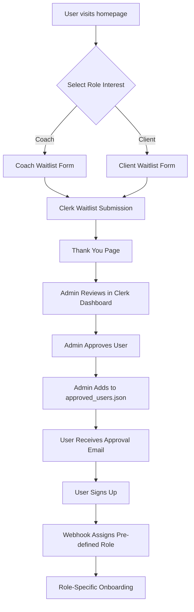
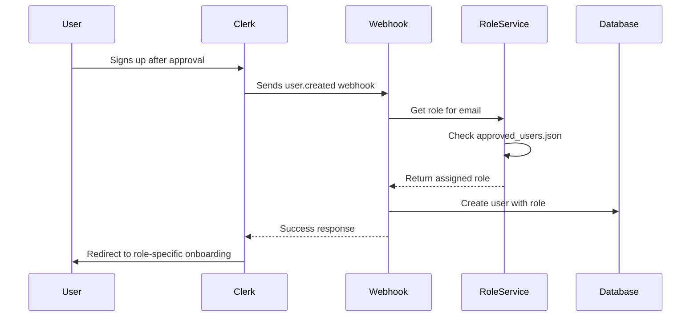

# Waitlist & Pre-Assigned Role Workflow Implementation Plan

## Overview

This document outlines the complete implementation plan for the Clerk-managed waitlist and pre-assigned role system for the Arete MVP. The system will allow users to join role-agnostic waitlists, get approved by admins, have roles pre-assigned, and be automatically onboarded with the correct role upon signup.

## Current Architecture Analysis

### What's Already Built
- ✅ **Homepage with static waitlist forms** ([`frontend/src/app/page.tsx`](frontend/src/app/page.tsx:198-253))
- ✅ **Role assignment system** via [`backend/config/approved_users.json`](backend/config/approved_users.json)
- ✅ **RoleService** ([`backend/app/services/role_service.py`](backend/app/services/role_service.py)) that reads config file
- ✅ **Clerk webhook integration** ([`backend/app/api/v1/webhooks/clerk.py`](backend/app/api/v1/webhooks/clerk.py)) with role assignment
- ✅ **Complete user/profile management** system
- ✅ **Role-specific onboarding** ([`frontend/src/components/onboarding/OnboardingGuide.tsx`](frontend/src/components/onboarding/OnboardingGuide.tsx))

### What Needs to Be Built
- ❌ **Functional waitlist forms** - Currently static UI elements
- ❌ **Clerk waitlist integration** - No actual Clerk waitlist component
- ❌ **Admin approval workflow** - No interface for managing waitlist approvals
- ❌ **Enhanced role assignment** - Needs waitlist integration

## Implementation Phases

### Phase 1: Frontend Waitlist Integration

**Objective**: Replace static waitlist forms with functional Clerk waitlist components

#### Tasks
1. **Update Homepage Waitlist Forms**
   - Replace static forms with Clerk's waitlist components
   - Implement separate waitlist flows for coaches and clients
   - Add proper form validation and submission handling
   - Create role-specific waitlist messaging

2. **Create Waitlist Success Pages**
   - Thank you pages for waitlist submissions
   - Clear next steps communication
   - Role-specific messaging

#### Files to Modify/Create
- [`frontend/src/app/page.tsx`](frontend/src/app/page.tsx:198-253) - Replace waitlist forms
- `frontend/src/app/waitlist/success/page.tsx` - New success page
- `frontend/src/app/waitlist/coach/page.tsx` - Coach-specific waitlist page
- `frontend/src/app/waitlist/client/page.tsx` - Client-specific waitlist page

#### Technical Details
```typescript
// Clerk waitlist component integration
import { SignUp } from "@clerk/nextjs";

// Coach waitlist with metadata
<SignUp 
  routing="hash"
  signInUrl="/sign-in"
  afterSignUpUrl="/waitlist/success?role=coach"
  unsafeMetadata={{ waitlistRole: "coach" }}
/>
```

### Phase 2: Backend Waitlist Management

**Objective**: Create backend services to manage waitlist and role assignment

#### Tasks
1. **Enhance RoleService**
   - Add CRUD methods for approved users configuration
   - Add validation and error handling
   - Create backup/restore functionality
   - Add audit logging

2. **Create Waitlist Management Endpoints**
   - CRUD operations for approved users
   - Bulk import/export functionality
   - Role assignment validation
   - Admin authentication middleware

3. **Update Clerk Webhook Handler**
   - Enhance logging for role assignment process
   - Add fallback handling for users not in approved list
   - Add waitlist status checking

#### Files to Modify/Create
- [`backend/app/services/role_service.py`](backend/app/services/role_service.py) - Enhance functionality
- `backend/app/api/v1/endpoints/waitlist.py` - New waitlist management endpoints
- `backend/app/schemas/waitlist.py` - New schemas for waitlist operations
- [`backend/app/api/v1/webhooks/clerk.py`](backend/app/api/v1/webhooks/clerk.py) - Minor enhancements

#### Enhanced Data Model
```json
{
  "email": "user@example.com",
  "role": "coach|client",
  "approved_at": "2025-01-01T00:00:00Z",
  "approved_by": "admin@example.com",
  "notes": "Optional admin notes",
  "waitlist_joined_at": "2024-12-15T00:00:00Z",
  "status": "approved|pending|rejected"
}
```

### Phase 3: Admin Interface

**Objective**: Create admin interface for managing waitlist approvals

#### Tasks
1. **Create Admin Dashboard**
   - View pending waitlist users (from Clerk)
   - Approve/reject users with role assignment
   - Bulk operations for efficiency
   - Search and filter functionality

2. **Admin Authentication & Authorization**
   - Secure admin routes with role-based access
   - Admin user management
   - Audit trail for admin actions

#### Files to Create
- `frontend/src/app/admin/waitlist/page.tsx` - Main admin dashboard
- `frontend/src/app/admin/layout.tsx` - Admin layout with navigation
- `frontend/src/components/admin/WaitlistManager.tsx` - Waitlist management component
- `backend/app/api/v1/endpoints/admin.py` - Admin-specific endpoints
- `backend/app/middleware/admin_auth.py` - Admin authentication middleware

### Phase 4: Enhanced User Flow

**Objective**: Improve user experience during signup and onboarding

#### Tasks
1. **Update Authentication Flow**
   - Handle waitlist vs approved user states
   - Redirect logic based on approval status
   - Error handling for non-approved users
   - Graceful degradation for edge cases

2. **Enhance Onboarding**
   - Role-specific onboarding flows
   - Welcome messages based on role assignment source
   - Skip profile creation if role pre-assigned

#### Files to Modify
- [`frontend/src/context/AuthContext.tsx`](frontend/src/context/AuthContext.tsx) - Add waitlist state handling
- [`frontend/src/components/onboarding/OnboardingGuide.tsx`](frontend/src/components/onboarding/OnboardingGuide.tsx) - Role-specific messaging
- [`frontend/src/app/layout.tsx`](frontend/src/app/layout.tsx) - Add waitlist status checking

## Technical Architecture

### Waitlist Flow Diagram


### Role Assignment Sequence


## API Specifications

### New Admin Endpoints
```typescript
// Approved Users Management
GET    /api/v1/admin/approved-users          // List approved users
POST   /api/v1/admin/approved-users          // Add approved user
PUT    /api/v1/admin/approved-users/{email}  // Update approved user
DELETE /api/v1/admin/approved-users/{email}  // Remove approved user
POST   /api/v1/admin/approved-users/bulk     // Bulk import

// Waitlist Management
GET    /api/v1/admin/waitlist                // Get waitlist status
POST   /api/v1/admin/waitlist/approve        // Approve waitlist user
POST   /api/v1/admin/waitlist/reject         // Reject waitlist user
```

### Enhanced RoleService Methods
```python
class RoleService:
    def get_role_for_email(self, email: str) -> Optional[str]
    def add_approved_user(self, email: str, role: str, approved_by: str) -> bool
    def remove_approved_user(self, email: str) -> bool
    def update_approved_user(self, email: str, updates: dict) -> bool
    def bulk_import_users(self, users: List[dict]) -> dict
    def export_approved_users(self) -> List[dict]
    def backup_config(self) -> str
    def restore_config(self, backup_data: str) -> bool
```

## Implementation Timeline

### Sprint 1 (Week 1): Core Waitlist Functionality
- [ ] Replace static waitlist forms with Clerk components
- [ ] Create waitlist success pages
- [ ] Test waitlist submission flow
- [ ] Basic error handling

**Deliverables**: Functional waitlist forms that integrate with Clerk

### Sprint 2 (Week 2): Backend Integration
- [ ] Enhance RoleService with CRUD operations
- [ ] Create waitlist management endpoints
- [ ] Update webhook handler with better logging
- [ ] Add data validation and error handling

**Deliverables**: Complete backend API for waitlist management

### Sprint 3 (Week 3): Admin Interface
- [ ] Create admin dashboard for waitlist management
- [ ] Implement admin authentication
- [ ] Add bulk operations for approved users
- [ ] Create audit trail functionality

**Deliverables**: Fully functional admin interface

### Sprint 4 (Week 4): Polish & Testing
- [ ] Enhanced user flow and error handling
- [ ] Comprehensive testing (unit, integration, e2e)
- [ ] Documentation and deployment preparation
- [ ] Performance optimization

**Deliverables**: Production-ready waitlist system

## Security Considerations

1. **Admin Authentication**: Secure admin routes with proper role-based access control
2. **Data Validation**: Validate all inputs to prevent injection attacks
3. **Rate Limiting**: Implement rate limiting on waitlist submissions
4. **Audit Trail**: Log all admin actions for accountability
5. **Backup Strategy**: Regular backups of approved_users.json
6. **Environment Separation**: Different configs for dev/staging/prod

## Risk Mitigation

1. **Clerk API Limits**: Monitor usage and implement rate limiting
2. **Data Consistency**: Add validation for approved_users.json format
3. **File Corruption**: Implement atomic writes and backups
4. **Admin Access**: Multi-factor authentication for admin accounts
5. **Scale Considerations**: Plan for database migration if file-based approach doesn't scale

## Testing Strategy

### Unit Tests
- RoleService methods
- Webhook handlers
- API endpoints
- Form validation

### Integration Tests
- Clerk webhook integration
- Database operations
- Admin workflow
- User signup flow

### End-to-End Tests
- Complete waitlist to onboarding flow
- Admin approval workflow
- Error scenarios and edge cases

## Success Metrics

1. **Functional Metrics**
   - Waitlist submission success rate > 99%
   - Role assignment accuracy > 99%
   - Admin approval workflow completion < 5 minutes

2. **User Experience Metrics**
   - Waitlist form completion rate > 80%
   - User onboarding completion rate > 90%
   - Time from approval to successful signup < 24 hours

3. **Technical Metrics**
   - API response times < 200ms
   - Zero data corruption incidents
   - Admin interface uptime > 99.9%

## Post-Implementation Considerations

1. **Monitoring**: Set up alerts for webhook failures and admin actions
2. **Analytics**: Track waitlist conversion rates and user behavior
3. **Scalability**: Plan migration to database-backed solution if needed
4. **User Feedback**: Collect feedback on waitlist and onboarding experience
5. **Iteration**: Regular reviews and improvements based on usage patterns

---

*This plan provides a comprehensive roadmap for implementing the waitlist and pre-assigned role workflow. Each phase builds upon the previous one, ensuring a stable and scalable solution.*