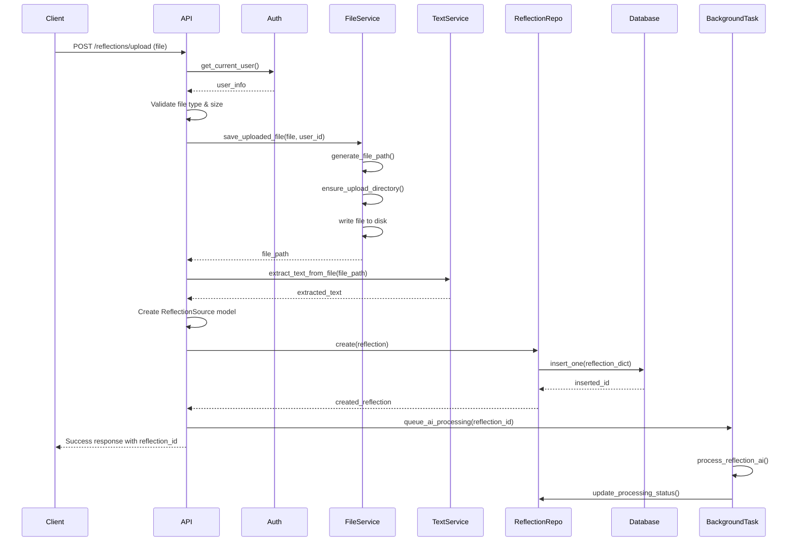

# Journey Feature Persistence Architecture

## Executive Summary

This document outlines the complete architecture for implementing full persistence in the Journey feature. The current implementation has a UI facade with mock data and inconsistent data models. This specification provides a unified approach to data modeling, file storage, processing workflows, and service architecture.

## Current State Analysis

### Issues Identified
1. **Model Inconsistencies**: Multiple conflicting definitions of `ReflectionSource` and `Insight` models
2. **Incomplete Persistence**: Upload endpoint validates files but doesn't save them or create database records
3. **Repository Gaps**: `ReflectionRepository` is a stub with no actual database operations
4. **Data Model Misalignment**: API endpoints expect different fields than what models provide
5. **Missing File Storage**: No actual file persistence strategy implemented

### Current Architecture Components
- **Models**: `backend/app/models/journey/` (inconsistent definitions)
- **Repositories**: `backend/app/repositories/journey/` (reflection repo is stub)
- **Services**: `backend/app/services/journey/` (partially implemented)
- **APIs**: `backend/app/api/v1/endpoints/` (reflections.py, journey.py)
- **Text Extraction**: `backend/app/services/text_extraction_service.py` (functional)

## 1. Data Models / Schemas

### 1.1 ReflectionSource Model (Final Schema)

```python
from datetime import datetime
from typing import Optional, List, Dict, Any
from pydantic import BaseModel, Field
from app.models.journey.base import UserOwnedDocument, ProcessableDocument
from app.models.journey.enums import ProcessingStatus, DocumentType, CategoryType

class DocumentAnalysis(BaseModel):
    """Analysis metadata for uploaded documents"""
    detected_type: DocumentType
    confidence: float = Field(ge=0.0, le=1.0)
    suggested_title: str
    extracted_date: Optional[datetime] = None
    key_topics: List[str] = Field(default_factory=list)
    document_summary: str
    relevant_categories: List[CategoryType] = Field(default_factory=list)
    actionability_score: float = Field(ge=0.0, le=1.0)
    estimated_read_time: int  # in minutes
    word_count: int
    character_count: int

class ReflectionSource(ProcessableDocument):
    """Complete reflection source model for MongoDB persistence"""
    
    # Core identification
    title: str = Field(..., description="Title or name of the reflection source")
    description: Optional[str] = Field(default=None, description="Optional description")
    
    # Content and source
    content: str = Field(..., description="Extracted text content")
    original_filename: Optional[str] = Field(default=None, description="Original uploaded filename")
    file_path: Optional[str] = Field(default=None, description="Path to stored file")
    file_size: Optional[int] = Field(default=None, description="File size in bytes")
    content_type: Optional[str] = Field(default=None, description="MIME type of uploaded file")
    
    # Document analysis
    document_type: Optional[DocumentType] = Field(default=None, description="Type of document")
    document_analysis: Optional[DocumentAnalysis] = Field(default=None, description="AI analysis of document")
    
    # Categorization and tagging
    categories: List[CategoryType] = Field(default_factory=list, description="Assigned categories")
    tags: List[str] = Field(default_factory=list, description="User-defined tags")
    
    # Processing and insights
    processing_status: ProcessingStatus = Field(default=ProcessingStatus.PENDING)
    insight_ids: List[str] = Field(default_factory=list, description="IDs of generated insights")
    
    # Metrics
    word_count: Optional[int] = Field(default=None, description="Word count of content")
    character_count: Optional[int] = Field(default=None, description="Character count of content")
    
    # Processing metadata
    text_extraction_completed_at: Optional[datetime] = Field(default=None)
    ai_processing_completed_at: Optional[datetime] = Field(default=None)
    
    class Config:
        collection_name = "journey_reflections"
```

### 1.2 Insight Model (Final Schema)

```python
from datetime import datetime
from typing import Optional, List, Dict, Any
from pydantic import BaseModel, Field
from app.models.journey.base import UserOwnedDocument
from app.models.journey.enums import CategoryType, ReviewStatus

class Insight(UserOwnedDocument):
    """Complete insight model for MongoDB persistence"""
    
    # Core content
    title: str = Field(..., description="Title of the insight")
    content: str = Field(..., description="Main insight content")
    summary: Optional[str] = Field(default=None, description="Brief summary")
    
    # Categorization
    category: CategoryType = Field(..., description="Primary category")
    subcategories: List[CategoryType] = Field(default_factory=list, description="Additional categories")
    tags: List[str] = Field(default_factory=list, description="User-defined tags")
    
    # Source relationship
    source_id: str = Field(..., description="ID of the reflection source")
    source_title: Optional[str] = Field(default=None, description="Title of source for reference")
    source_excerpt: Optional[str] = Field(default=None, description="Relevant excerpt from source")
    
    # Review and quality
    review_status: ReviewStatus = Field(default=ReviewStatus.DRAFT)
    confidence_score: Optional[float] = Field(default=None, ge=0.0, le=1.0, description="AI confidence")
    
    # User interaction
    is_favorite: bool = Field(default=False, description="User marked as favorite")
    is_archived: bool = Field(default=False, description="User archived this insight")
    user_rating: Optional[int] = Field(default=None, ge=1, le=5, description="User rating 1-5")
    view_count: int = Field(default=0, description="Number of times viewed")
    last_viewed_at: Optional[datetime] = Field(default=None)
    
    # Actionability
    is_actionable: bool = Field(default=False, description="Contains actionable items")
    suggested_actions: List[str] = Field(default_factory=list, description="AI-suggested actions")
    
    # AI metadata
    ai_model_version: Optional[str] = Field(default=None, description="AI model used for generation")
    processing_metadata: Dict[str, Any] = Field(default_factory=dict, description="AI processing metadata")
    generated_at: datetime = Field(default_factory=datetime.utcnow, description="When insight was generated")
    
    # Archival
    archived_at: Optional[datetime] = Field(default=None)
    
    class Config:
        collection_name = "journey_insights"
```

### 1.3 MongoDB Indexes

```python
# Required indexes for optimal performance
REFLECTION_INDEXES = [
    [("user_id", 1), ("created_at", -1)],  # User timeline queries
    [("user_id", 1), ("processing_status", 1)],  # Processing status queries
    [("user_id", 1), ("categories", 1)],  # Category filtering
    [("file_path", 1)],  # File path uniqueness
    [("original_filename", 1), ("user_id", 1)],  # Duplicate detection
]

INSIGHT_INDEXES = [
    [("user_id", 1), ("created_at", -1)],  # User timeline queries
    [("user_id", 1), ("category", 1)],  # Category filtering
    [("user_id", 1), ("is_favorite", 1)],  # Favorites queries
    [("user_id", 1), ("is_actionable", 1)],  # Actionable insights
    [("source_id", 1)],  # Source relationship queries
    [("user_id", 1), ("review_status", 1)],  # Review status filtering
    # Text search index
    [("title", "text"), ("content", "text"), ("summary", "text")],
]
```

## 2. File Storage Strategy

### 2.1 Storage Location
- **Primary**: Local filesystem at `backend/uploads/reflections/`
- **Structure**: `backend/uploads/reflections/{user_id}/{year}/{month}/`
- **Future**: Easily migrable to cloud storage (S3, Google Cloud Storage)

### 2.2 File Naming Convention
```
{timestamp}_{user_id}_{uuid}_{sanitized_filename}
```

**Example**: `20250715_user_abc123_f47ac10b_quarterly_review.pdf`

**Components**:
- `timestamp`: YYYYMMDD_HHMMSS format
- `user_id`: First 8 characters of Clerk user ID
- `uuid`: First 8 characters of UUID4 for uniqueness
- `sanitized_filename`: Original filename with spaces replaced by underscores, special characters removed

### 2.3 File Management Functions

```python
def generate_file_path(user_id: str, original_filename: str) -> str:
    """Generate unique file path for uploaded document"""
    timestamp = datetime.now().strftime("%Y%m%d_%H%M%S")
    user_short = user_id[:8]
    unique_id = str(uuid.uuid4())[:8]
    
    # Sanitize filename
    safe_filename = re.sub(r'[^\w\-_\.]', '_', original_filename)
    safe_filename = re.sub(r'_+', '_', safe_filename)
    
    # Create directory structure
    year = datetime.now().strftime("%Y")
    month = datetime.now().strftime("%m")
    
    directory = f"backend/uploads/reflections/{user_id}/{year}/{month}"
    filename = f"{timestamp}_{user_short}_{unique_id}_{safe_filename}"
    
    return os.path.join(directory, filename)

def ensure_upload_directory(file_path: str) -> None:
    """Ensure upload directory exists"""
    directory = os.path.dirname(file_path)
    os.makedirs(directory, exist_ok=True)
```

## 3. End-to-End Data Flow

### 3.1 Document Upload Flow (`POST /api/v1/reflections/upload`)



### 3.2 Detailed Step-by-Step Process

#### Step 1: File Upload and Validation
```python
async def upload_reflection_document(
    file: UploadFile = File(...),
    user_info: dict = Depends(get_current_user)
):
    user_id = user_info['clerk_user_id']
    
    # 1. Validate file type
    allowed_types = ["application/pdf", "application/vnd.openxmlformats-officedocument.wordprocessingml.document", "text/plain"]
    if file.content_type not in allowed_types:
        raise HTTPException(400, "Unsupported file type")
    
    # 2. Validate file size (10MB limit)
    file_content = await file.read()
    if len(file_content) > 10 * 1024 * 1024:
        raise HTTPException(400, "File too large")
```

#### Step 2: File Storage
```python
    # 3. Generate unique file path
    file_path = generate_file_path(user_id, file.filename)
    ensure_upload_directory(file_path)
    
    # 4. Save file to disk
    with open(file_path, "wb") as f:
        f.write(file_content)
```

#### Step 3: Text Extraction
```python
    # 5. Extract text content
    text_service = TextExtractionService()
    extracted_text = await text_service.extract_text_from_file(file_path, file.content_type)
    
    # 6. Calculate metrics
    word_count = len(extracted_text.split())
    character_count = len(extracted_text)
```

#### Step 4: Database Record Creation
```python
    # 7. Create ReflectionSource record
    reflection = ReflectionSource(
        user_id=user_id,
        title=file.filename or "Uploaded Document",
        content=extracted_text,
        original_filename=file.filename,
        file_path=file_path,
        file_size=len(file_content),
        content_type=file.content_type,
        word_count=word_count,
        character_count=character_count,
        processing_status=ProcessingStatus.PROCESSING,
        text_extraction_completed_at=datetime.utcnow()
    )
    
    # 8. Save to database
    reflection_repo = ReflectionRepository()
    created_reflection = await reflection_repo.create(reflection)
```

#### Step 5: Background Processing Queue
```python
    # 9. Queue for AI processing
    background_tasks.add_task(
        process_reflection_ai,
        str(created_reflection.id),
        user_id
    )
    
    return {
        "status": "success",
        "reflection_id": str(created_reflection.id),
        "message": "Document uploaded and queued for processing"
    }
```

## 4. Services and Repositories

### 4.1 ReflectionRepository (Complete Implementation)

```python
class ReflectionRepository:
    """Repository for managing reflection sources in MongoDB"""
    
    def __init__(self):
        self.collection_name = "journey_reflections"
    
    async def create(self, reflection: ReflectionSource) -> ReflectionSource:
        """Create a new reflection source"""
        db = get_database()
        reflection_dict = reflection.model_dump(by_alias=True, exclude_unset=True)
        
        if "_id" in reflection_dict and reflection_dict["_id"] is None:
            del reflection_dict["_id"]
        
        result = await db[self.collection_name].insert_one(reflection_dict)
        reflection.id = result.inserted_id
        return reflection
    
    async def get_by_id(self, reflection_id: str) -> Optional[ReflectionSource]:
        """Get reflection by ID"""
        db = get_database()
        doc = await db[self.collection_name].find_one({"_id": ObjectId(reflection_id)})
        
        if doc:
            doc["_id"] = str(doc["_id"])
            return ReflectionSource(**doc)
        return None
    
    async def get_all_for_user(self, user_id: str, skip: int = 0, limit: int = 100) -> List[ReflectionSource]:
        """Get all reflections for a user with pagination"""
        db = get_database()
        cursor = db[self.collection_name].find({"user_id": user_id}).skip(skip).limit(limit).sort("created_at", -1)
        docs = await cursor.to_list(length=limit)
        
        reflections = []
        for doc in docs:
            doc["_id"] = str(doc["_id"])
            reflections.append(ReflectionSource(**doc))
        
        return reflections
    
    async def get_by_category(self, user_id: str, category: CategoryType, skip: int = 0, limit: int = 100) -> List[ReflectionSource]:
        """Get reflections by category for a user"""
        db = get_database()
        cursor = db[self.collection_name].find({
            "user_id": user_id,
            "categories": category
        }).skip(skip).limit(limit).sort("created_at", -1)
        
        docs = await cursor.to_list(length=limit)
        reflections = []
        for doc in docs:
            doc["_id"] = str(doc["_id"])
            reflections.append(ReflectionSource(**doc))
        
        return reflections
    
    async def update(self, reflection_id: str, update_data: Dict[str, Any]) -> Optional[ReflectionSource]:
        """Update a reflection"""
        db = get_database()
        update_data["updated_at"] = datetime.utcnow()
        
        result = await db[self.collection_name].update_one(
            {"_id": ObjectId(reflection_id)},
            {"$set": update_data}
        )
        
        if result.modified_count:
            return await self.get_by_id(reflection_id)
        return None
    
    async def add_insight_id(self, reflection_id: str, insight_id: str) -> bool:
        """Add insight ID to reflection's insight_ids array"""
        db = get_database()
        result = await db[self.collection_name].update_one(
            {"_id": ObjectId(reflection_id)},
            {
                "$addToSet": {"insight_ids": insight_id},
                "$set": {"updated_at": datetime.utcnow()}
            }
        )
        return result.modified_count > 0
    
    async def count_for_user(self, user_id: str) -> int:
        """Count total reflections for a user"""
        db = get_database()
        return await db[self.collection_name].count_documents({"user_id": user_id})
    
    async def delete(self, reflection_id: str) -> bool:
        """Delete a reflection and its associated file"""
        db = get_database()
        
        # Get reflection to find file path
        reflection = await self.get_by_id(reflection_id)
        if reflection and reflection.file_path:
            try:
                os.remove(reflection.file_path)
            except OSError:
                logger.warning(f"Could not delete file: {reflection.file_path}")
        
        result = await db[self.collection_name].delete_one({"_id": ObjectId(reflection_id)})
        return result.deleted_count > 0
```

### 4.2 Enhanced Services

#### 4.2.1 TextExtractionService (Already Implemented)
- Current implementation is functional and complete
- Supports PDF, DOCX, TXT file types
- Handles encoding issues and error cases
- No changes needed

#### 4.2.2 AIService (Placeholder Implementation)

```python
class AIService:
    """Service for AI processing of reflections and insight generation"""
    
    async def analyze_document(self, reflection: ReflectionSource) -> DocumentAnalysis:
        """Analyze document and extract metadata"""
        # TODO: Implement actual AI analysis
        return DocumentAnalysis(
            detected_type=DocumentType.PDF,
            confidence=0.95,
            suggested_title=reflection.title,
            document_summary="AI-generated summary placeholder",
            relevant_categories=[CategoryType.PERSONAL_GROWTH],
            actionability_score=0.7,
            estimated_read_time=max(1, reflection.word_count // 200),
            word_count=reflection.word_count or 0,
            character_count=reflection.character_count or 0
        )
    
    async def generate_insights(self, reflection: ReflectionSource) -> List[Dict[str, Any]]:
        """Generate insights from reflection content"""
        # TODO: Implement actual AI insight generation
        return [
            {
                "title": "Sample Insight",
                "content": "This is a placeholder insight generated from the reflection.",
                "summary": "Placeholder summary",
                "category": CategoryType.PERSONAL_GROWTH,
                "confidence_score": 0.8,
                "is_actionable": True,
                "suggested_actions": ["Take action based on this insight"]
            }
        ]
```

#### 4.2.3 Background Processing Service

```python
async def process_reflection_ai(reflection_id: str, user_id: str):
    """Background task for AI processing of reflections"""
    logger.info(f"Starting AI processing for reflection {reflection_id}")
    
    try:
        # Get reflection
        reflection_repo = ReflectionRepository()
        reflection = await reflection_repo.get_by_id(reflection_id)
        
        if not reflection:
            logger.error(f"Reflection not found: {reflection_id}")
            return
        
        # Update status to processing
        await reflection_repo.update(reflection_id, {
            "processing_status": ProcessingStatus.PROCESSING,
            "processing_started_at": datetime.utcnow()
        })
        
        # AI document analysis
        ai_service = AIService()
        document_analysis = await ai_service.analyze_document(reflection)
        
        # Generate insights
        raw_insights = await ai_service.generate_insights(reflection)
        
        # Save insights to database
        insight_repo = InsightRepository()
        insight_ids = []
        
        for raw_insight in raw_insights:
            insight = Insight(
                title=raw_insight["title"],
                content=raw_insight["content"],
                summary=raw_insight.get("summary"),
                category=raw_insight["category"],
                source_id=reflection_id,
                source_title=reflection.title,
                user_id=user_id,
                confidence_score=raw_insight.get("confidence_score"),
                is_actionable=raw_insight.get("is_actionable", False),
                suggested_actions=raw_insight.get("suggested_actions", [])
            )
            
            created_insight = await insight_repo.create(insight)
            insight_ids.append(str(created_insight.id))
        
        # Update reflection with completion status
        await reflection_repo.update(reflection_id, {
            "processing_status": ProcessingStatus.COMPLETED,
            "processing_completed_at": datetime.utcnow(),
            "ai_processing_completed_at": datetime.utcnow(),
            "document_analysis": document_analysis.model_dump(),
            "insight_ids": insight_ids
        })
        
        logger.info(f"✅ Completed AI processing for reflection {reflection_id}")
        
    except Exception as e:
        logger.error(f"❌ AI processing failed for reflection {reflection_id}: {e}")
        
        # Update reflection with error status
        await reflection_repo.update(reflection_id, {
            "processing_status": ProcessingStatus.FAILED,
            "processing_error": str(e)
        })
```

## 5. API Endpoint Updates

### 5.1 Updated Upload Endpoint

```python
@router.post("/upload", response_model=dict)
async def upload_reflection_document(
    background_tasks: BackgroundTasks,
    file: UploadFile = File(...),
    user_info: dict = Depends(get_current_user)
):
    """
    Upload a document file and create a reflection source with full persistence.
    
    This endpoint:
    1. Validates the uploaded file (PDF, DOCX, TXT)
    2. Saves the file to the uploads directory with unique naming
    3. Extracts text content from the file
    4. Creates a ReflectionSource record in MongoDB
    5. Queues the reflection for AI processing
    
    Returns:
        dict: Success response with reflection_id for tracking
    """
    # Implementation as detailed in section 3.2
```

### 5.2 New Endpoints to Add

```python
@router.get("/{reflection_id}", response_model=ReflectionResponse)
async def get_reflection(
    reflection_id: str,
    user_info: dict = Depends(get_current_user)
):
    """Get a specific reflection by ID"""

@router.put("/{reflection_id}", response_model=ReflectionResponse)
async def update_reflection(
    reflection_id: str,
    update_data: ReflectionUpdateRequest,
    user_info: dict = Depends(get_current_user)
):
    """Update reflection metadata (title, description, categories, tags)"""

@router.delete("/{reflection_id}")
async def delete_reflection(
    reflection_id: str,
    user_info: dict = Depends(get_current_user)
):
    """Delete a reflection and its associated file"""

@router.get("/{reflection_id}/file")
async def download_reflection_file(
    reflection_id: str,
    user_info: dict = Depends(get_current_user)
):
    """Download the original uploaded file"""
```

## 6. Database Migration Strategy

### 6.1 Migration Script

```python
async def migrate_journey_collections():
    """Migrate existing journey data to new schema"""
    db = get_database()
    
    # Create indexes
    await db.journey_reflections.create_indexes(REFLECTION_INDEXES)
    await db.journey_insights.create_indexes(INSIGHT_INDEXES)
    
    # Migrate existing data if any
    # (Currently no production data to migrate)
    
    logger.info("✅ Journey collections migration completed")
```

## 7. Testing Strategy

### 7.1 Unit Tests
- Model validation tests
- Repository CRUD operation tests
- Service layer business logic tests
- File storage and text extraction tests

### 7.2 Integration Tests
- End-to-end upload flow tests
- AI processing pipeline tests
- API endpoint tests with real file uploads

### 7.3 Performance Tests
- Large file upload tests
- Concurrent upload handling
- Database query performance tests

## 8. Security Considerations

### 8.1 File Upload Security
- File type validation (whitelist approach)
- File size limits (10MB maximum)
- Virus scanning (future enhancement)
- User isolation (files stored per user directory)

### 8.2 Access Control
- User can only access their own reflections and insights
- Clerk authentication required for all endpoints
- File download requires ownership verification

### 8.3 Data Privacy
- User data isolated by user_id
- File paths not exposed in API responses
- Secure file deletion when reflection is deleted

## 9. Monitoring and Logging

### 9.1 Key Metrics to Track
- Upload success/failure rates
- Text extraction success rates
- AI processing completion times
- File storage usage per user
- Database query performance

### 9.2 Logging Strategy
- Structured logging with correlation IDs
- Error tracking for failed uploads
- Performance logging for slow operations
- User activity logging for analytics

## 10. Future Enhancements

### 10.1 Phase 2 Features
- Cloud storage migration (S3/GCS)
- Advanced AI insight generation
- Batch processing capabilities
- Real-time processing status updates

### 10.2 Phase 3 Features
- Multi-language support
- Advanced document analysis
- Insight sharing and collaboration
- Export capabilities

## 11. Implementation Checklist

### 11.1 Data Layer
- [ ] Update ReflectionSource model with complete schema
- [ ] Update Insight model with complete schema
- [ ] Implement complete ReflectionRepository
- [ ] Create database indexes
- [ ] Write migration script

### 11.2 Service Layer
- [ ] Implement file storage service with unique naming
- [ ] Create AIService placeholder implementation
- [ ] Implement background processing service
- [ ] Add error handling and retry logic

### 11.3 API Layer
- [ ] Update upload endpoint with full persistence
- [ ] Add new CRUD endpoints for reflections
- [ ] Update response models
- [ ] Add proper error handling

### 11.4 Testing
- [ ] Write unit tests for all components
- [ ] Create integration tests for upload flow
- [ ] Add performance tests
- [ ] Test with various file types and sizes

### 11.5 Documentation
- [ ] Update API documentation
- [ ] Create deployment guide
- [ ] Write troubleshooting guide

## Conclusion

This architecture provides a robust, scalable foundation for the Journey feature with complete persistence. The design emphasizes:

1. **Data Consistency**: Unified models across all layers
2. **Scalability**: Efficient database design with proper indexing
3. **Reliability**: Comprehensive error handling and logging
4. **Security**: User isolation and secure file handling
5. **Maintainability**: Clean separation of concerns and modular design

The implementation should be done incrementally, starting with the data models and repositories, then the service layer, and finally the API endpoints. Each component should be thoroughly tested before moving to the next phase.