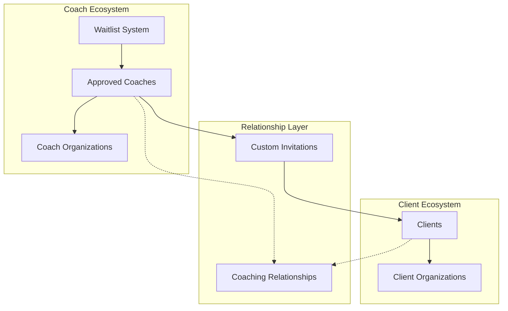
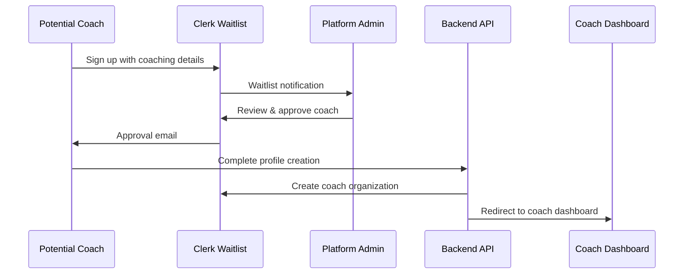
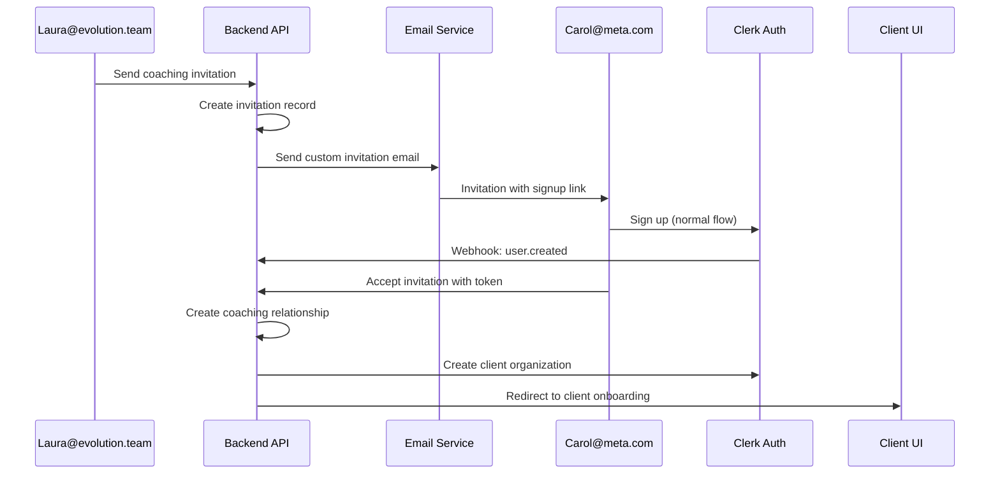

# Sprint S3 Phase 3: Client Invitation and Onboarding - Technical Plan

## Executive Summary

This plan implements a comprehensive client invitation and onboarding system that maintains organizational integrity while enabling cross-organization coaching relationships. The architecture leverages Clerk's waitlist mode for coach quality control and implements a custom invitation system for seamless client onboarding.

## Architecture Overview

### Organizational Structure
- **Coach Organizations**: Independent coaching practices (e.g., `evolution.team`)
- **Client Organizations**: Client companies (e.g., `Meta`, `Google`)
- **Coaching Relationships**: Cross-organization connections tracked separately



## 1. Current State Analysis

### ✅ Already Implemented
- **Profile Creation**: [`/api/v1/profiles/coach`](backend/app/api/v1/endpoints/profiles.py:19), [`/api/v1/profiles/client`](backend/app/api/v1/endpoints/profiles.py:85)
- **Organization Services**: [`ClerkOrganizationService`](backend/app/services/clerk_organization_service.py:1)
- **Basic Webhook Handling**: [`/webhooks/clerk`](backend/app/api/v1/webhooks/clerk.py:28)
- **Relationship Infrastructure**: [`ClerkInvitationService`](backend/app/services/clerk_invitation_service.py:1) (needs modification)

### ❌ Missing Components
1. **Coach Waitlist System**
2. **Custom Client Invitation System**
3. **Cross-Organization Relationship Management**
4. **Client Onboarding Flow**
5. **Coach Dashboard for Invitation Management**

## 2. User Flows

### 2.1 Coach Onboarding Flow (Waitlist Mode)



### 2.2 Client Invitation & Onboarding Flow



## 3. Database Schema Changes

### 3.1 New Model: CoachingRelationship

```python
# File: backend/app/models/coaching_relationship.py
from pydantic import BaseModel, Field, ConfigDict
from typing import Optional, Dict, Any, List
from bson import ObjectId
from datetime import datetime
from enum import Enum

class RelationshipStatus(str, Enum):
    PENDING = "pending"
    ACTIVE = "active"
    PAUSED = "paused"
    COMPLETED = "completed"
    DECLINED = "declined"
    EXPIRED = "expired"

class CoachingRelationship(BaseModel):
    model_config = ConfigDict(
        populate_by_name=True,
        arbitrary_types_allowed=True,
        json_encoders={ObjectId: str}
    )
    
    id: Optional[PyObjectId] = Field(default=None, alias="_id")
    
    # Core relationship data
    coach_user_id: str  # Clerk user ID
    client_user_id: Optional[str] = None  # Filled when client accepts
    coach_organization_id: str  # Clerk org ID (evolution.team)
    client_organization_id: Optional[str] = None  # Filled during onboarding
    
    # Invitation data
    invitation_token: str  # Secure token for invitation acceptance
    client_email: str  # Email where invitation was sent
    
    # Status and timing
    status: RelationshipStatus = RelationshipStatus.PENDING
    invited_at: datetime = Field(default_factory=datetime.utcnow)
    accepted_at: Optional[datetime] = None
    started_at: Optional[datetime] = None
    expires_at: datetime  # Invitation expiration (7 days default)
    
    # Metadata
    invitation_message: Optional[str] = None
    coaching_focus: List[str] = []  # Areas of focus for coaching
    client_first_name: Optional[str] = None
    client_last_name: Optional[str] = None
    
    # Audit fields
    created_at: datetime = Field(default_factory=datetime.utcnow)
    updated_at: datetime = Field(default_factory=datetime.utcnow)
```

### 3.2 Enhanced Profile Model

```python
# File: backend/app/models/profile.py (additions)
class Profile(BaseModel):
    # ... existing fields ...
    
    # New fields for relationship management
    coaching_relationships: List[str] = []  # List of relationship IDs
    waitlist_approved_at: Optional[datetime] = None  # When coach was approved
    waitlist_metadata: Optional[Dict[str, Any]] = None  # Waitlist signup data
```

## 4. Backend Implementation

### 4.1 Custom Invitation Service

```python
# File: backend/app/services/custom_invitation_service.py
from typing import Optional, Dict, Any, List
import secrets
from datetime import datetime, timedelta
from app.models.coaching_relationship import CoachingRelationship, RelationshipStatus
from app.repositories.coaching_relationship_repository import CoachingRelationshipRepository
from app.services.email_service import EmailService
from app.services.profile_service import ProfileService
from app.core.config import settings
import logging

logger = logging.getLogger(__name__)

class CustomInvitationService:
    """Service for managing custom coaching invitations (not Clerk org invitations)"""
    
    def __init__(self):
        self.relationship_repo = CoachingRelationshipRepository()
        self.email_service = EmailService()
        self.profile_service = ProfileService()
    
    async def send_coaching_invitation(self, coach_user_id: str, invitation_data: Dict[str, Any]) -> CoachingRelationship:
        """Send custom coaching invitation to client"""
        try:
            # Get coach profile and organization
            coach_profile = await self.profile_service.get_profile_by_clerk_id(coach_user_id)
            if not coach_profile or not coach_profile.coach_data:
                raise Exception("Coach profile required to send invitations")
            
            if not coach_profile.primary_organization_id:
                raise Exception("Coach must have an organization to send invitations")
            
            # Check for existing active relationship
            existing = await self.relationship_repo.find_by_coach_and_client_email(
                coach_user_id, invitation_data["client_email"]
            )
            if existing and existing.status in [RelationshipStatus.ACTIVE, RelationshipStatus.PENDING]:
                raise Exception("Active or pending relationship already exists with this client")
            
            # Generate secure invitation token
            invitation_token = secrets.token_urlsafe(32)
            
            # Create coaching relationship record
            relationship = CoachingRelationship(
                coach_user_id=coach_user_id,
                coach_organization_id=coach_profile.primary_organization_id,
                invitation_token=invitation_token,
                client_email=invitation_data["client_email"],
                client_first_name=invitation_data.get("client_first_name"),
                client_last_name=invitation_data.get("client_last_name"),
                invitation_message=invitation_data.get("message"),
                coaching_focus=invitation_data.get("coaching_focus", []),
                expires_at=datetime.utcnow() + timedelta(days=7),
                status=RelationshipStatus.PENDING
            )
            
            # Save to database
            created_relationship = await self.relationship_repo.create(relationship)
            
            # Send invitation email
            invitation_url = f"{settings.frontend_url}/invitations/accept/{invitation_token}"
            await self.email_service.send_coaching_invitation(
                client_email=invitation_data["client_email"],
                coach_name=f"{coach_profile.first_name} {coach_profile.last_name}",
                coach_organization=coach_profile.primary_organization_id,  # Will need org name
                invitation_url=invitation_url,
                message=invitation_data.get("message", ""),
                coaching_focus=invitation_data.get("coaching_focus", [])
            )
            
            logger.info(f"Coaching invitation sent: {created_relationship.id}")
            return created_relationship
            
        except Exception as e:
            logger.error(f"Error sending coaching invitation: {str(e)}")
            raise
    
    async def get_invitation_by_token(self, token: str) -> Optional[CoachingRelationship]:
        """Get invitation by token for acceptance"""
        try:
            relationship = await self.relationship_repo.find_by_token(token)
            
            if not relationship:
                return None
            
            # Check if expired
            if relationship.expires_at < datetime.utcnow():
                relationship.status = RelationshipStatus.EXPIRED
                await self.relationship_repo.update(relationship)
                return None
            
            return relationship
            
        except Exception as e:
            logger.error(f"Error getting invitation by token: {str(e)}")
            raise
    
    async def accept_invitation(self, token: str, client_user_id: str) -> CoachingRelationship:
        """Accept coaching invitation and establish relationship"""
        try:
            # Get invitation
            relationship = await self.get_invitation_by_token(token)
            if not relationship:
                raise Exception("Invitation not found or expired")
            
            if relationship.status != RelationshipStatus.PENDING:
                raise Exception("Invitation is not in pending status")
            
            # Update relationship
            relationship.client_user_id = client_user_id
            relationship.status = RelationshipStatus.ACTIVE
            relationship.accepted_at = datetime.utcnow()
            relationship.started_at = datetime.utcnow()
            
            # Save updated relationship
            updated_relationship = await self.relationship_repo.update(relationship)
            
            # Update coach profile relationships
            coach_profile = await self.profile_service.get_profile_by_clerk_id(relationship.coach_user_id)
            if coach_profile:
                coach_profile.coaching_relationships.append(str(updated_relationship.id))
                await self.profile_service.update_profile(coach_profile)
            
            logger.info(f"Coaching invitation accepted: {updated_relationship.id}")
            return updated_relationship
            
        except Exception as e:
            logger.error(f"Error accepting invitation: {str(e)}")
            raise
    
    async def get_coach_relationships(self, coach_user_id: str) -> Dict[str, Any]:
        """Get all relationships for a coach"""
        try:
            relationships = await self.relationship_repo.find_by_coach(coach_user_id)
            
            active_relationships = []
            pending_invitations = []
            
            for rel in relationships:
                if rel.status == RelationshipStatus.ACTIVE:
                    # Get client profile for additional info
                    client_profile = None
                    if rel.client_user_id:
                        client_profile = await self.profile_service.get_profile_by_clerk_id(rel.client_user_id)
                    
                    active_relationships.append({
                        "relationship_id": str(rel.id),
                        "client_user_id": rel.client_user_id,
                        "client_name": f"{client_profile.first_name} {client_profile.last_name}" if client_profile else f"{rel.client_first_name} {rel.client_last_name}",
                        "client_email": rel.client_email,
                        "client_organization": rel.client_organization_id,
                        "coaching_focus": rel.coaching_focus,
                        "started_at": rel.started_at.isoformat() if rel.started_at else None,
                        "status": rel.status
                    })
                elif rel.status == RelationshipStatus.PENDING:
                    pending_invitations.append({
                        "relationship_id": str(rel.id),
                        "invitation_token": rel.invitation_token,
                        "client_email": rel.client_email,
                        "client_name": f"{rel.client_first_name} {rel.client_last_name}" if rel.client_first_name else rel.client_email,
                        "coaching_focus": rel.coaching_focus,
                        "invited_at": rel.invited_at.isoformat(),
                        "expires_at": rel.expires_at.isoformat(),
                        "status": rel.status
                    })
            
            return {
                "active_relationships": active_relationships,
                "pending_invitations": pending_invitations
            }
            
        except Exception as e:
            logger.error(f"Error getting coach relationships: {str(e)}")
            raise
```

### 4.2 Enhanced API Endpoints

```python
# File: backend/app/api/v1/endpoints/custom_invitations.py
from fastapi import APIRouter, Depends, HTTPException, status
from app.api.v1.deps import get_current_user_clerk_id
from app.services.custom_invitation_service import CustomInvitationService
from app.services.client_onboarding_service import ClientOnboardingService
from pydantic import BaseModel, EmailStr
from typing import List, Optional, Dict, Any
import logging

logger = logging.getLogger(__name__)
router = APIRouter()

class CustomInvitationRequest(BaseModel):
    client_email: EmailStr
    client_first_name: str
    client_last_name: str
    message: Optional[str] = ""
    coaching_focus: List[str] = []

class InvitationAcceptanceRequest(BaseModel):
    client_organization_data: Optional[Dict[str, Any]] = None

@router.post("/send")
async def send_custom_coaching_invitation(
    invitation_data: CustomInvitationRequest,
    coach_user_id: str = Depends(get_current_user_clerk_id)
):
    """Send custom coaching invitation (not Clerk org invitation)"""
    try:
        invitation_service = CustomInvitationService()
        
        relationship = await invitation_service.send_coaching_invitation(
            coach_user_id, 
            invitation_data.dict()
        )
        
        return {
            "relationship_id": str(relationship.id),
            "invitation_token": relationship.invitation_token,
            "client_email": relationship.client_email,
            "status": relationship.status,
            "expires_at": relationship.expires_at.isoformat(),
            "invitation_url": f"/invitations/accept/{relationship.invitation_token}"
        }
        
    except Exception as e:
        logger.error(f"Error sending custom invitation: {str(e)}")
        raise HTTPException(
            status_code=status.HTTP_500_INTERNAL_SERVER_ERROR,
            detail=str(e)
        )

@router.get("/accept/{token}")
async def get_invitation_details(token: str):
    """Get invitation details for client review (public endpoint)"""
    try:
        invitation_service = CustomInvitationService()
        
        relationship = await invitation_service.get_invitation_by_token(token)
        if not relationship:
            raise HTTPException(
                status_code=status.HTTP_404_NOT_FOUND,
                detail="Invitation not found or expired"
            )
        
        # Get coach details
        from app.services.profile_service import ProfileService
        profile_service = ProfileService()
        coach_profile = await profile_service.get_profile_by_clerk_id(relationship.coach_user_id)
        
        return {
            "invitation_token": relationship.invitation_token,
            "coach_name": f"{coach_profile.first_name} {coach_profile.last_name}" if coach_profile else "Coach",
            "coach_organization": relationship.coach_organization_id,  # Will need to resolve org name
            "client_email": relationship.client_email,
            "message": relationship.invitation_message,
            "coaching_focus": relationship.coaching_focus,
            "expires_at": relationship.expires_at.isoformat()
        }
        
    except HTTPException:
        raise
    except Exception as e:
        logger.error(f"Error getting invitation details: {str(e)}")
        raise HTTPException(
            status_code=status.HTTP_500_INTERNAL_SERVER_ERROR,
            detail="Failed to get invitation details"
        )

@router.post("/accept/{token}")
async def accept_coaching_invitation(
    token: str,
    acceptance_data: InvitationAcceptanceRequest,
    client_user_id: str = Depends(get_current_user_clerk_id)
):
    """Accept coaching invitation and initiate client onboarding"""
    try:
        invitation_service = CustomInvitationService()
        onboarding_service = ClientOnboardingService()
        
        # Accept the invitation
        relationship = await invitation_service.accept_invitation(token, client_user_id)
        
        # Initiate client onboarding
        onboarding_data = await onboarding_service.initiate_onboarding(
            client_user_id, 
            relationship.coach_organization_id,
            acceptance_data.client_organization_data
        )
        
        return {
            "relationship_id": str(relationship.id),
            "status": "accepted",
            "onboarding_required": onboarding_data.get("onboarding_required", True),
            "redirect_url": "/onboarding",
            "coach_name": onboarding_data.get("coach_name"),
            "coaching_focus": relationship.coaching_focus
        }
        
    except Exception as e:
        logger.error(f"Error accepting invitation: {str(e)}")
        raise HTTPException(
            status_code=status.HTTP_500_INTERNAL_SERVER_ERROR,
            detail=str(e)
        )

@router.get("/coach/relationships")
async def get_coach_relationships(
    coach_user_id: str = Depends(get_current_user_clerk_id)
):
    """Get coach's custom relationships (not Clerk org memberships)"""
    try:
        invitation_service = CustomInvitationService()
        
        relationships = await invitation_service.get_coach_relationships(coach_user_id)
        
        return relationships
        
    except Exception as e:
        logger.error(f"Error getting coach relationships: {str(e)}")
        raise HTTPException(
            status_code=status.HTTP_500_INTERNAL_SERVER_ERROR,
            detail=str(e)
        )
```

### 4.3 Client Onboarding Service

```python
# File: backend/app/services/client_onboarding_service.py
from typing import Dict, Any, Optional
from app.services.profile_service import ProfileService
from app.services.clerk_organization_service import ClerkOrganizationService
from app.models.profile import Profile, ClientData
import logging

logger = logging.getLogger(__name__)

class ClientOnboardingService:
    """Service for managing client onboarding after invitation acceptance"""
    
    def __init__(self):
        self.profile_service = ProfileService()
        self.org_service = ClerkOrganizationService()
    
    async def initiate_onboarding(self, client_user_id: str, coach_org_id: str, org_data: Optional[Dict[str, Any]] = None) -> Dict[str, Any]:
        """Initiate client onboarding process"""
        try:
            # Check if client already has a profile
            existing_profile = await self.profile_service.get_profile_by_clerk_id(client_user_id)
            
            if existing_profile:
                return {
                    "onboarding_required": False,
                    "profile_exists": True,
                    "redirect_url": "/dashboard/client"
                }
            
            # Get coach organization details for context
            coach_org = await self.org_service.get_organization_with_metadata(coach_org_id)
            
            return {
                "onboarding_required": True,
                "client_user_id": client_user_id,
                "coach_organization": {
                    "id": coach_org["id"],
                    "name": coach_org["name"],
                    "specialties": coach_org["metadata"].get("specialties", [])
                },
                "next_step": "profile_creation"
            }
            
        except Exception as e:
            logger.error(f"Error initiating client onboarding: {str(e)}")
            raise
    
    async def complete_onboarding(self, client_user_id: str, onboarding_data: Dict[str, Any]) -> Dict[str, Any]:
        """Complete client onboarding with profile and organization creation"""
        try:
            # Create client organization if provided
            primary_org_id = None
            if onboarding_data.get("organization_data"):
                org_data = onboarding_data["organization_data"]
                client_org = await self.org_service.create_client_organization(client_user_id, org_data)
                primary_org_id = client_org["id"]
            
            # Create client profile
            profile_data = {
                "first_name": onboarding_data["first_name"],
                "last_name": onboarding_data["last_name"],
                "client_data": onboarding_data["client_data"],
                "primary_organization_id": primary_org_id
            }
            
            profile = await self.profile_service.create_profile(client_user_id, profile_data)
            
            return {
                "profile_id": str(profile.id),
                "organization_id": primary_org_id,
                "onboarding_complete": True,
                "redirect_url": "/dashboard/client"
            }
            
        except Exception as e:
            logger.error(f"Error completing client onboarding: {str(e)}")
            raise
```

### 4.4 Enhanced Webhook Handler

```python
# File: backend/app/api/v1/webhooks/clerk.py (additions)

async def handle_waitlist_approval(event_data: dict):
    """Handle when admin approves coach from waitlist"""
    try:
        user_data = event_data["data"]
        
        # Check if this is a coach approval
        public_metadata = user_data.get("public_metadata", {})
        if public_metadata.get("role_type") == "coach":
            logger.info(f"Processing coach waitlist approval: {user_data['id']}")
            
            # Create user record with waitlist metadata
            user_service = UserService()
            await user_service.create_user_from_clerk(
                clerk_user_id=user_data["id"],
                email=user_data["email_addresses"][0]["email_address"],
                role="coach"
            )
            
            # Store waitlist metadata for profile creation
            # This will be used when coach completes profile setup
            
            logger.info(f"Coach approved and user created: {user_data['id']}")
            
    except Exception as e:
        logger.error(f"Error handling waitlist approval: {str(e)}")

# Update main webhook handler
@router.post("/clerk")
async def handle_clerk_webhook(request: Request):
    # ... existing code ...
    
    if event_type == "user.created":
        # Check if this is from waitlist approval
        public_metadata = data.get("public_metadata", {})
        if public_metadata.get("role_type") == "coach":
            await handle_waitlist_approval(payload)
        else:
            # Regular client signup
            await handle_client_signup(payload)
    
    # ... rest of existing webhook handling ...
```

## 5. Frontend Implementation

### 5.1 Invitation Acceptance Page

```typescript
// File: frontend/src/app/invitations/accept/[token]/page.tsx
'use client';

import { useEffect, useState } from 'react';
import { useParams, useRouter } from 'next/navigation';
import { Button } from '@/components/ui/button';
import { Card, CardContent, CardDescription, CardHeader, CardTitle } from '@/components/ui/card';
import { Badge } from '@/components/ui/badge';
import { useAuth } from '@clerk/nextjs';

interface InvitationDetails {
  invitation_token: string;
  coach_name: string;
  coach_organization: string;
  client_email: string;
  message: string;
  coaching_focus: string[];
  expires_at: string;
}

export default function InvitationAcceptancePage() {
  const { token } = useParams();
  const router = useRouter();
  const { getToken, userId, isSignedIn } = useAuth();
  const [invitation, setInvitation] = useState<InvitationDetails | null>(null);
  const [loading, setLoading] = useState(true);
  const [accepting, setAccepting] = useState(false);
  const [error, setError] = useState<string | null>(null);

  useEffect(() => {
    fetchInvitationDetails();
  }, [token]);

  const fetchInvitationDetails = async () => {
    try {
      const response = await fetch(`${process.env.NEXT_PUBLIC_API_URL}/api/v1/custom-invitations/accept/${token}`);
      
      if (response.ok) {
        const data = await response.json();
        setInvitation(data);
      } else {
        setError('Invitation not found or expired');
      }
    } catch (err) {
      setError('Failed to load invitation details');
    } finally {
      setLoading(false);
    }
  };

  const handleAcceptInvitation = async () => {
    if (!isSignedIn) {
      // Redirect to sign up with return URL
      const returnUrl = encodeURIComponent(window.location.href);
      router.push(`/sign-up?redirect_url=${returnUrl}`);
      return;
    }

    setAccepting(true);
    try {
      const authToken = await getToken();
      const response = await fetch(`${process.env.NEXT_PUBLIC_API_URL}/api/v1/custom-invitations/accept/${token}`, {
        method: 'POST',
        headers: {
          'Content-Type': 'application/json',
          'Authorization': `Bearer ${authToken}`,
        },
        body: JSON.stringify({
          client_organization_data: null // Will be collected during onboarding
        }),
      });

      if (response.ok) {
        const result = await response.json();
        router.push(result.redirect_url || '/onboarding');
      } else {
        const errorData = await response.json();
        setError(errorData.detail || 'Failed to accept invitation');
      }
    } catch (err) {
      setError('Failed to accept invitation');
    } finally {
      setAccepting(false);
    }
  };

  if (loading) {
    return (
      <div className="min-h-screen flex items-center justify-center">
        <div>Loading invitation...</div>
      </div>
    );
  }

  if (error) {
    return (
      <div className="min-h-screen flex items-center justify-center">
        <Card className="max-w-md w-full">
          <CardHeader>
            <CardTitle className="text-red-600">Error</CardTitle>
          </CardHeader>
          <CardContent>
            <p>{error}</p>
            <Button 
              onClick={() => router.push('/')} 
              className="mt-4 w-full"
              variant="outline"
            >
              Go Home
            </Button>
          </CardContent>
        </Card>
      </div>
    );
  }

  if (!invitation) return null;

  const isExpired = new Date(invitation.expires_at) < new Date();

  return (
    <div className="min-h-screen flex items-center justify-center bg-gray-50 py-12 px-4">
      <Card className="max-w-lg w-full">
        <CardHeader>
          <CardTitle>Coaching Invitation</CardTitle>
          <CardDescription>
            You've been invited to start a coaching relationship
          </CardDescription>
        </CardHeader>
        <CardContent className="space-y-6">
          <div className="text-center">
            <h3 className="text-xl font-semibold">{invitation.coach_name}</h3>
            <p className="text-gray-600">{invitation.coach_organization}</p>
          </div>
          
          {invitation.message && (
            <div className="bg-blue-50 p-4 rounded-lg">
              <h4 className="font-medium text-blue-900">Personal Message:</h4>
              <p className="text-blue-800 italic mt-1">"{invitation.message}"</p>
            </div>
          )}
          
          {invitation.coaching_focus.length > 0 && (
            <div>
              <h4 className="font-medium mb-2">Coaching Focus Areas:</h4>
              <div className="flex flex-wrap gap-2">
                {invitation.coaching_focus.map((focus, index) => (
                  <Badge key={index} variant="secondary">{focus}</Badge>
                ))}
              </div>
            </div>
          )}
          
          <div className="text-sm text-gray-500 text-center">
            {isExpired ? (
              <span className="text-red-600">This invitation has expired</span>
            ) : (
              <>Invitation expires: {new Date(invitation.expires_at).toLocaleDateString()}</>
            )}
          </div>
          
          {!isExpired && (
            <Button 
              onClick={handleAcceptInvitation}
              disabled={accepting}
              className="w-full bg-[#1B1E3C] hover:bg-[#1B1E3C]/90"
              size="lg"
            >
              {accepting ? 'Accepting...' : isSignedIn ? 'Accept Invitation' : 'Sign Up & Accept'}
            </Button>
          )}
          
          {isExpired && (
            <div className="text-center">
              <p className="text-sm text-gray-600 mb-4">
                This invitation has expired. Please contact your coach for a new invitation.
              </p>
              <Button 
                onClick={() => router.push('/')} 
                variant="outline"
                className="w-full"
              >
                Go Home
              </Button>
            </div>
          )}
        </CardContent>
      </Card>
    </div>
  );
}
```

### 5.2 Enhanced Coach Dashboard

```typescript
// File: frontend/src/app/dashboard/coach/invitations/page.tsx
'use client';

import { useEffect, useState } from 'react';
import { Button } from