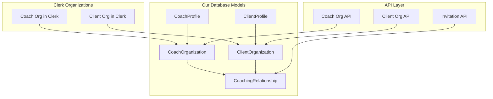
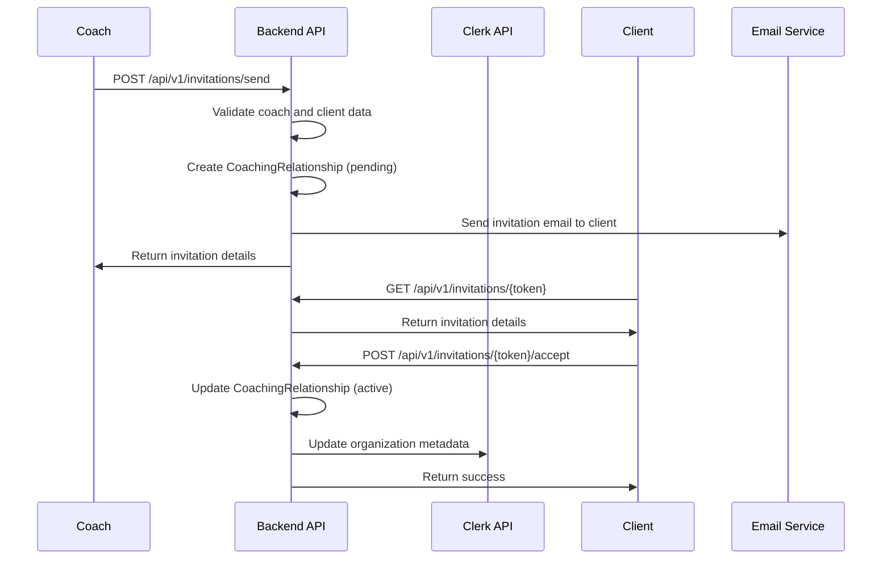

# Sprint S3: Coach Organizations & Client Invitations - Technical Plan

## Overview

This sprint implements a robust organizational structure for the Arete coaching platform, enabling coaches and clients to belong to their respective organizations while establishing coaching relationships through a formal invitation system.

## Architecture Overview

The system implements separate organizational models for coaches and clients, leveraging Clerk's Organizations API while maintaining our own data models for business logic and performance optimization.



## 1. Enhanced Profile Creation

### Updated Data Models

#### CoachData Enhancement
```python
class CoachData(BaseModel):
    specialties: List[str]
    experience: int
    philosophy: str
    organization_name: Optional[str] = None  # New: Coach's practice name
    is_solo_practice: bool = True  # New: Solo vs team practice indicator
```

#### ClientData Enhancement
```python
class ClientData(BaseModel):
    background: str
    challenges: List[str]
    company_name: Optional[str] = None  # New: Client's company
    job_title: Optional[str] = None  # New: Client's role
```

### API Endpoints

#### POST /api/v1/profiles/coach
Creates a coach profile and automatically sets up their organization.

**Request Body:**
```json
{
  "first_name": "Laura",
  "last_name": "Smith",
  "coach_data": {
    "specialties": ["Leadership", "Career Development"],
    "experience": 5,
    "philosophy": "Empowering leaders through authentic growth",
    "organization_name": "Evolution.team",
    "is_solo_practice": false
  }
}
```

**Response:**
```json
{
  "id": "profile_id",
  "user_id": "user_id",
  "first_name": "Laura",
  "last_name": "Smith",
  "coach_data": {
    "specialties": ["Leadership", "Career Development"],
    "experience": 5,
    "philosophy": "Empowering leaders through authentic growth",
    "organization_name": "Evolution.team",
    "is_solo_practice": false
  },
  "organization": {
    "id": "org_id",
    "name": "Evolution.team",
    "clerk_org_id": "clerk_org_123"
  },
  "created_at": "2025-01-01T00:00:00Z",
  "updated_at": "2025-01-01T00:00:00Z"
}
```

#### POST /api/v1/profiles/client
Creates a client profile and sets up their organization.

**Request Body:**
```json
{
  "first_name": "Carol",
  "last_name": "Johnson",
  "client_data": {
    "background": "Senior marketing manager transitioning to leadership",
    "challenges": ["Leadership skills", "Strategic thinking"],
    "company_name": "Meta",
    "job_title": "Senior Marketing Manager"
  }
}
```

**Response:**
```json
{
  "id": "profile_id",
  "user_id": "user_id",
  "first_name": "Carol",
  "last_name": "Johnson",
  "client_data": {
    "background": "Senior marketing manager transitioning to leadership",
    "challenges": ["Leadership skills", "Strategic thinking"],
    "company_name": "Meta",
    "job_title": "Senior Marketing Manager"
  },
  "organization": {
    "id": "org_id",
    "name": "Meta",
    "clerk_org_id": "clerk_org_456"
  },
  "created_at": "2025-01-01T00:00:00Z",
  "updated_at": "2025-01-01T00:00:00Z"
}
```

## 2. Organization Models

### CoachOrganization Model
```python
class CoachOrganization(BaseModel):
    model_config = ConfigDict(
        populate_by_name=True,
        arbitrary_types_allowed=True,
        json_encoders={ObjectId: str}
    )
    
    id: Optional[PyObjectId] = Field(default=None, alias="_id")
    name: str
    clerk_org_id: str  # Reference to Clerk organization
    description: Optional[str] = None
    website: Optional[str] = None
    created_by: str  # User ID of the coach who created it
    is_active: bool = True
    created_at: datetime = Field(default_factory=datetime.utcnow)
    updated_at: datetime = Field(default_factory=datetime.utcnow)
```

### ClientOrganization Model
```python
class ClientOrganization(BaseModel):
    model_config = ConfigDict(
        populate_by_name=True,
        arbitrary_types_allowed=True,
        json_encoders={ObjectId: str}
    )
    
    id: Optional[PyObjectId] = Field(default=None, alias="_id")
    name: str
    clerk_org_id: str  # Reference to Clerk organization
    industry: Optional[str] = None
    size: Optional[str] = None  # "startup", "small", "medium", "large", "enterprise"
    created_by: str  # User ID of the client who created it
    is_active: bool = True
    created_at: datetime = Field(default_factory=datetime.utcnow)
    updated_at: datetime = Field(default_factory=datetime.utcnow)
```

### CoachingRelationship Model
```python
class CoachingRelationship(BaseModel):
    model_config = ConfigDict(
        populate_by_name=True,
        arbitrary_types_allowed=True,
        json_encoders={ObjectId: str}
    )
    
    id: Optional[PyObjectId] = Field(default=None, alias="_id")
    coach_user_id: str
    client_user_id: str
    coach_organization_id: str
    client_organization_id: str
    status: str  # "pending", "active", "paused", "completed"
    invitation_token: str  # Unique token for invitation acceptance
    invited_at: datetime = Field(default_factory=datetime.utcnow)
    accepted_at: Optional[datetime] = None
    started_at: Optional[datetime] = None
    expires_at: datetime  # Invitation expiration
    notes: Optional[str] = None
    created_at: datetime = Field(default_factory=datetime.utcnow)
    updated_at: datetime = Field(default_factory=datetime.utcnow)
```

## 3. Clerk Organizations Integration

### Coach Organization Creation API

#### POST /api/v1/organizations/coach
Creates a coach organization in both Clerk and our database.

**Request Body:**
```json
{
  "name": "Evolution.team",
  "description": "Professional coaching practice focused on leadership development",
  "website": "https://evolution.team"
}
```

**Response:**
```json
{
  "id": "org_123",
  "name": "Evolution.team",
  "clerk_org_id": "clerk_org_abc123",
  "description": "Professional coaching practice focused on leadership development",
  "website": "https://evolution.team",
  "created_by": "user_456",
  "is_active": true,
  "created_at": "2025-01-01T00:00:00Z"
}
```

**Implementation Flow:**
1. Validate coach authorization
2. Create organization in Clerk using Clerk API
3. Add coach as admin member in Clerk organization
4. Create CoachOrganization record in our database
5. Update coach's profile with organization reference

### Client Organization Creation API

#### POST /api/v1/organizations/client
Creates a client organization in both Clerk and our database.

**Request Body:**
```json
{
  "name": "Meta",
  "industry": "Technology",
  "size": "large"
}
```

**Response:**
```json
{
  "id": "org_789",
  "name": "Meta",
  "clerk_org_id": "clerk_org_def456",
  "industry": "Technology",
  "size": "large",
  "created_by": "user_101",
  "is_active": true,
  "created_at": "2025-01-01T00:00:00Z"
}
```

## 4. Client Invitation System

### Invitation Workflow



### Invitation API Endpoints

#### POST /api/v1/invitations/send
Sends a coaching invitation to a client.

**Request Body:**
```json
{
  "client_email": "carol@meta.com",
  "client_first_name": "Carol",
  "client_last_name": "Johnson",
  "message": "I'd like to invite you to start our coaching journey together.",
  "client_organization_name": "Meta"
}
```

**Response:**
```json
{
  "invitation_id": "inv_123",
  "status": "sent",
  "client_email": "carol@meta.com",
  "expires_at": "2025-02-01T00:00:00Z",
  "invitation_url": "https://app.arete.com/invitations/accept/token_abc123"
}
```

#### GET /api/v1/invitations/{token}
Retrieves invitation details for client review.

**Response:**
```json
{
  "invitation_id": "inv_123",
  "coach_name": "Laura Smith",
  "coach_organization": "Evolution.team",
  "client_email": "carol@meta.com",
  "message": "I'd like to invite you to start our coaching journey together.",
  "expires_at": "2025-02-01T00:00:00Z",
  "status": "pending"
}
```

#### POST /api/v1/invitations/{token}/accept
Accepts a coaching invitation and establishes the relationship.

**Request Body:**
```json
{
  "accepted": true,
  "client_organization_name": "Meta",
  "client_organization_industry": "Technology"
}
```

**Response:**
```json
{
  "relationship_id": "rel_456",
  "status": "active",
  "coach_name": "Laura Smith",
  "coach_organization": "Evolution.team",
  "client_organization": "Meta",
  "started_at": "2025-01-01T00:00:00Z"
}
```

## 5. Database Schema

### New Collections

#### coach_organizations
```json
{
  "_id": "ObjectId",
  "name": "string",
  "clerk_org_id": "string",
  "description": "string",
  "website": "string",
  "created_by": "string",
  "is_active": "boolean",
  "created_at": "datetime",
  "updated_at": "datetime"
}
```

#### client_organizations
```json
{
  "_id": "ObjectId",
  "name": "string",
  "clerk_org_id": "string",
  "industry": "string",
  "size": "string",
  "created_by": "string",
  "is_active": "boolean",
  "created_at": "datetime",
  "updated_at": "datetime"
}
```

#### coaching_relationships
```json
{
  "_id": "ObjectId",
  "coach_user_id": "string",
  "client_user_id": "string",
  "coach_organization_id": "string",
  "client_organization_id": "string",
  "status": "string",
  "invitation_token": "string",
  "invited_at": "datetime",
  "accepted_at": "datetime",
  "started_at": "datetime",
  "expires_at": "datetime",
  "notes": "string",
  "created_at": "datetime",
  "updated_at": "datetime"
}
```

### Updated Collections

#### profiles
Add organization references:
```json
{
  "coach_organization_id": "string",
  "client_organization_id": "string"
}
```

## 6. Service Layer Architecture

### OrganizationService
```python
class OrganizationService:
    async def create_coach_organization(self, coach_user_id: str, org_data: dict) -> CoachOrganization:
        """Create coach organization in Clerk and database"""
        
    async def create_client_organization(self, client_user_id: str, org_data: dict) -> ClientOrganization:
        """Create client organization in Clerk and database"""
        
    async def get_coach_organization(self, org_id: str) -> Optional[CoachOrganization]:
        """Retrieve coach organization by ID"""
        
    async def get_client_organization(self, org_id: str) -> Optional[ClientOrganization]:
        """Retrieve client organization by ID"""
        
    async def add_coach_to_organization(self, coach_user_id: str, org_id: str) -> bool:
        """Add coach to existing organization"""
        
    async def add_client_to_organization(self, client_user_id: str, org_id: str) -> bool:
        """Add client to existing organization"""
```

### InvitationService
```python
class InvitationService:
    async def send_coaching_invitation(self, coach_user_id: str, invitation_data: dict) -> CoachingRelationship:
        """Send coaching invitation to client"""
        
    async def get_invitation_by_token(self, token: str) -> Optional[dict]:
        """Retrieve invitation details by token"""
        
    async def accept_invitation(self, token: str, client_data: dict) -> CoachingRelationship:
        """Accept coaching invitation and create relationship"""
        
    async def get_coach_invitations(self, coach_user_id: str) -> List[CoachingRelationship]:
        """Get all invitations sent by coach"""
        
    async def get_client_invitations(self, client_user_id: str) -> List[CoachingRelationship]:
        """Get all invitations received by client"""
        
    async def expire_old_invitations(self) -> int:
        """Clean up expired invitations"""
```

## 7. Frontend Components

### Coach Dashboard Components

#### OrganizationSetup Component
```typescript
interface OrganizationSetupProps {
  onOrganizationCreated: (org: CoachOrganization) => void;
}

// Form for creating/joining coach organization
// Fields: name, description, website, is_solo_practice
```

#### ClientInvitation Component
```typescript
interface ClientInvitationProps {
  coachOrganization: CoachOrganization;
  onInvitationSent: (invitation: CoachingRelationship) => void;
}

// Interface for sending invitations to clients
// Fields: client_email, client_name, message, client_organization_name
```

#### ClientList Component
```typescript
interface ClientListProps {
  relationships: CoachingRelationship[];
  onRelationshipUpdate: (rel: CoachingRelationship) => void;
}

// Display active coaching relationships
// Shows client info, organization, relationship status
```

#### InvitationStatus Component
```typescript
interface InvitationStatusProps {
  invitations: CoachingRelationship[];
  onInvitationAction: (invitationId: string, action: string) => void;
}

// Track sent invitations (pending, accepted, expired)
```

### Client Components

#### InvitationAcceptance Component
```typescript
interface InvitationAcceptanceProps {
  token: string;
  onInvitationAccepted: (relationship: CoachingRelationship) => void;
}

// Page for accepting coaching invitations
// Shows coach info, organization, invitation message
```

#### OrganizationSetup Component
```typescript
interface ClientOrganizationSetupProps {
  onOrganizationCreated: (org: ClientOrganization) => void;
}

// Form for creating/joining client organization
// Fields: name, industry, size
```

#### CoachConnection Component
```typescript
interface CoachConnectionProps {
  relationships: CoachingRelationship[];
}

// Display connected coaches and their organizations
```

### Shared Components

#### OrganizationSelector Component
```typescript
interface OrganizationSelectorProps {
  organizationType: 'coach' | 'client';
  onOrganizationSelected: (orgId: string) => void;
  onCreateNew: () => void;
}

// Dropdown for selecting/creating organizations
```

#### RelationshipCard Component
```typescript
interface RelationshipCardProps {
  relationship: CoachingRelationship;
  viewType: 'coach' | 'client';
  onAction: (action: string) => void;
}

// Display coach-client relationship details
```

## 8. API Endpoint Summary

| Method | Endpoint | Description |
|--------|----------|-------------|
| POST | `/api/v1/profiles/coach` | Create coach profile with organization |
| POST | `/api/v1/profiles/client` | Create client profile with organization |
| POST | `/api/v1/organizations/coach` | Create coach organization |
| POST | `/api/v1/organizations/client` | Create client organization |
| GET | `/api/v1/organizations/coach/{id}` | Get coach organization details |
| GET | `/api/v1/organizations/client/{id}` | Get client organization details |
| POST | `/api/v1/invitations/send` | Send coaching invitation |
| GET | `/api/v1/invitations/{token}` | Get invitation details |
| POST | `/api/v1/invitations/{token}/accept` | Accept coaching invitation |
| GET | `/api/v1/relationships/coach` | Get coach's client relationships |
| GET | `/api/v1/relationships/client` | Get client's coach relationships |
| PUT | `/api/v1/relationships/{id}/status` | Update relationship status |
| DELETE | `/api/v1/invitations/{token}` | Cancel/decline invitation |

## 9. Error Handling & Validation

### Common Error Responses

#### 400 Bad Request
```json
{
  "error": "validation_error",
  "message": "Invalid request data",
  "details": {
    "field": "organization_name",
    "issue": "Organization name must be between 2 and 100 characters"
  }
}
```

#### 404 Not Found
```json
{
  "error": "not_found",
  "message": "Invitation not found or expired",
  "details": {
    "token": "inv_token_123"
  }
}
```

#### 409 Conflict
```json
{
  "error": "conflict",
  "message": "Coaching relationship already exists",
  "details": {
    "coach_id": "user_123",
    "client_id": "user_456"
  }
}
```

### Validation Rules

#### Organization Names
- Must be 2-100 characters
- Cannot contain special characters except hyphens and periods
- Must be unique within organization type

#### Invitations
- Email must be valid format
- Cannot invite same client twice (active relationship)
- Invitations expire after 7 days
- Maximum 10 pending invitations per coach

#### Relationships
- One active relationship per coach-client pair
- Coach must have completed profile
- Client must accept invitation to activate relationship

## 10. Testing Strategy

### Unit Tests

#### Model Validation Tests
```python
def test_coach_organization_validation():
    # Test required fields
    # Test field length limits
    # Test unique constraints

def test_coaching_relationship_status_transitions():
    # Test valid status transitions
    # Test invalid status transitions
    # Test expiration logic
```

#### Service Layer Tests
```python
def test_organization_service_create_coach_org():
    # Test successful creation
    # Test Clerk API integration
    # Test error handling

def test_invitation_service_send_invitation():
    # Test invitation creation
    # Test email sending
    # Test duplicate prevention
```

### Integration Tests

#### API Endpoint Tests
```python
def test_create_coach_profile_with_organization():
    # Test complete profile creation flow
    # Test organization auto-creation
    # Test Clerk integration

def test_invitation_workflow():
    # Test send invitation
    # Test get invitation details
    # Test accept invitation
    # Test relationship creation
```

#### Clerk API Integration Tests
```python
def test_clerk_organization_creation():
    # Test organization creation in Clerk
    # Test member addition
    # Test error handling for Clerk API failures
```

### QA Test Scenarios

#### Happy Path Scenarios
1. **Coach Solo Practice Setup**
   - Coach creates profile with solo practice
   - Organization auto-created in Clerk and database
   - Coach can send invitations

2. **Coach Team Practice Setup**
   - Coach creates profile for existing organization
   - Coach joins existing Clerk organization
   - Multiple coaches can send invitations

3. **Client Invitation Acceptance**
   - Client receives invitation email
   - Client views invitation details
   - Client accepts and creates/joins organization
   - Relationship becomes active

#### Edge Cases
1. **Expired Invitations**
   - Client tries to accept expired invitation
   - System shows appropriate error message
   - Coach can resend invitation

2. **Duplicate Invitations**
   - Coach tries to invite same client twice
   - System prevents duplicate active relationships
   - Appropriate error message shown

3. **Organization Name Conflicts**
   - Multiple coaches try to create same organization name
   - System handles conflicts appropriately
   - Suggests alternative names

4. **Clerk API Failures**
   - Clerk API is unavailable during organization creation
   - System handles gracefully with retry logic
   - User receives appropriate feedback

## 11. Implementation Priority

### Phase 1: Foundation (Week 1)
- [ ] Create new database models (CoachOrganization, ClientOrganization, CoachingRelationship)
- [ ] Update existing Profile models with organization fields
- [ ] Create repository classes for new models
- [ ] Set up database migrations

### Phase 2: Organization Management (Week 2)
- [ ] Implement OrganizationService
- [ ] Create Clerk API integration for organizations
- [ ] Build organization creation endpoints
- [ ] Update profile creation to include organization setup

### Phase 3: Invitation System (Week 3)
- [ ] Implement InvitationService
- [ ] Create invitation endpoints (send, get, accept)
- [ ] Set up email service integration
- [ ] Implement invitation token generation and validation

### Phase 4: Frontend Components (Week 4)
- [ ] Build organization setup components
- [ ] Create invitation management interfaces
- [ ] Implement invitation acceptance flow
- [ ] Update profile creation forms

### Phase 5: Testing & QA (Week 5)
- [ ] Write comprehensive unit tests
- [ ] Implement integration tests
- [ ] Conduct QA testing scenarios
- [ ] Performance testing and optimization

## 12. Success Criteria

### Functional Requirements
- ✅ Coaches can create/join organizations
- ✅ Clients can create/join organizations  
- ✅ Coaches can send invitations to clients
- ✅ Clients can accept invitations
- ✅ Coaching relationships are properly tracked
- ✅ Organizations are synced with Clerk

### Technical Requirements
- ✅ All API endpoints return proper HTTP status codes
- ✅ Data validation prevents invalid states
- ✅ Error handling provides meaningful feedback
- ✅ Database operations are atomic and consistent
- ✅ Clerk integration is reliable and handles failures

### Performance Requirements
- ✅ Organization creation completes within 3 seconds
- ✅ Invitation sending completes within 2 seconds
- ✅ API endpoints respond within 500ms for normal operations
- ✅ Database queries are optimized with proper indexing

This comprehensive technical plan provides a robust foundation for Sprint S3 implementation, ensuring minimal QA/UAT loops through clear separation of concerns, comprehensive error handling, and thorough testing strategies.